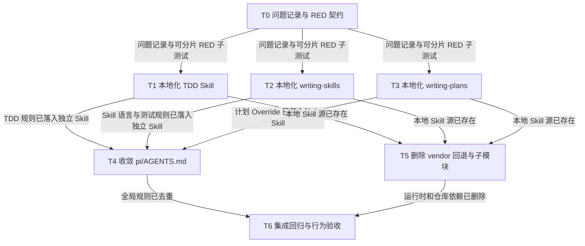

# 三个核心 Skill 本地化与 Superpowers 解耦实施计划

> **供执行代理使用：** 严格按任务复选框逐项执行。任何逻辑或 Skill 行为变更必须遵循 `test-driven-development` 的 RED–GREEN–REFACTOR；修改 Skill 时同时遵循 `writing-skills`。未经用户单独授权，不创建 Git commit。

**目标：** 将 `test-driven-development`、`writing-skills`、`writing-plans` 完整迁入 `skill-overrides/`，把 `pi/AGENTS.md` 中与三者相关的行为约束合并进对应 Skill，并删除 Superpowers 子模块及运行时回退依赖。

**架构：** 三个 Skill 保持原名称和白名单接口不变，`scripts/lib/skill-whitelist.mjs` 改为只接受 `skill-overrides/<name>` 作为 Git 管理的共享源。Skill 自身承载 TDD、Skill 测试、计划 DAG 和执行交接规则；`pi/AGENTS.md` 只保留跨 Skill 的全局安全约束。历史 `docs/superpowers/` 文档作为归档保留，不再作为新计划默认目录。

**技术栈：** Markdown Agent Skills、Node.js 22+、Node 内置测试运行器、Pi `resources_discover`、Git submodule 元数据。

## 全局约束

- 当前工作树已有用户修改：`pi/models.json`、`test/models-config.test.mjs`；所有任务禁止修改、暂存、还原或覆盖它们。
- 先创建 `docs/bugs/bug-superpowers-skill-source-coupling.md`，再建立并观察迁移测试为 RED，之后才可写三个 Skill 或生产逻辑。
- 三个 Skill 的 frontmatter `name` 和白名单名称保持不变，避免调用方迁移。
- 三个 Skill 内不得保留 `superpowers:` 命名空间或 `../using-superpowers/` 跨目录引用。
- 新计划默认写入 `docs/plans/`；不批量改名或重写历史 `docs/superpowers/` 归档。
- 禁止 raw `git worktree add/remove/prune/move/repair/lock/unlock`；本计划不需要创建 worktree。
- 不创建 commit，不 push，不访问凭据。

## 文件结构

| 路径 | 职责 |
|---|---|
| `skill-overrides/test-driven-development/` | 独立 TDD 流程和高质量测试参考 |
| `skill-overrides/writing-skills/` | 独立 Skill 编写、压力测试及可选图渲染资料 |
| `skill-overrides/writing-plans/` | 独立中文计划、DAG、Wave 和执行交接规则 |
| `pi/AGENTS.md` | 只保留跨 Skill 的安全、Subagent、Worktree、Bugfix、提交和输出约束 |
| `scripts/lib/skill-whitelist.mjs` | 只从 `skill-overrides/` 解析共享 Skill |
| `test/core-skills-local.test.mjs` | 本地化、规则归属和无 Superpowers 运行时依赖契约 |
| `test/skill-list.test.mjs` | 单一 Skill 源的解析和越界保护 |
| `test/migration-contract.test.mjs` | 三个核心 Skill 本地存在、子模块已移除的迁移契约 |
| `docs/bugs/bug-superpowers-skill-source-coupling.md` | 问题、复现、迁移方案和 RED 证据 |

## DAG 依赖图



### 依赖边理由

- `T0 → T1/T2/T3`：三个 Skill 修改共享同一份问题记录和 RED 契约；未完成 RED 前不得开始 Skill 逻辑修改。
- `T1/T2/T3 → T4`：只有对应规则已经进入独立 Skill，才能从 `pi/AGENTS.md` 删除，避免规则空窗。
- `T1/T2/T3 → T5`：删除 vendor 前必须保证白名单中的三个名称均有本地可读源。
- `T4/T5 → T6`：最终验收必须同时看到规则归属收敛和运行时依赖删除。

## 并行调度 Wave

- **Wave 0**：T0
- **Wave 1**：T1、T2、T3（完成 T0 后立即并行；写入目录互不重叠）
- **Wave 2**：T4、T5（各自前驱完成后立即执行，不必互相等待）
- **Wave 3**：T6

Wave 仅用于拓扑展示，不构成额外屏障。

---

### Task T0：建立问题记录和可分片 RED 契约

**Deps:** none

**WritePaths:**
- `docs/bugs/bug-superpowers-skill-source-coupling.md`
- `test/core-skills-local.test.mjs`

**接口：**
- Produces：三个独立测试名称，分别约束 TDD、`writing-skills`、`writing-plans`；另有规则归属和 vendor 移除测试，供后续任务按 `--test-name-pattern` 单独转绿。
- Consumes：当前白名单名称和现有 `pi/AGENTS.md` 规则。

- [x] **Step 1：创建问题记录**

使用中文记录：

1. 一句话描述：三个核心 Skill 仍从 `vendor/superpowers` 加载，项目行为同时散落在 `pi/AGENTS.md`。
2. 复现流程：读取三个 `~/.agents/skills/<name>` 软链、运行 `resolveSkillSource()`、检查 `.gitmodules`。
3. 修复方案：本地化三个 Skill、迁移规则、收窄解析根、移除子模块。

- [x] **Step 2：编写迁移失败测试**

`test/core-skills-local.test.mjs` 至少拆成以下独立测试：

- TDD 本地 Skill 存在，包含单行/纯文档/已有测试覆盖豁免、显式豁免理由、`docs/bugs/bug-*.md` 和 RED 规则；`writing-good-tests.md` 无 `superpowers:`。
- `writing-skills` 本地 Skill 及直接引用资料完整，规定 Skill 可用英文、测试必须使用 fresh context，并通过 `subagent-dispatch` 适配当前运行时；目录无 `superpowers:` 或 `../using-superpowers/`。
- `writing-plans` 本地 Skill 包含中文、DAG、`Deps`、Wave、`WritePaths`、三种执行方式和 managed worktree 规则；默认目录为 `docs/plans/`；目录无 `superpowers:`。
- `pi/AGENTS.md` 不再包含 `## TDD` 和 `## Skill 行为 Override`，但仍保留全局 Bugfix、Subagent、Worktree 和输出安全规则。
- `.gitmodules` 与 `vendor/superpowers` 不存在，三个白名单 Skill 的解析结果全部位于 `skill-overrides/`。

- [x] **Step 3：运行测试并观察 RED**

Run:

```bash
node --test test/core-skills-local.test.mjs
```

Expected：因三个本地目录尚不存在、AGENTS Override 尚未移除、子模块仍存在而 FAIL；将实际失败摘要追加到问题记录。

**验收：** 问题记录先于逻辑变更存在；测试失败原因是缺少目标迁移产物，而不是语法错误。

---

### Task T1：本地化 `test-driven-development`

**Deps:** T0

**WritePaths:**
- `skill-overrides/test-driven-development/SKILL.md`
- `skill-overrides/test-driven-development/writing-good-tests.md`
- `skill-overrides/test-driven-development/LICENSE`

**接口：**
- Produces：名称仍为 `test-driven-development` 的完整 Skill；供 `writing-skills` 通过名称引用。
- Consumes：T0 中 TDD 子测试定义；`pi/AGENTS.md` 当前 TDD 规则文本。

- [x] **Step 1：单独运行 TDD 子测试并确认 RED**

```bash
node --test --test-name-pattern='TDD local skill' test/core-skills-local.test.mjs
```

- [x] **Step 2：复制并本地化 Skill**

复制上游 `SKILL.md` 和 `writing-good-tests.md`；合入以下项目规则：

- 逻辑变更开始前必须加载本 Skill。
- 单行改动、纯文档变更、已有测试覆盖可豁免，但必须显式声明理由。
- 生产或 Skill 逻辑修改前先建立 `docs/bugs/bug-*.md`，并观察对应测试为 RED。
- 保留 RED–GREEN–REFACTOR 和“先看到正确失败”的核心约束。
- 将 `writing-good-tests.md` 中 `superpowers:writing-skills` 改为本地名称 `writing-skills`。

- [x] **Step 3：加入 MIT 许可**

`LICENSE` 保留上游 Copyright 与 MIT 全文。

- [x] **Step 4：运行 TDD 子测试并确认 GREEN**

```bash
node --test --test-name-pattern='TDD local skill' test/core-skills-local.test.mjs
```

**验收：** 子测试 PASS；目录中无 `superpowers:`；相对引用可读。

---

### Task T2：本地化 `writing-skills`

**Deps:** T0

**WritePaths:**
- `skill-overrides/writing-skills/**`

**接口：**
- Produces：名称仍为 `writing-skills` 的自包含 Skill 目录；只按名称依赖 `test-driven-development` 和 `subagent-dispatch`。
- Consumes：T0 中 `writing-skills` 子测试定义；当前 Skill 英文输出规则。

- [x] **Step 1：单独运行 `writing-skills` 子测试并确认 RED**

```bash
node --test --test-name-pattern='writing-skills local skill' test/core-skills-local.test.mjs
```

- [x] **Step 2：复制直接使用的内容**

保留：

- `SKILL.md`
- `anthropic-best-practices.md`
- `testing-skills-with-subagents.md`
- `persuasion-principles.md`
- `graphviz-conventions.dot`
- `examples/CLAUDE_MD_TESTING.md`

不引入 `using-superpowers` 目录。

- [x] **Step 3：本地化命名和运行时规则**

- 将所有 `superpowers:test-driven-development` 改为 `test-driven-development`。
- 删除 `superpowers:systematic-debugging` 示例或替换为不依赖未安装 Skill 的普通示例。
- 删除 `../using-superpowers/references/*`，统一说明共享目录为 `~/.agents/skills/`。
- 明确 Skill 内容允许全英文；人审技术文章仍服从项目全局中文规则。
- 将压力测试的执行入口适配为 `subagent-dispatch`，要求 fresh-context、先无 Skill 基线、再加载 Skill 验证。

- [x] **Step 4：处理可选图渲染器**

将 CommonJS `render-graphs.js` 改为 ESM `render-graphs.mjs` 并更新引用；只使用 Node 内置模块。Graphviz `dot` 明确标记为可选依赖，缺失时给出可操作错误。

- [x] **Step 5：加入 MIT 许可并运行子测试**

```bash
node --test --test-name-pattern='writing-skills local skill' test/core-skills-local.test.mjs
node skill-overrides/writing-skills/render-graphs.mjs
```

Expected：子测试 PASS；无参数脚本输出 usage 并以非零状态退出，不出现 ESM `require is not defined`。

**验收：** 目录自包含、无 Superpowers 命名空间/跨目录引用；可选脚本在当前 ESM 仓库中可启动。

---

### Task T3：本地化 `writing-plans`

**Deps:** T0

**WritePaths:**
- `skill-overrides/writing-plans/SKILL.md`
- `skill-overrides/writing-plans/LICENSE`

**接口：**
- Produces：名称仍为 `writing-plans` 的独立计划契约；输出可被现有 `subagent-dispatch` 和 `using-goal-engine` 消费。
- Consumes：T0 中计划子测试；`pi/AGENTS.md` 当前 `writing-plans` Override。

- [x] **Step 1：单独运行计划子测试并确认 RED**

```bash
node --test --test-name-pattern='writing-plans local skill' test/core-skills-local.test.mjs
```

- [x] **Step 2：复制主 Skill 并合并 Override**

在 `SKILL.md` 中直接纳入：

- 计划正文默认中文。
- 每项任务必须有 `Deps` 和 `WritePaths`。
- Mermaid DAG 与 `Deps` 一致；依赖边声明理由和目标产物。
- DAG 后提供 Wave；Wave 不构成调度屏障。
- 接口契约、共享 fixture、探索任务、关键路径、资源竞争和写入热点规则完整保留。
- 默认保存到 `docs/plans/YYYY-MM-DD-<feature-name>.md`。

- [x] **Step 3：替换上游执行交接**

删除 `using-git-worktrees`、`subagent-driven-development`、`executing-plans` 引用，改为：

1. Subagent-Driven：使用 `subagent-dispatch`，按 DAG 在前驱完成后派发。
2. Inline Execution：当前会话按任务执行，不加载不存在的子 Skill。
3. Goal Engine：使用 `using-goal-engine` 和 typed tools。

Worktree 规则改为项目的 typed Goal disposition 或 `node scripts/worktree-lifecycle.mjs ...` managed lifecycle，禁止 raw `git worktree` 生命周期命令。

- [x] **Step 4：收敛 commit 示例并加入许可**

计划不得默认创建 commit；只有用户明确授权时，才通过 `git-commit-convention` 生成提交。加入 MIT `LICENSE`。

- [x] **Step 5：运行计划子测试并确认 GREEN**

```bash
node --test --test-name-pattern='writing-plans local skill' test/core-skills-local.test.mjs
```

**验收：** 子测试 PASS；计划契约自包含且不引用任何未暴露的 Superpowers Skill。

---

### Task T4：从 `pi/AGENTS.md` 删除已迁移的 Skill Override

**Deps:** T1, T2, T3

**WritePaths:**
- `pi/AGENTS.md`
- `test/global-rules.test.mjs`

**接口：**
- Produces：只包含全局安全约束的 `pi/AGENTS.md`。
- Consumes：T1 的 TDD 规则、T2 的 Skill 语言规则、T3 的计划规则。

- [x] **Step 1：运行规则归属子测试并确认 RED**

```bash
node --test --test-name-pattern='AGENTS keeps only global rules' test/core-skills-local.test.mjs
```

- [x] **Step 2：删除已迁移内容**

- 删除 `## TDD` 段；其内容已进入 T1。
- 删除 `## Skill 行为 Override` 及 `writing-plans` 全段；其内容已进入 T3。
- 将“编写 Skill 可全英文”的局部规则留在 T2；`pi/AGENTS.md` 只保留人审技术文章默认中文和禁止英文的全局规则。
- 保留 Bugfix、Subagent、敏感信息、Worktree、提交规范、Playwright 和决策报告规则。

- [x] **Step 3：更新全局规则测试**

`test/global-rules.test.mjs` 不再要求 AGENTS 含 TDD 文本；改为读取本地 TDD Skill 验证该门禁，同时继续验证模型 prompt 和全局安全规则。

- [x] **Step 4：运行相关测试**

```bash
node --test test/global-rules.test.mjs
node --test --test-name-pattern='AGENTS keeps only global rules' test/core-skills-local.test.mjs
```

**验收：** 规则无空窗、无双处维护；相关测试 PASS。

---

### Task T5：删除 Superpowers 源回退、子模块和安装依赖

**Deps:** T1, T2, T3

**WritePaths:**
- `.gitmodules`（删除）
- `vendor/superpowers`（删除 Git gitlink）
- `scripts/lib/skill-whitelist.mjs`
- `scripts/sync-skills.mjs`
- `scripts/doctor.mjs`
- `init-pi.sh`
- `README.md`
- `skill-overrides/README.md`
- `test/helpers/skill-fixture.mjs`
- `test/skill-list.test.mjs`
- `test/migration-contract.test.mjs`
- `test/init-pi.test.mjs`

**接口：**
- Produces：唯一共享源根 `skill-overrides/`；初始化不执行 submodule 命令。
- Consumes：T1/T2/T3 的三个本地 Skill 目录。

- [x] **Step 1：运行 vendor 移除子测试并确认 RED**

```bash
node --test --test-name-pattern='repository has no Superpowers runtime dependency' test/core-skills-local.test.mjs
```

- [x] **Step 2：收窄 Skill 解析器**

`resolveSkillSource()` 只解析 `skill-overrides/<name>`，继续执行 realpath 边界检查和 frontmatter 校验；不存在时 fail closed。同步器和 doctor 的白名单名称保持不变。

- [x] **Step 3：更新解析测试和 fixture**

- fixture 不再创建 `vendor/superpowers/skills`。
- 删除“优先 local、回退 vendor”和 vendor 越界测试。
- 保留并强化单一 `skill-overrides` 根的可读性、frontmatter、缺失和软链越界测试。

- [x] **Step 4：删除子模块依赖**

- 删除 `.gitmodules`（仓库没有其他 submodule）。
- 从 Git 索引删除 `vendor/superpowers` gitlink；不手工清理 `.git/modules`。
- 从 `init-pi.sh` 删除 `git submodule update --init --recursive`。
- 更新 `test/init-pi.test.mjs`，明确初始化命令日志不再包含 submodule 操作。

- [x] **Step 5：更新迁移契约和文档**

- `test/migration-contract.test.mjs` 删除版本 pin，改为断言三个本地 Skill 可解析且仓库无 Superpowers gitlink。
- README 和 `skill-overrides/README.md` 删除 vendor 回退与升级说明，说明所有 Git 管理共享 Skill 均在 `skill-overrides/`。
- 历史 `docs/superpowers/` 归档保持原路径，不作为运行时依赖判定。

- [x] **Step 6：运行相关测试并同步链接**

```bash
node --test test/skill-list.test.mjs test/migration-contract.test.mjs test/init-pi.test.mjs
node scripts/sync-skills.mjs
node --test --test-name-pattern='repository has no Superpowers runtime dependency' test/core-skills-local.test.mjs
```

**验收：** 测试 PASS；三个 `~/.agents/skills/<name>` 链接均指向 `skill-overrides/`；未知或越界源继续 fail closed。

---

### Task T6：集成回归与 Skill 行为验收

**Deps:** T4, T5

**WritePaths:**
- `docs/summaries/2026-08-17-core-skills-extraction-verification.md`
- `docs/plans/2026-08-17-superpowers-skill-extraction.md`

**接口：**
- Produces：机械回归和三个 Skill 场景验收证据。
- Consumes：T4 的规则归属结果、T5 的无 vendor 运行时。

- [x] **Step 1：运行迁移相关机械回归**

用户明确要求不运行 Goal Engine 测试，因此最终门禁使用本迁移相关测试与 Doctor：

```bash
node --test test/core-skills-local.test.mjs test/global-rules.test.mjs test/skill-list.test.mjs test/migration-contract.test.mjs test/init-pi.test.mjs
npm run doctor
```

Expected：迁移相关测试全部通过，无 skipped、cancelled 或 todo；doctor 不报告 Skill 缺失。全量 `npm test` 中的 Goal Engine 测试不属于本次验收。

- [x] **Step 2：验证运行时来源**

```bash
for name in test-driven-development writing-skills writing-plans; do
  readlink "$HOME/.agents/skills/$name"
done
```

Expected：三个目标均位于 `<repo>/skill-overrides/<name>`。

- [x] **Step 3：验证活动代码无 vendor 依赖**

检查 `.gitmodules` 和 `vendor/superpowers` 不存在，并确认以下活动路径不含 `vendor/superpowers` 或 `superpowers:`：

```text
init-pi.sh
README.md
scripts/
skill-overrides/
test/
```

历史 `docs/superpowers/` 归档、历史状态证据和问题说明中的文字不计为运行时依赖。

- [x] **Step 4：执行三个 fresh-context 行为场景**

分别验证：

1. TDD：逻辑变更先写问题记录并看到正确 RED，合法豁免会显式说明。
2. `writing-skills`：在隔离 fresh session 中复核无 Skill 基线、`subagent-dispatch`、WITH Skill GREEN 与 REFACTOR 闭环；本次不声称已完成真实 WITHOUT/WITH 双轮模型对照实验。
3. `writing-plans`：输出中文计划，包含一致 DAG/Deps/Wave/WritePaths，并提供三种执行方式。

只做一次最终行为验收，不对每个实现任务重复全量审查。

- [x] **Step 5：记录证据并更新计划复选框**

将测试命令、结果摘要、软链目标和行为验收结论写入中文总结；只勾选有真实证据的步骤。

**验收：** 机械测试、运行时来源和行为场景全部通过；用户已有 `pi/models.json`、`test/models-config.test.mjs` 修改保持不变。

## 自审结果

- 需求覆盖：三个 Skill 抽取、AGENTS 规则合并、vendor/submodule/回退删除均有任务。
- 并发性：三个 Skill 目录独立并行；AGENTS 收敛与 vendor 删除在其前驱完成后并行。
- 依赖最小化：T1/T2/T3 不互相等待，只依赖已声明的稳定 Skill 名称；T4/T5 只依赖实际需要的本地产物。
- TDD：T0 提供先于逻辑修改的 bug 文档和可分片 RED；后续每个切片独立转绿。
- 写入隔离：并行任务 WritePaths 不重叠；用户已有修改路径明确排除。
- 范围控制：不迁移历史 `docs/superpowers/` 归档，不顺带重构其他 Skill 或 Goal Engine。
