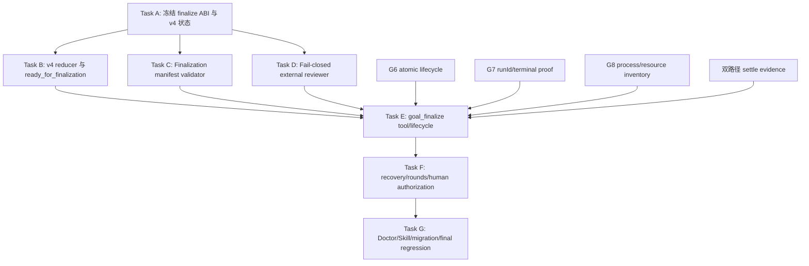

# Goal Finalization Gate 实施计划

> **For agentic workers:** REQUIRED SUB-SKILL: Use superpowers:subagent-driven-development (recommended) or superpowers:executing-plans to implement this plan task-by-task. Steps use checkbox (`- [ ]`) syntax for tracking.

**Goal:** 新增第八个 model-facing 工具 `goal_finalize`，作为 `planned` Goal/计划的唯一终局门禁：校验此前全部结构化状态与资源事实，取得真实用户外发授权，触发外源评审，只有评审无 Critical/Important 时才完成 Goal。

**Architecture:** 新 v4 Planned Goal 在最后一个 task accepted 后进入 `ready_for_finalization`，不再由 `goal_accept` 自动追加 `goal.completed`。`goal_finalize` 先消费一次性 action token，生成并校验完整 finalization manifest；随后持久化 review intent，在不持有 writer lock 的情况下调用外源 reviewer，最后用 atomic event batch 记录评审结果与 completion。外源不可用、状态不一致、资源未释放、证据不完整或存在 Critical/Important 时均 fail closed。

**Tech Stack:** Node.js ESM、Pi typed tools/lifecycle hooks、Goal Engine v4 events、Root Broker terminal proof、Git、external-llm-review reviewer、`node:test`。

## 模式边界与外部借鉴

- 本计划只实现 `planned` Goal 的 DAG/DoD finalization predicate；Convergent Goal 的 cycle/finding/stability mode-aware扩展见 `docs/superpowers/plans/2026-08-07-convergent-goal-execution.md`，不得在本计划中用“零 task 全 accepted”空真代替。
- [Codex Goals](https://developers.openai.com/cookbook/examples/codex/using_goals_in_codex) 将 budget-limited、paused、blocked 与 complete 分离，并要求完成前按 objective 对当前状态做 requirement-to-evidence audit；本计划固定 budget/停止不等于完成，manifest 必须逐项映射 DoD 与当前 evidence。
- Codex 模型可以提出 `complete/blocked`，但本计划不把模型调用当完成权威；只有 Host `goal_finalize` 校验全账本后才能追加完成事件。
- [Claude Code `/goal`](https://code.claude.com/docs/en/goal) 使用 fresh evaluator降低执行者自判偏差；本计划借鉴独立评审，但 reviewer 输入必须是结构化 manifest、固定 Git range 和 artifact hashes，不接受只读 transcript 的 yes/no。

## Global Constraints

- 新 root model-facing ABI 恰好八工具：现有七工具 + `goal_finalize`；不得新增其他 Goal tool。
- `goal_accept` 仍只验收单个 task，但新 v4 不再自动完成 Goal；最后一个 task accepted 后返回 `ready_for_finalization=true`。
- 历史 v1/v2/v3 completed Goal 只读兼容，不要求补跑 finalize，不改写旧 verdict/evidence。
- 新 v4 Goal 只有 `goal_finalize` 可以追加 `goal.completed`，新完成 verdict 必须是 `COMPLETE`。
- Finalize 必须验证双路径 settle evidence、dispatch hash、runId/terminal proof、workspace disposition/release、DAG、discoveries、human decisions、action capability、event/projection/registry 与 Git identity。
- 每项 DoD/evidence 必须绑定当前 Goal HEAD/stateHash；修复前、旧 review round 或仅在 transcript 中出现的结论不得证明完成。
- token/time/review round budget耗尽只能进入 budget_limited/escalation/attention，不能产生 completion。
- 外源评审属于代码/结构化上下文外发；每个 Goal 必须绑定 challenge 之后、同 session、interactive/RPC 用户输入的真实授权。Agent 或 extension 注入不能授权。
- 外源 reviewer 全部不可用时 finalization fail closed；不得复用 push gate 的 fail-open 行为。
- 同一 Goal diff 默认最多两轮外源评审；Round 3+ 仅允许真实用户单独授权。
- Round 1/2 的 Critical/Important 必须阻止 completion；Minor 记录为 residual risk，不阻止 completion。
- Review 期间不得持有 Goal writer lock；review intent 与 result 使用 reviewId/stateHash/base/head 绑定，支持 crash recovery。
- 评审 artifact 保存 provider、round、base/head、manifest hash、output hash 与 parsed severity；不保存 API key。
- 不直接编辑 `.state/goal-engine/**`；所有 Goal 状态只能通过 typed tool/event store。
- 不修改 `pi/settings.json`，SHA-256 保持 `7b9c3ace7929e9c3a3e13dfb024188f55a619089f002fa754083971e60559adf`。
- 不触碰 TokenRec、`skill-overrides/aliyun-beijing-server/` 或历史 worktree；禁止 reset、restore、clean、stash、rebase、amend、force push 与宽泛 staging。

## 新工具 ABI

```ts
goal_finalize({
  goal_id?: string;
  action_token: string;
  approval_entry_id: string;
})
```

成功返回：

```ts
{
  status: "completed";
  goal_id: string;
  review: {
    review_id: string;
    round: number;
    provider: string;
    base_commit: string;
    head_commit: string;
    manifest_sha256: string;
    output_sha256: string;
    report_path: string;
    has_critical: false;
    has_important: false;
    has_minor: boolean;
  };
  completion_verdict: "COMPLETE";
}
```

有阻断发现时返回非 completion 状态：

```ts
{
  status: "changes_required";
  goal_id: string;
  review: { review_id: string; round: number; report_path: string; has_critical: boolean; has_important: boolean };
  requiredNextAction: { tool: "goal_status"; params: { goal_id: string } };
}
```

## v4 状态

- `ready_for_finalization`：所有 task accepted/superseded，结构化账本尚未终审。
- `final_review_running`：review intent 已持久化，外源调用尚无 terminal result。
- `final_review_changes_required`：Round 1/2 有 Critical/Important；允许 `goal_amend(add_tasks)` 添加修复 task。
- `final_review_escalation_required`：第二轮仍有 Critical/Important；默认拒绝第三轮，等待真实用户决策。
- `completed`：manifest 合法且外源评审通过。

## Finalization Manifest 必检项

```ts
type FinalizationManifest = {
  schemaVersion: "goal-engine.finalization-manifest.v1";
  goalId: string;
  epoch: number;
  objective: string;
  scope: string[];
  nonGoals: string[];
  dod: string[];
  repo: { root: string; originRef: string; baseCommit: string; headCommit: string };
  stateHash: string;
  tasks: Array<{
    taskId: string;
    status: "accepted" | "superseded";
    deps: string[];
    contractHash?: string;
    runId?: string;
    terminalProofHash?: string;
    settlementEvidenceHash?: string;
    disposition: "integrated" | "superseded";
    released: boolean;
    integratedCommit?: string;
  }>;
  reviewHistory: Array<{ round: number; baseCommit: string; headCommit: string; outputHash: string; verdict: string }>;
};
```

校验要求：

1. event log 可从空 projection 完整 replay；projection.json 与 replay stateHash 一致；registry lifecycle/goal entry 一致。
2. Goal lifecycle/coordinationState 允许 finalize，且不存在 untriaged discovery、pending human decision、未解决 blocked task。
3. DAG 仍合法；每个非 superseded task 都 accepted；superseded 链无环且最终指向 accepted task。
4. 每个 accepted task 有 dispatch contractHash、绑定 runId、official terminal proof、双路径 settle YAML hash。
5. 每个 accepted task workspace 为 disposed + integrated + released；无 preserved/orphan/cleanup debt。
6. 无 task-owned 活跃 process、worktree lease 或未释放资源。
7. Goal base/head 与 Git identity 有效；head 包含所有 integrated commits，且不存在未归属 Goal 的中间 commit。
8. 所有 DoD 都映射到至少一个 accepted task criterion 或 settlement evidence，并证明 evidence 产生于当前 HEAD/stateHash 且覆盖范围不窄于 DoD；无法映射或仅有 transcript 声明即 fail closed。
9. 当前 action offer 精确绑定 `goal_finalize`、goalId、projection version、sessionId。
10. review authorization 来自 challenge 之后的真实用户 entry，且绑定当前 Goal/stateHash/head。

## 外源评审输入与判定

- Reviewer range：Goal `baseCommit → headCommit`，不得使用不稳定 upstream range。
- Reviewer spec：规范化 finalization manifest + Goal objective/scope/nonGoals/DoD；不附凭据、完整 transcript 或未脱敏用户输入。
- Provider 顺序沿用异源策略，但本工具全部失败必须报 `EXTERNAL_REVIEW_UNAVAILABLE`。
- Round 1 使用 exhaustive；只有 Round 1 有 Critical/Important 且修复 task 全 accepted 后才运行 Round 2。
- `parseSections()` 只提取 Critical/Important/Minor presence；完整 markdown 保存为 report artifact。
- 无 Critical/Important：atomic append `goal.final_review_recorded + goal.completed`。
- 有 Critical/Important：append `goal.final_review_recorded + goal.finalization_changes_required`，Goal 不 completed。

## DAG



## 并行调度组（Wave）

- **Wave 1**：Task A。
- **Wave 2**：Task B、Task C、Task D 可并行；WritePaths 不重叠。
- **Wave 3**：Task E；等待 B/C/D 与 G6/G7/G8/双路径 evidence。
- **Wave 4**：Task F。
- **Wave 5**：Task G。

---

### Task A: 冻结 finalize ABI 与 v4 状态

**Deps:** none

**WritePaths:**
- `docs/superpowers/specs/2026-08-05-goal-finalization-gate-design.md`

**Interfaces:** Produces `goal_finalize` ABI、FinalizationManifest v1、v4 coordination states、review result events。

- [ ] 编写中文设计，逐项固定本计划接口与失败恢复语义。
- [ ] 明确 legacy：v1/v2/v3 completed 不迁移；仅 v4 禁止 accept 自动 complete。
- [ ] 明确外发授权 challenge 与 reviewId/stateHash/head 绑定。
- [ ] 提交：

```bash
git add docs/superpowers/specs/2026-08-05-goal-finalization-gate-design.md
git commit -m "docs(goal-engine): 定义 Goal 终局门禁"
```

---

### Task B: v4 reducer 与 ready_for_finalization

**Deps:** A

**WritePaths:**
- `docs/bugs/bug-goal-completes-without-plan-wide-final-gate.md`
- `scripts/lib/goal-engine/events.mjs`
- `scripts/lib/goal-engine/graph.mjs`
- `test/goal-engine-events.test.mjs`
- `test/goal-engine-graph.test.mjs`

**Interfaces:** Produces v4 events：

```text
goal.final_review_started
goal.final_review_recorded
goal.finalization_changes_required
goal.final_review_escalation_required
goal.completed
```

- [ ] 先写六要素 bug 文档。
- [ ] 写 RED：v4 最后一个 task accepted 后 state=`ready_for_finalization` 且 lifecycle 不 completed。
- [ ] 写 RED：v4 非 finalize 路径追加 `goal.completed` 被拒绝；legacy replay 仍接受历史完成事件。
- [ ] 写 RED：review started/result 的 reviewId、round、stateHash、base/head 必须精确匹配。
- [ ] 运行 RED：`node --test test/goal-engine-events.test.mjs test/goal-engine-graph.test.mjs --test-name-pattern="finalization|ready_for_finalization"`。
- [ ] 最小 GREEN，保持旧 accepted/completion history 不变。
- [ ] 运行 GREEN：`node --test test/goal-engine-events.test.mjs test/goal-engine-graph.test.mjs`。
- [ ] 提交：

```bash
git add docs/bugs/bug-goal-completes-without-plan-wide-final-gate.md scripts/lib/goal-engine/events.mjs scripts/lib/goal-engine/graph.mjs test/goal-engine-events.test.mjs test/goal-engine-graph.test.mjs
git commit -m "feat(goal-engine): 增加待终审状态"
```

---

### Task C: Finalization manifest validator

**Deps:** A

**WritePaths:**
- `docs/bugs/bug-goal-completion-does-not-validate-structured-ledger.md`
- `scripts/lib/goal-engine/finalization.mjs`
- `test/goal-engine-finalization.test.mjs`

**Interfaces:**

```js
buildFinalizationManifest({ projection, events, registry, repoSnapshot, resourceInventory, terminalProofs })
validateFinalizationManifest(manifest)
hashFinalizationManifest(manifest)
```

- [ ] 先写六要素 bug 文档。
- [ ] 写 table-driven RED 覆盖本计划十项 manifest 门禁，每项单独破坏一个结构化事实并断言稳定错误码。
- [ ] 写 RED：projection/registry 派生快照与 event replay 不一致时拒绝。
- [ ] 写 RED：未归属 commit、活动 process、preserved/orphan workspace、缺双路径 evidence 均拒绝。
- [ ] 运行 RED：`node --test test/goal-engine-finalization.test.mjs`。
- [ ] 最小 GREEN；validator 纯函数不得执行 Git、网络或写文件。
- [ ] 重跑同命令并提交：

```bash
git add docs/bugs/bug-goal-completion-does-not-validate-structured-ledger.md scripts/lib/goal-engine/finalization.mjs test/goal-engine-finalization.test.mjs
git commit -m "feat(goal-engine): 校验终局结构化账本"
```

---

### Task D: Fail-closed external reviewer

**Deps:** A

**WritePaths:**
- `docs/bugs/bug-goal-completion-does-not-require-external-review.md`
- `scripts/lib/goal-engine/final-review.mjs`
- `test/goal-engine-final-review.test.mjs`

**Interfaces:**

```js
runGoalFinalReview({ repoRoot, baseCommit, headCommit, manifestPath, round, reviewId, timeoutMs })
// => { provider, output, outputHash, reportPath, hasCritical, hasImportant, hasMinor }
```

- [ ] 先写六要素 bug 文档。
- [ ] 写 RED：固定 base/head/manifest/round 参数传给 reviewer；输出保存到内容寻址 report。
- [ ] 写 RED：空输出、所有 provider 异常、timeout、malformed sections 全部 fail closed。
- [ ] 写 RED：provider error 只记录脱敏诊断，不包含 key/header/env。
- [ ] 运行 RED：`node --test test/goal-engine-final-review.test.mjs`。
- [ ] 最小 GREEN；复用 section parser 但不得复用 push gate fail-open。
- [ ] 重跑同命令并提交：

```bash
git add docs/bugs/bug-goal-completion-does-not-require-external-review.md scripts/lib/goal-engine/final-review.mjs test/goal-engine-final-review.test.mjs
git commit -m "feat(goal-engine): 强制执行终局外源评审"
```

---

### Task E: goal_finalize tool 与 lifecycle

**Deps:** B、C、D、G6、G7、G8、双路径 settle evidence

**WritePaths:**
- `scripts/lib/goal-engine/extension.mjs`
- `scripts/lib/goal-engine/events.mjs`
- `scripts/lib/goal-engine/store.mjs`
- `pi/extensions/goal-engine.ts`
- `test/goal-engine-extension.test.mjs`
- `test/goal-engine-runtime.integration.mjs`

**Interfaces:** 注册第八工具 `goal_finalize`；`goal_status` 在 ready state 签发 finalize action token。

- [ ] 写 RED：公开 Goal tools 恰好八个且仅新增 `goal_finalize`。
- [ ] 写 RED：最后 task accept 返回 ready，不 append completed；status machine action 指向 finalize。
- [ ] 写 RED：无 action token、错 session、错 version、缺用户外发授权均拒绝且不调用 reviewer。
- [ ] 写 RED：manifest 任何门禁失败均在 review intent 前 fail closed。
- [ ] 写 RED：review intent durable 后 reviewer 调用；pass 时 atomic record+complete；Critical/Important 时只 record+changes_required。
- [ ] 运行 RED：`node --test test/goal-engine-extension.test.mjs test/goal-engine-runtime.integration.mjs --test-name-pattern="goal_finalize|ready_for_finalization"`。
- [ ] 最小 GREEN；网络调用期间不得持有 writer lock。
- [ ] 运行 GREEN：`node --test test/goal-engine-extension.test.mjs test/goal-engine-runtime.integration.mjs`。
- [ ] 提交：

```bash
git add scripts/lib/goal-engine/extension.mjs scripts/lib/goal-engine/events.mjs scripts/lib/goal-engine/store.mjs pi/extensions/goal-engine.ts test/goal-engine-extension.test.mjs test/goal-engine-runtime.integration.mjs
git commit -m "feat(goal-engine): 增加 Goal 终局门禁"
```

---

### Task F: crash recovery、评审轮次与用户授权

**Deps:** E

**WritePaths:**
- `scripts/lib/goal-engine/extension.mjs`
- `scripts/lib/goal-engine/events.mjs`
- `scripts/lib/goal-engine/human-decision.mjs`
- `test/goal-engine-extension.test.mjs`
- `test/goal-engine-human-decision.test.mjs`
- `test/goal-engine-runtime.integration.mjs`

**Interfaces:** Produces resumable review intent、最多两轮默认策略、Round 3+ human challenge。

- [ ] 写 RED：started 后进程退出，reload/status 根据 reviewId 恢复，不重复完成或混用旧 output。
- [ ] 写 RED：Round 1 changes_required 后新增 fix task，全部 accepted 才允许 Round 2。
- [ ] 写 RED：Round 2 仍有阻断项进入 escalation；无真实用户批准不能 Round 3。
- [ ] 写 RED：external unavailable 保持 ready/retryable，但必须签发新 token，不重放旧 token。
- [ ] 运行 RED：`node --test test/goal-engine-extension.test.mjs test/goal-engine-human-decision.test.mjs test/goal-engine-runtime.integration.mjs --test-name-pattern="final review recovery|review round|external authorization"`。
- [ ] 最小 GREEN 并运行上述三个完整测试文件。
- [ ] 提交：

```bash
git add scripts/lib/goal-engine/extension.mjs scripts/lib/goal-engine/events.mjs scripts/lib/goal-engine/human-decision.mjs test/goal-engine-extension.test.mjs test/goal-engine-human-decision.test.mjs test/goal-engine-runtime.integration.mjs
git commit -m "fix(goal-engine): 恢复终局评审并限制轮次"
```

---

### Task G: Doctor、Skill、迁移与最终回归

**Deps:** F

**WritePaths:**
- `scripts/doctor.mjs`
- `test/doctor.test.mjs`
- `test/migration-contract.test.mjs`
- `skill-overrides/using-goal-engine/SKILL.md`
- `test/using-goal-engine-skill.test.mjs`
- `docs/superpowers/specs/2026-08-05-goal-engine-continuous-evolution-design.md`
- `docs/superpowers/plans/2026-08-05-goal-engine-continuous-evolution.md`
- `docs/summaries/2026-08-05-goal-finalization-gate-verification.md`

**Interfaces:** Doctor 固定 exact-eight ABI；Skill 固定 `... → accept each task → finalize whole Goal`。

- [ ] 加载 writing-skills skill 并写静态 RED：Skill 必须区分 task accept 与 Goal finalize。
- [ ] Doctor RED：缺 finalize、多余第九工具、v4 accept 自动 complete、review fail-open 均失败。
- [ ] Migration RED：legacy completed 可读；v4 必须 final review 才 completed。
- [ ] 更新 Skill/Doctor/设计与计划，不复活 Plan Runner。
- [ ] 运行专项：

```bash
node --test test/doctor.test.mjs test/migration-contract.test.mjs test/using-goal-engine-skill.test.mjs
```

- [ ] 运行全量：

```bash
node --test test/goal-engine-*.test.mjs test/root-subagent-broker.test.mjs test/subagent-*.test.mjs
node --test test/goal-engine-runtime.integration.mjs test/pi-runtime.integration.mjs
```

- [ ] 最多两轮外源只读复审；仅修复有证据的 Critical/Important。
- [ ] 验证 settings hash、aliyun skill、TokenRec 与 worktree 保护边界。
- [ ] 提交：

```bash
git add scripts/doctor.mjs test/doctor.test.mjs test/migration-contract.test.mjs skill-overrides/using-goal-engine/SKILL.md test/using-goal-engine-skill.test.mjs docs/superpowers/specs/2026-08-05-goal-engine-continuous-evolution-design.md docs/superpowers/plans/2026-08-05-goal-engine-continuous-evolution.md docs/summaries/2026-08-05-goal-finalization-gate-verification.md
git commit -m "test(goal-engine): 验证 Goal 终局门禁"
```

## Definition of Done

- Root Goal Engine 精确暴露八工具，新增工具名为 `goal_finalize`。
- v4 最后 task accepted 后只进入 ready state；仅 finalize 可完成整个 Goal。
- Finalize 对 event/projection/registry、DAG、双路径 evidence、run terminal、workspace/process/Git identity 做全账本校验。
- Planned Goal 的 DoD 逐项映射当前 HEAD/stateHash 的 authoritative evidence；模型自报、旧证据和 budget停止不能完成 Goal。
- Convergent Goal 不使用本计划的 DAG predicate空真完成，后续只通过 mode-aware扩展接入同一第八工具。
- 外发 review 有真实用户授权；reviewer 全不可用时 fail closed。
- Critical/Important 阻止 completion；Minor 记录 residual risk；默认最多两轮。
- Review intent/result crash-recoverable，token/review output 不可跨 stateHash/head 重放。
- Legacy Goals 只读兼容，Plan Runner 不复活。
- 全量测试、外源复审和保护边界全部通过。
