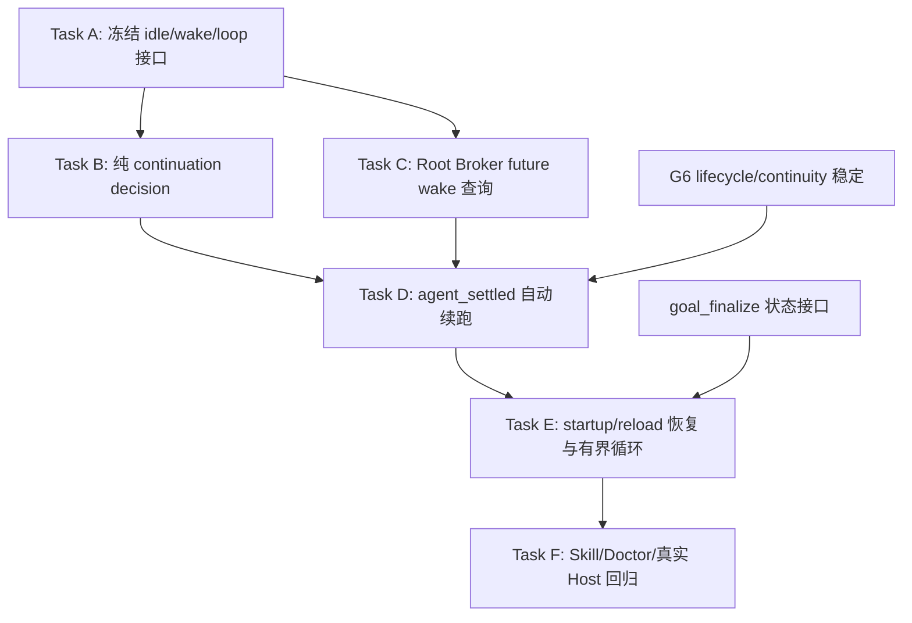

# Goal Idle Continuation Guard 实施计划

> **暂停执行：** 本计划保留为历史输入；应先完成 `docs/superpowers/plans/2026-08-13-goal-obligation-runtime.md` 的 Manual Preview，再按 obligation frontier 重新编写 auto-continuation 计划。当前不得派发其中 Task。

> **For agentic workers:** REQUIRED SUB-SKILL: Use superpowers:subagent-driven-development (recommended) or superpowers:executing-plans to implement this plan task-by-task. Steps use checkbox (`- [ ]`) syntax for tracking.

**Goal:** 当主 Agent真正 settled 且没有任何 queued/future wake 时，检查 Planned Goal 结构化状态；若计划尚未完成且存在可推进动作，自动触发新 turn，提示主 Agent从 `goal_status` 恢复并继续推进。

**Architecture:** 使用 Pi `agent_settled` 作为正常 idle 边界，绝不使用 `turn_end`、`tool_result` 或 `agent_end`。共享 idle safety core 根据 Root Broker future wake、session pending messages、用户中断与持久 continuation receipt 判断“是否允许续跑”；本计划的 Planned policy 再根据 task/DAG projection 决定“下一步是什么”。Extension 通过 `pi.sendMessage(customType, { deliverAs: "followUp", triggerTurn: true })` 触发下一 turn。进程退出后的恢复在下次 `session_start/resources_discover` 执行同一决策。每个业务进度指纹最多自动触发两次，避免无进展无限循环。

**Tech Stack:** Pi Extension lifecycle events、Goal Engine projection、Root Broker read-only run state、session custom entries、Node.js ESM、真实 Pi Host integration tests。

## 模式边界与外部借鉴

- 本计划实现共享 idle safety core 与 `planned` task/DAG continuation policy；Convergent Goal 只复用 safety core，并在 `docs/superpowers/plans/2026-08-07-convergent-goal-execution.md` 定义独立 cycle/finding policy。
- [Codex Goal runtime](https://github.com/openai/codex/blob/main/codex-rs/ext/goal/src/runtime.rs) 把 long-running continuation放在 core idle lifecycle，并让 pending user input、interrupt、budget与其他 mailbox work优先；本计划以 `agent_settled + idle + no pending + no future wake`落实同一安全边界。
- Codex 在 continuation turn 无 tool call 时抑制重复自动续跑；本计划把“无新 tool/artifact/task/workspace/head变化”计入同 fingerprint无进展，最多两次后转 attention。
- [Claude Code `/goal`](https://code.claude.com/docs/en/goal) 将 evaluator 的未完成 reason注入下一轮；本计划的 steering同样解释结构化阻断原因，但必须用 custom extension message，不能伪装用户输入或批准。
- [Claude hooks](https://code.claude.com/docs/en/hooks-guide) 对重复 Stop block设置上限；本计划使用更严格的业务指纹两次上限，并在用户中断时立即停止。

## Global Constraints

- 只使用 `agent_settled` 判断“当前 Agent 不会自动继续”；不得在单个 tool call 后或 `turn_end` 触发。
- 触发前必须同时满足 `ctx.isIdle() === true` 与 `ctx.hasPendingMessages() === false`。
- 已存在 queued steer/follow-up、auto retry、overflow compaction retry 时不得触发。
- 本机制只处理 root 主 Agent 的交互式 TUI 场景：必须满足 `ctx.mode === "tui"`，且 `PI_SUBAGENT_CHILD/PI_SUBAGENT_FANOUT_CHILD` 均不为 `1`。
- TUI 用户通过 interactive steer/follow-up 主动介入，或 root assistant 以 `stopReason="aborted"` 结束时，必须持久化 user-interrupt receipt；该次 settled/startup 检查直接抑制，不触发新 turn。
- RPC abort、Subagent terminal abort、Extension custom message、自动 continuation 与 Subagent notification 均不属于本机制的用户中断，不能生成、清除或冒充 receipt。
- Guard 启用时，项目 Extension 禁止直接调用 root `ctx.abort()`；若未来确需系统 abort，必须先记录独立 system-abort receipt，否则 TUI 的 `stopReason="aborted"` 无法保持用户来源唯一性。
- user-interrupt suppression 持续到下一条 idle 状态下的真实 interactive 用户输入；hard kill/reload 不得提前清除。
- 已绑定且仍运行、并具有 official completion wake 的 Executor 不触发；等待 Root Broker 通知。
- Goal completed/cancelled 或无 Goal 时不触发。
- Goal 未完成且 actionable 时触发；需要真实用户授权时最多触发一次让主 Agent请求用户，不得把 extension message 当授权。
- 自动消息必须使用 custom message，不使用 `sendUserMessage`，避免伪装成用户输入或授权 human decision。
- 每个业务进度指纹最多自动 trigger 2 次；只调用 status/action offer不算业务进展，continuation turn无tool call或无新artifact/task/workspace/head也必须计为无进展。
- 达到上限仍无进展时停止自动消耗 token，持久化 attention receipt 并通知用户。
- Hard process kill 无法在进程已死亡时触发；必须在下次 startup/reload 自动恢复。
- continuation receipt 存于 session custom entry，不伪造 Goal domain event；reload 后可恢复。
- 新增机制不改变 Goal model-facing 工具数量；与终局门禁落地后兼容 exact-eight ABI。
- 不直接编辑 `.state/goal-engine/**`；不触碰 TokenRec、aliyun skill 或历史 worktree。
- `pi/settings.json` SHA-256 保持 `7b9c3ace7929e9c3a3e13dfb024188f55a619089f002fa754083971e60559adf`。
- 禁止 reset、restore、clean、stash、rebase、amend、force push 与宽泛 staging。

## 业务进度指纹

`progressFingerprint(projection)` 只包含会改变 Goal 业务进展的字段：

```ts
type GoalProgressSnapshot = {
  goalId: string;
  epoch: number;
  lifecycle: string;
  coordinationState: string;
  tasks: Array<{
    taskId: string;
    status: string;
    attempts: number;
    workspacePhase: string | null;
    disposition: string | null;
    released: boolean | null;
    settlementOutcome: string | null;
    accepted: boolean;
  }>;
  unresolvedDiscoveryIds: string[];
  pendingHumanDecisionId: string | null;
  finalReviewState: string | null;
  finalReviewRound: number;
};
```

以下不进入 fingerprint：projection version、action offer/consume、checkpoint count、status 时间戳、continuation receipt。这样主 Agent只调用 `goal_status` 后再次停下不会被误判为已推进。

## 决策结果

```ts
type ContinuationDecision =
  | { action: "none"; reason: "no_goal" | "completed" | "pending_message" | "future_wake" | "not_idle" | "user_interrupted" | "no_tool_progress" }
  | { action: "trigger"; goalId: string; progressHash: string; attempt: 1 | 2; prompt: string }
  | { action: "attention"; goalId: string; progressHash: string; reason: string };

// safety core不理解DAG或cycle；Planned policy由本计划实现，Convergent policy后续注入。
type ContinuationPolicy = {
  mode: "planned" | "convergent";
  progressFingerprint(projection: unknown): string;
  nextAction(projection: unknown): { actionable: boolean; reason: string };
};
```

自动 prompt 固定为：

```text
Goal Engine idle guard: Goal <goalId> 尚未完成，且当前没有其他自动 continuation。
业务状态：<coordinationState>；进度指纹：<hash>。
先调用 goal_status({ goal_id: <goalId> }) 获取权威状态与 action token，
然后只执行返回的 machine action。不要根据对话记忆宣称完成，也不要绕过 Goal typed tools。
```

prompt 不包含用户原文、完整 projection、凭据、review output 或 action token。

## DAG



依赖边说明：

- `A → B/C`：纯决策与 future wake 使用同一状态定义。
- `B,C,G6 → D`：hook 必须基于稳定 projection 与 Root Broker future wake，不能自己猜运行状态。
- `D,finalize state → E`：startup/reload 使用同一 trigger 机制，并识别 ready/finalizing/completed。
- `E → F`：文档和 Doctor 验证最终 lifecycle 行为。

## 并行调度组（Wave）

- **Wave 1**：Task A。
- **Wave 2**：Task B、Task C 可并行；WritePaths 不重叠。
- **Wave 3**：Task D。
- **Wave 4**：Task E。
- **Wave 5**：Task F。

---

### Task A: 冻结 idle、future wake 与 loop 接口

**Deps:** none

**WritePaths:**
- `docs/superpowers/specs/2026-08-05-goal-idle-continuation-guard-design.md`

**Interfaces:** Produces GoalProgressSnapshot、ContinuationDecision、receipt schema、trigger prompt。

- [ ] 编写中文设计，明确 `agent_settled` 与 `turn_end/agent_end` 的差异。
- [ ] 定义 session receipt：`goal-engine-auto-continuation.v1 { goalId, progressHash, attempt, triggerId, triggeredAt, state }`。
- [ ] 定义中断 receipt：`goal-engine-user-interrupt.v1 { goalId, progressHash, sessionId, leafId, source: "interactive", kind, interruptedAt, state: "suppress" }`；kind 仅允许 `steer|follow_up|aborted`，并固定 root TUI process-role guard。
- [ ] 定义 future wake：active bound run + official completion subscription 存在时返回 true。
- [ ] 分离共享 idle safety core 与 Planned continuation policy接口；本任务不实现Convergent cycle action。
- [ ] 明确 hard kill 只能在下次 startup/reload 恢复。
- [ ] 提交：

```bash
git add docs/superpowers/specs/2026-08-05-goal-idle-continuation-guard-design.md
git commit -m "docs(goal-engine): 定义空闲自动续跑门禁"
```

---

### Task B: 纯 continuation decision

**Deps:** A

**WritePaths:**
- `docs/bugs/bug-goal-engine-allows-agent-to-stop-before-goal-completion.md`
- `scripts/lib/goal-engine/auto-continuation.mjs`
- `test/goal-engine-auto-continuation.test.mjs`

**Interfaces:**

```js
progressFingerprint(projection)
decideAutoContinuation({ projection, isIdle, hasPendingMessages, hasFutureWake, receipts })
buildAutoContinuationPrompt(decision)
```

- [ ] 先写中文六要素 bug 文档。
- [ ] 写 RED：无 Goal、completed、pending messages、future wake、not idle、user interrupted 均 `none`。
- [ ] 写 RED：active/blocked/needs_triage/ready_for_finalization 分别生成确定 trigger prompt。
- [ ] 写 RED：action offer/version/checkpoint 变化不改变 fingerprint；task/workspace/discovery/review 变化必须改变。
- [ ] 写 RED：同 fingerprint 第一次/第二次 trigger；第三次 attention，不继续 trigger。
- [ ] 写 RED：自动 continuation turn无tool call或没有新artifact/task/workspace/head时保持同fingerprint并按no-progress处理。
- [ ] 运行 RED：`node --test test/goal-engine-auto-continuation.test.mjs`。
- [ ] 最小 GREEN 并重跑。
- [ ] 提交：

```bash
git add docs/bugs/bug-goal-engine-allows-agent-to-stop-before-goal-completion.md scripts/lib/goal-engine/auto-continuation.mjs test/goal-engine-auto-continuation.test.mjs
git commit -m "feat(goal-engine): 判断空闲自动续跑"
```

---

### Task C: Root Broker future wake 查询

**Deps:** A

**WritePaths:**
- `scripts/lib/subagent-dispatch/root-broker-registry.ts`
- `scripts/lib/subagent-dispatch/root-broker-server.ts`
- `test/root-subagent-broker.test.mjs`

**Interfaces:**

```ts
getFutureWake(runId: string): {
  runId: string;
  processState: "running" | "terminal" | "unknown";
  completionSubscription: "bound" | "missing";
} | undefined;
```

- [ ] 现有 Root Broker ownership 测试作为已有覆盖；为 future wake 决策写最小 RED。
- [ ] RED 覆盖 running+bound 抑制 auto trigger；terminal/missing/identity conflict 不声称存在 future wake。
- [ ] 最小 GREEN：只返回冻结副本，不暴露内部 Map，不执行 Git/cleanup。
- [ ] 运行：`node --test test/root-subagent-broker.test.mjs`。
- [ ] 提交：

```bash
git add scripts/lib/subagent-dispatch/root-broker-registry.ts scripts/lib/subagent-dispatch/root-broker-server.ts test/root-subagent-broker.test.mjs
git commit -m "feat(subagent): 查询预期完成唤醒"
```

---

### Task D: agent_settled 自动续跑

**Deps:** B、C、G6 lifecycle/continuity

**WritePaths:**
- `scripts/lib/goal-engine/extension.mjs`
- `pi/extensions/goal-engine.ts`
- `test/goal-engine-extension.test.mjs`
- `test/helpers/pi-host.mjs`
- `test/goal-engine-runtime.integration.mjs`

**Interfaces:** `pi.on("input"|"agent_end"|"agent_settled", handler)`；input/agent_end 只记录真实中断，agent_settled 才可通过 custom message + followUp + triggerTurn 触发。

- [ ] 扩展 mock/real host RED：tool call 后的 `turn_end/tool_result/agent_end` 均不触发；agent_end 只允许记录 aborted receipt。
- [ ] RED：root TUI interactive `streamingBehavior=steer|followUp` 与 root assistant `stopReason=aborted` 抑制随后 settled；RPC、child process 与 source=extension 不抑制也不清除。
- [ ] RED：只有 `agent_settled` 且 idle/no pending/incomplete/actionable 才触发一次。
- [ ] RED：active Executor future wake 抑制 trigger；completed Goal 抑制。
- [ ] RED：自动消息 source/customType 不可被 human-decision 识别为用户授权。
- [ ] 运行 RED：`node --test test/goal-engine-extension.test.mjs test/goal-engine-runtime.integration.mjs --test-name-pattern="agent_settled|auto continuation"`。
- [ ] 最小 GREEN：append session receipt 后再次检查 idle/pending，再 `pi.sendMessage(..., { deliverAs: "followUp", triggerTurn: true })`。
- [ ] 运行完整两个测试文件。
- [ ] 提交：

```bash
git add scripts/lib/goal-engine/extension.mjs pi/extensions/goal-engine.ts test/goal-engine-extension.test.mjs test/helpers/pi-host.mjs test/goal-engine-runtime.integration.mjs
git commit -m "feat(goal-engine): 在真正空闲后自动续跑"
```

---

### Task E: startup/reload 恢复与有界循环

**Deps:** D、goal_finalize 状态接口

**WritePaths:**
- `scripts/lib/goal-engine/extension.mjs`
- `test/goal-engine-extension.test.mjs`
- `test/goal-engine-runtime.integration.mjs`

**Interfaces:** `session_start` 恢复 receipts；`resources_discover(startup|reload)` 在 runtime ready 后执行 continuation decision。

- [ ] RED：进程重启后 incomplete actionable Goal 自动 trigger；completed 不 trigger。
- [ ] RED：user-interrupt receipt 跨 shutdown/reload 保留并抑制 startup trigger；下一条 idle 状态真实 TUI interactive 输入才清除，RPC/extension 输入不能清除。
- [ ] RED：reload 保留 attempt 计数；同 fingerprint 第三次仅 attention，不启动 LLM。
- [ ] RED：业务 progress 改变后 attempt 重置为 1；status/action offer 变化不重置。
- [ ] RED：human decision required 时只触发一次请求用户，extension message 本身不能批准。
- [ ] RED：compaction retry/session replacement 期间 pending continuation 不重复。
- [ ] 运行 RED：`node --test test/goal-engine-extension.test.mjs test/goal-engine-runtime.integration.mjs --test-name-pattern="startup continuation|reload continuation|bounded continuation"`。
- [ ] 最小 GREEN 并运行完整测试文件。
- [ ] 提交：

```bash
git add scripts/lib/goal-engine/extension.mjs test/goal-engine-extension.test.mjs test/goal-engine-runtime.integration.mjs
git commit -m "fix(goal-engine): 恢复并限制自动续跑"
```

---

### Task F: Skill、Doctor 与真实 Host 回归

**Deps:** E

**WritePaths:**
- `skill-overrides/using-goal-engine/SKILL.md`
- `test/using-goal-engine-skill.test.mjs`
- `scripts/doctor.mjs`
- `test/doctor.test.mjs`
- `docs/superpowers/specs/2026-08-05-goal-engine-continuous-evolution-design.md`
- `docs/superpowers/plans/2026-08-05-goal-engine-continuous-evolution.md`
- `docs/summaries/2026-08-05-goal-idle-continuation-guard-verification.md`

**Interfaces:** Skill 明确 idle guard 是恢复提示，不是用户授权，也不允许绕过 status/action token。

- [ ] 加载 writing-skills skill 并写静态 RED。
- [ ] Doctor RED：缺 agent_settled hook、误用 turn_end、使用 sendUserMessage、无 loop bound、未处理 user interrupt、项目 Extension 直接调用 root `ctx.abort()` 均失败。
- [ ] 更新 Skill/Doctor/设计，不增加 model-facing Goal tool。
- [ ] 真实 Host 场景：assistant 纯文本提前停止后自动新 turn；含多个 tool calls 的正常 turn 不在中间触发；Goal finalize 后停止。
- [ ] 运行专项：

```bash
node --test test/using-goal-engine-skill.test.mjs test/doctor.test.mjs test/goal-engine-runtime.integration.mjs
```

- [ ] 运行全量：

```bash
node --test test/goal-engine-*.test.mjs test/root-subagent-broker.test.mjs test/subagent-*.test.mjs
node --test test/pi-runtime.integration.mjs
```

- [ ] 验证 settings hash、aliyun skill、TokenRec 与 worktree 边界。
- [ ] 提交：

```bash
git add skill-overrides/using-goal-engine/SKILL.md test/using-goal-engine-skill.test.mjs scripts/doctor.mjs test/doctor.test.mjs docs/superpowers/specs/2026-08-05-goal-engine-continuous-evolution-design.md docs/superpowers/plans/2026-08-05-goal-engine-continuous-evolution.md docs/summaries/2026-08-05-goal-idle-continuation-guard-verification.md
git commit -m "test(goal-engine): 验证空闲自动续跑"
```

## Definition of Done

- Tool call/turn 中间状态绝不触发 auto continuation。
- Root TUI 用户 steer/follow-up/abort 后不执行 Goal 检查、不触发新 turn；suppression 可跨 reload，且只能由后续真实 idle TUI 用户输入清除。
- Child/RPC abort 走 Subagent terminal 或 RPC lifecycle，不生成 root user-interrupt receipt。
- 仅 `agent_settled` + idle + no pending + no future wake + no user interrupt + incomplete Goal 触发新 turn。
- 自动消息是 custom extension message，不伪装用户、不授权 human decision。
- active Executor 有可靠 completion wake 时不抢跑。
- startup/reload 能恢复 incomplete Goal；hard kill 后下次启动继续。
- 同业务 fingerprint 最多自动触发两次；无tool call或无新artifact/task/workspace/head同样算无进展，之后转 user attention，避免无限 token 循环。
- safety core与Planned policy接口分离；Convergent policy可复用idle/interrupt/future-wake门禁而不复用DAG next-action逻辑。
- Goal progress 后计数重置；status/action offer 不算 progress。
- completed/finalized Goal 不触发；model-facing Goal ABI 不因本机制增加工具。
- 全量测试与保护边界通过。
