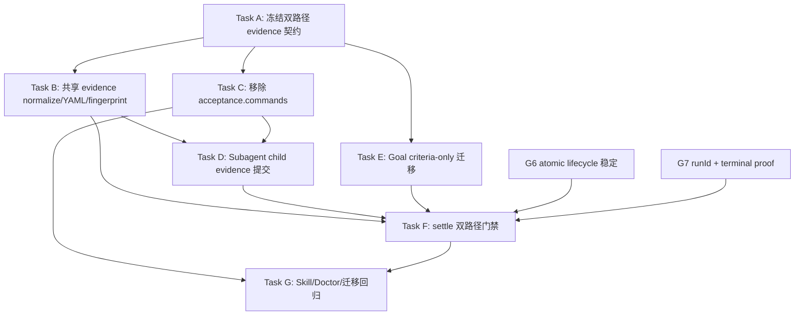

# 双路径 Settle Acceptance Evidence 实施计划

> **For agentic workers:** REQUIRED SUB-SKILL: Use superpowers:subagent-driven-development (recommended) or superpowers:executing-plans to implement this plan task-by-task. Steps use checkbox (`- [ ]`) syntax for tracking.

**Goal:** 为 `planned` Goal 删除 `acceptance.commands`；Subagent 自检后提交 YAML evidence，主 Agent在 `goal_settle` 前必须选择至少一条不同路径独立复核，并由 settle 同时持久化 Subagent evidence、主 Agent复核结果及二者的独立性。

**Architecture:** 新 dispatch 与 Planned Goal task contract 只保留 `acceptance.criteria`。Coding Subagent 通过 child-only typed tool 提交结构化自检结果，项目 runtime 使用共享 canonical serializer 写入 Executor worktree 的 YAML artifact；主 Agent读取该 evidence 后，以不同方法、不同输入或不同 artifact 完成独立验证。`goal_settle` 校验 task/run/contract/attempt 绑定、criterion 覆盖、outcome 一致性和路径独立性，再生成一个包含双份证据的 settlement YAML，并用 atomic event batch 记录 path/hash/规范对象。`goal_accept` 完全不变。

**Tech Stack:** TypeScript、Node.js ESM、Pi child extension、Goal Engine v3 events、canonical YAML、Root Broker terminal proof、`node:test`。

## 模式边界与外部借鉴

- 本计划只定义 `planned` Goal 的 task-level settle evidence；不定义 Convergent Goal 的 observation cycle、Oracle、finding 或稳定窗口，后者见 `docs/superpowers/plans/2026-08-07-convergent-goal-execution.md`。
- [Codex Goal continuation audit](https://github.com/openai/codex/blob/main/codex-rs/ext/goal/templates/goals/continuation.md) 要求把 objective 中每个要求映射到当前 artifact/command/test 证据，并把不确定性视为未完成；本计划把该原则落实为 criterion exact coverage、fresh artifact 和 scope-matched evidence。
- [Claude Code `/goal`](https://code.claude.com/docs/en/goal) 将工作模型与独立完成 evaluator 分离；本计划借鉴角色分离，但不接受只读 transcript 的 `yes/no` 作为工程证据，主 Agent仍必须产生不同 verification path 的结构化 artifact。
- Subagent completion summary、对话中的“测试通过”和 main 对同一输出的复述都不是独立证据。

## Global Constraints

- 逻辑变更必须先写中文六要素 bug 文档，再严格 RED→GREEN。
- `goal_accept` 的参数、reducer、调用条件和 task-level 语义完全不变。
- `goal_settle` 是一次执行尝试的判定；它必须记录判定依据，但不能把 Subagent 自证当作唯一依据。
- 新 contract 只允许 `acceptance.criteria`；删除公开 schema、canonical hash、prompt 与新 v3 event 中的 `acceptance.commands`。
- 旧 v1/v2 event log 中的 commands 只读 replay，不改写历史，也不传播到新 dispatch。
- Subagent evidence 是不可信候选证据；主 Agent必须独立复核，不能只重跑完全相同的命令或复述同一 artifact。
- 主 Agent至少提交一条与 Subagent path fingerprint 不同、且 evidence refs 不完全相同的 validation path，并解释独立性。
- 每条 passed evidence 必须来自当前 Executor HEAD/run/attempt；旧 HEAD、修复前或仅存在于 transcript 的结果不得证明当前完成。
- verification scope 必须覆盖 criterion scope；窄 unit test、单一 manifest 或“未发现错误”不能单独支撑更宽的完成声明。
- YAML 不保存凭据、完整命令输出、完整用户输入或未脱敏秘密；大输出仅通过相对 artifact path/ref 引用。
- Agent 不得直接写 `.state/goal-engine/**`；combined settlement YAML 由 Goal Engine typed tool 生成。
- child-only evidence tool 不计入 root Goal exact-seven ABI；root model-facing Goal tools 仍恰好七个。
- Goal settle 集成依赖当前 G6 atomic batch 与 G7 runId/terminal proof；两者完成前不得弱化绑定。
- `pi/settings.json` SHA-256 保持 `7b9c3ace7929e9c3a3e13dfb024188f55a619089f002fa754083971e60559adf`。
- 不触碰 TokenRec、`skill-overrides/aliyun-beijing-server/` 或历史 worktree；禁止 reset、restore、clean、stash、rebase、amend、force push 与宽泛 staging。

## 稳定接口

Task acceptance：

```ts
type TaskAcceptance = {
  criteria: string[];
};
```

共享 validation path：

```ts
type ValidationPath = {
  id: string;
  kind: "test" | "build" | "lint" | "typecheck" | "diff_review" |
        "artifact_inspection" | "runtime_probe" | "manual" | "external_review";
  description: string;
  evidence: Array<{
    type: "diff" | "file" | "test_output" | "screenshot" | "log" | "external_review";
    path?: string;
    ref?: string;
  }>;
};

type CriterionResult = {
  criterion: string;
  verdict: "passed" | "failed" | "blocked" | "not_run";
  validation_path_ids: string[];
};
```

Subagent 自检 evidence：

```ts
type SubagentAcceptanceEvidence = {
  summary: string;
  criteria: CriterionResult[];
  validation_paths: ValidationPath[];
  residual_risks: string[];
};
```

主 Agent独立复核：

```ts
type MainIndependentVerification = {
  summary: string;
  criteria: CriterionResult[];
  validation_paths: Array<ValidationPath & {
    independent_from_subagent_path_ids: string[];
    independence_reason: string;
  }>;
  residual_risks: string[];
};
```

`goal_settle` 新参数：

```ts
type GoalSettleEvidence = {
  subagent_evidence: {
    sha256: string;
    content: SubagentAcceptanceEvidence;
  };
  main_verification: MainIndependentVerification;
};
```

Subagent evidence artifact 由 child tool 写入：

```text
<executor-worktree>/.pi-subagents/artifacts/acceptance-evidence/<task-id>.yaml
```

Combined settlement evidence 由 Goal Engine 写入：

```text
.state/goal-engine/acceptance-evidence/sha256/<combined-hash>.yaml
```

## 独立性规则

每条 validation path 计算 canonical fingerprint：`sha256(kind + normalized description + sorted evidence refs)`。

主 Agent复核至少满足：

1. 至少一个 main fingerprint 不存在于 Subagent fingerprints；
2. 该 main path 的 evidence refs 不能与其声明独立于的 Subagent path 完全相同；
3. `independence_reason` 必须说明为何不是重复自证；
4. 只改变描述、ID、顺序或大小写不构成新路径；
5. succeeded 时，Subagent 与 main 都必须覆盖全部 criteria 且全部 passed；
6. failed/blocked 时，main 必须通过独立路径确认至少一个 failed/blocked/not_run 结论；
7. evidence 必须绑定当前 HEAD/run/attempt，且其验证范围不得窄于所支持 criterion；
8. 只让 fresh model 阅读同一 transcript 不构成结构独立，除非它同时产出并核验新的 artifact/ref。

示例：

- Subagent 运行 unit tests；主 Agent审查 diff 并运行集成测试：独立。
- Subagent 运行 `node --test x`；主 Agent仅再次运行相同命令：不独立。
- Subagent 检查截图；主 Agent使用同一截图但改写描述：不独立。
- Subagent 运行 build；主 Agent执行 runtime probe 并记录新日志：独立。

## Combined YAML 示例

```yaml
schema_version: "goal-engine.settlement-evidence.v1"
goal_id: "example-goal"
task_id: "task-1"
attempt: 1
run_id: "run-id"
contract_hash: "sha256"
outcome: "succeeded"
subagent:
  artifact_sha256: "sha256"
  summary: "完成单元测试与构建自检"
  criteria:
    - criterion: "解析结果正确"
      verdict: "passed"
      validation_path_ids: ["unit-tests"]
  validation_paths:
    - id: "unit-tests"
      kind: "test"
      description: "运行解析器单元测试"
      evidence:
        - type: "test_output"
          path: ".pi-subagents/artifacts/parser-unit.log"
main_agent:
  session_id: "main-session"
  summary: "通过不同路径独立复核"
  criteria:
    - criterion: "解析结果正确"
      verdict: "passed"
      validation_path_ids: ["integration-probe"]
  validation_paths:
    - id: "integration-probe"
      kind: "runtime_probe"
      description: "运行端到端输入并核对输出"
      independent_from_subagent_path_ids: ["unit-tests"]
      independence_reason: "使用真实入口和不同输入，不复用单元测试断言"
      evidence:
        - type: "log"
          path: ".pi-subagents/artifacts/verification/parser-integration.log"
residual_risks: []
```

## DAG



依赖边说明：

- `A → B/C/E`：三支实现共享同一字段和独立性定义。
- `B,C → D`：child tool 使用共享 serializer，且 prompt 已迁移为 criteria-only。
- `B,D,E,G6,G7 → F`：settle 需要稳定 evidence codec、真实 Subagent artifact、criteria-only projection、atomic batch 和 run terminal binding。
- `C,F → G`：文档与 Doctor 必须基于最终 root/child ABI。

## 并行调度组（Wave）

- **Wave 1**：Task A。
- **Wave 2**：Task B、Task C、Task E 可并行；WritePaths 不重叠。
- **Wave 3**：Task D；同时继续既有 G6/G7。
- **Wave 4**：Task F。
- **Wave 5**：Task G。

---

### Task A: 冻结双路径 evidence 契约

**Deps:** none

**WritePaths:**
- `docs/superpowers/specs/2026-08-05-dual-path-settlement-evidence-design.md`

**Interfaces:** Produces 本计划全部 TypeScript shapes、fingerprint 规则、YAML v1 与 outcome 一致性。

- [ ] 编写中文设计，明确 Subagent 自检、主 Agent独立复核、settle 记录、accept 不变。
- [ ] 固定安全上限：summary/description/reason 单项 ≤4096 字符；criteria/path 各 ≤32；evidence refs 各 ≤16。
- [ ] 固定兼容：新 v3 strict，旧 v1/v2 settlement 无双路径 evidence 只读 replay。
- [ ] 提交：

```bash
git add docs/superpowers/specs/2026-08-05-dual-path-settlement-evidence-design.md
git commit -m "docs(goal-engine): 定义双路径 settle 证据"
```

---

### Task B: 共享 evidence normalize、YAML 与 fingerprint

**Deps:** A

**WritePaths:**
- `docs/bugs/bug-settlement-evidence-paths-can-be-duplicated-or-unbound.md`
- `scripts/lib/goal-engine/settlement-evidence.mjs`
- `test/goal-engine-settlement-evidence.test.mjs`

**Interfaces:**

```js
normalizeSubagentEvidence({ declaredCriteria, input })
normalizeMainVerification({ declaredCriteria, subagentEvidence, input })
validationPathFingerprint(path)
serializeSubagentEvidenceYaml(context, evidence)
serializeCombinedSettlementYaml(context, subagentEvidence, mainVerification)
materializeCanonicalYaml({ root, relativePath, content })
```

- [ ] 先写六要素 bug 文档。
- [ ] 写 RED：criterion exact coverage、outcome verdict、path/ref 安全、ID 唯一、未知字段、大小上限。
- [ ] 写 RED：相同命令/相同 refs/仅改描述或 ID 被判为非独立；runtime probe + 新日志通过。
- [ ] 写 RED：canonical YAML 稳定、内容寻址、0600、temp+rename、无 secrets/full output。
- [ ] 运行 RED：`node --test test/goal-engine-settlement-evidence.test.mjs`。
- [ ] 最小 GREEN 并重跑同命令。
- [ ] 提交：

```bash
git add docs/bugs/bug-settlement-evidence-paths-can-be-duplicated-or-unbound.md scripts/lib/goal-engine/settlement-evidence.mjs test/goal-engine-settlement-evidence.test.mjs
git commit -m "feat(goal-engine): 校验双路径 settle 证据"
```

---

### Task C: 移除 acceptance.commands

**Deps:** A

**WritePaths:**
- `docs/bugs/bug-dispatch-contract-requires-predeclared-acceptance-commands.md`
- `scripts/lib/subagent-dispatch/ir.ts`
- `scripts/lib/subagent-dispatch/extension.ts`
- `scripts/lib/subagent-dispatch/prompt.ts`
- `test/subagent-dispatch-ir.test.mjs`
- `test/subagent-runtime-membrane.test.mjs`
- `test/subagent-dispatch-rpc.test.mjs`

**Interfaces:** Produces `dispatch-ir.v1.acceptance = { criteria }`，upstream acceptance 不再发送 verify commands。

- [ ] 先写六要素 bug 文档。
- [ ] 写 RED：criteria-only 成功；commands 被 strict schema 拒绝；hash/prompt/spawn 均无 commands。
- [ ] 运行 RED：`node --test test/subagent-dispatch-ir.test.mjs test/subagent-runtime-membrane.test.mjs`。
- [ ] 最小 GREEN；保留 criteria、TDD、自检结果与 residual risk 报告要求。
- [ ] 运行 GREEN：

```bash
node --test test/subagent-dispatch-ir.test.mjs test/subagent-runtime-membrane.test.mjs test/subagent-dispatch-rpc.test.mjs
```

- [ ] 提交：

```bash
git add docs/bugs/bug-dispatch-contract-requires-predeclared-acceptance-commands.md scripts/lib/subagent-dispatch/ir.ts scripts/lib/subagent-dispatch/extension.ts scripts/lib/subagent-dispatch/prompt.ts test/subagent-dispatch-ir.test.mjs test/subagent-runtime-membrane.test.mjs test/subagent-dispatch-rpc.test.mjs
git commit -m "refactor(subagent): 移除预声明验收命令"
```

---

### Task D: Subagent child evidence 提交

**Deps:** B（codec）；C（criteria-only prompt）

**WritePaths:**
- `docs/bugs/bug-subagent-completion-does-not-produce-bound-acceptance-evidence.md`
- `pi/child-extensions/acceptance-evidence.ts`
- `pi/extensions/subagent-runtime.ts`
- `scripts/lib/subagent-dispatch/extension.ts`
- `scripts/lib/subagent-dispatch/child-runtime-entry.ts`
- `test/subagent-acceptance-evidence.integration.mjs`
- `test/subagent-runtime-production-shutdown.test.mjs`

**Interfaces:** child-only typed tool：

```ts
submit_acceptance_evidence({ summary, criteria, validation_paths, residual_risks })
// returns { path, sha256 }
```

- [ ] 先写六要素 bug 文档。
- [ ] 写 RED：coding child 缺 evidence 不能产生可 settle handle；提交后 YAML 位于 executor worktree runtime artifact，绑定 taskId/contractHash。
- [ ] 写 RED：child 不能提交未知 criterion、重复 path、绝对路径、secret 字段或 outcome 自相矛盾 evidence。
- [ ] 运行 RED：`node --test test/subagent-acceptance-evidence.integration.mjs`。
- [ ] 最小 GREEN：仅 child 暴露 evidence tool；root Goal tools 数量不变；shutdown 不泄漏句柄。
- [ ] 运行 GREEN：

```bash
node --test test/subagent-acceptance-evidence.integration.mjs test/subagent-runtime-production-shutdown.test.mjs
```

- [ ] 提交：

```bash
git add docs/bugs/bug-subagent-completion-does-not-produce-bound-acceptance-evidence.md pi/child-extensions/acceptance-evidence.ts pi/extensions/subagent-runtime.ts scripts/lib/subagent-dispatch/extension.ts scripts/lib/subagent-dispatch/child-runtime-entry.ts test/subagent-acceptance-evidence.integration.mjs test/subagent-runtime-production-shutdown.test.mjs
git commit -m "feat(subagent): 提交自检验收证据"
```

---

### Task E: Goal task criteria-only 迁移

**Deps:** A

**WritePaths:**
- `docs/bugs/bug-goal-task-contract-requires-predeclared-acceptance-commands.md`
- `scripts/lib/goal-engine/task-definition.mjs`
- `scripts/lib/goal-engine/dispatch-ir.mjs`
- `scripts/lib/goal-engine/dispatch.mjs`
- `test/goal-engine-dispatch.test.mjs`
- `test/goal-engine-events.test.mjs`

**Interfaces:** Produces新 v3 task acceptance `{ criteria }`；旧 v1/v2 commands 仅 replay。

- [ ] 先写六要素 bug 文档与 RED：criteria-only、新 v3 commands 拒绝、旧 logs 可读、新 dispatch 无 commands。
- [ ] 运行 RED：`node --test test/goal-engine-dispatch.test.mjs test/goal-engine-events.test.mjs --test-name-pattern="criteria-only|legacy acceptance commands"`。
- [ ] 最小 GREEN，不改写 accepted task/history/contractHash。
- [ ] 运行 GREEN：`node --test test/goal-engine-dispatch.test.mjs test/goal-engine-events.test.mjs`。
- [ ] 提交：

```bash
git add docs/bugs/bug-goal-task-contract-requires-predeclared-acceptance-commands.md scripts/lib/goal-engine/task-definition.mjs scripts/lib/goal-engine/dispatch-ir.mjs scripts/lib/goal-engine/dispatch.mjs test/goal-engine-dispatch.test.mjs test/goal-engine-events.test.mjs
git commit -m "refactor(goal-engine): 移除任务预声明验收命令"
```

---

### Task F: goal_settle 双路径门禁

**Deps:** B、D、E、G6 atomic lifecycle、G7 runId/terminal proof

**WritePaths:**
- `docs/bugs/bug-goal-settle-trusts-subagent-self-verification.md`
- `scripts/lib/goal-engine/events.mjs`
- `scripts/lib/goal-engine/extension.mjs`
- `scripts/lib/goal-engine/store.mjs`
- `test/goal-engine-events.test.mjs`
- `test/goal-engine-extension.test.mjs`
- `test/goal-engine-runtime.integration.mjs`

**Interfaces:** `goal_settle` requires `subagent_evidence` + `main_verification`；v3 `task.settled` 保存 combined normalized/path/hash。

- [ ] 先写六要素 bug 文档。
- [ ] 写 RED：缺 Subagent evidence、hash mismatch、run/task/attempt/contract mismatch、无 terminal proof 全部拒绝。
- [ ] 写 RED：主 Agent复用同一命令、同一 refs、只改描述/ID 均拒绝；不同 runtime probe/diff review + 新 artifact 通过。
- [ ] 写 RED：succeeded/failed/blocked criterion verdict 必须与 outcome 一致。
- [ ] 写 RED：combined YAML 同时含 Subagent 与 main paths、independence reason、sessionId/runId/contractHash。
- [ ] 运行 RED：`node --test test/goal-engine-events.test.mjs test/goal-engine-extension.test.mjs --test-name-pattern="dual-path|independent verification"`。
- [ ] 最小 GREEN：先 consume action token，再完成 terminal/workspace/evidence preflight；materialize combined YAML；用 atomic batch append settled+checkpoint。
- [ ] 明确不修改 `goal_accept` schema、事件或条件。
- [ ] 运行 GREEN：

```bash
node --test test/goal-engine-events.test.mjs test/goal-engine-extension.test.mjs test/goal-engine-runtime.integration.mjs
```

- [ ] 提交：

```bash
git add docs/bugs/bug-goal-settle-trusts-subagent-self-verification.md scripts/lib/goal-engine/events.mjs scripts/lib/goal-engine/extension.mjs scripts/lib/goal-engine/store.mjs test/goal-engine-events.test.mjs test/goal-engine-extension.test.mjs test/goal-engine-runtime.integration.mjs
git commit -m "feat(goal-engine): 记录双路径 settle 验收"
```

---

### Task G: Skill、Doctor 与迁移回归

**Deps:** C、F

**WritePaths:**
- `skill-overrides/subagent-dispatch/SKILL.md`
- `skill-overrides/using-goal-engine/SKILL.md`
- `test/subagent-dispatch-skill.test.mjs`
- `test/using-goal-engine-skill.test.mjs`
- `scripts/doctor.mjs`
- `test/doctor.test.mjs`
- `test/migration-contract.test.mjs`
- `docs/superpowers/specs/2026-08-05-goal-engine-continuous-evolution-design.md`
- `docs/superpowers/plans/2026-08-05-goal-engine-continuous-evolution.md`
- `docs/summaries/2026-08-05-dual-path-settlement-evidence-verification.md`

**Interfaces:** 固定流程：`Subagent 自检提交 YAML → main 选择不同路径复核 → settle 双记录 → integrate → accept`。

- [ ] 加载 writing-skills skill，先写静态 RED。
- [ ] 更新 Skill：禁止把 Subagent evidence 当最终结论；main 不得仅重跑相同命令/复用同一 artifact。
- [ ] Doctor 检查 commandless schema、child evidence tool、settle 双证据 required、exact-seven root ABI。
- [ ] 运行专项：

```bash
node --test test/subagent-dispatch-skill.test.mjs test/using-goal-engine-skill.test.mjs test/doctor.test.mjs test/migration-contract.test.mjs
```

- [ ] 运行全量：

```bash
node --test test/subagent-*.test.mjs test/root-subagent-broker.test.mjs
node --test test/goal-engine-*.test.mjs test/goal-engine-runtime.integration.mjs
```

- [ ] 验证 settings hash、aliyun skill 与 TokenRec 保护边界。
- [ ] 提交：

```bash
git add skill-overrides/subagent-dispatch/SKILL.md skill-overrides/using-goal-engine/SKILL.md test/subagent-dispatch-skill.test.mjs test/using-goal-engine-skill.test.mjs scripts/doctor.mjs test/doctor.test.mjs test/migration-contract.test.mjs docs/superpowers/specs/2026-08-05-goal-engine-continuous-evolution-design.md docs/superpowers/plans/2026-08-05-goal-engine-continuous-evolution.md docs/summaries/2026-08-05-dual-path-settlement-evidence-verification.md
git commit -m "test(goal-engine): 验证双路径 settle 闭环"
```

## Definition of Done

- 新 contract 不含 `acceptance.commands`，只保留 criteria。
- 每个 Coding Subagent 自检后通过 child-only typed tool生成绑定 task/contract 的 YAML evidence。
- 主 Agent在 settle 前至少使用一条结构上独立的路径复核，不能复用相同命令、同一 transcript 或同一 artifact 冒充独立验证。
- 每项 passed 结论绑定当前 HEAD/run/attempt，且 evidence scope 足以覆盖 criterion scope。
- `goal_settle` 同时记录 Subagent evidence、main verification、independence reason、run/session/contract/attempt 与 combined YAML hash/path。
- succeeded/failed/blocked 与双方 criterion verdict 一致；缺失、重复或不独立 evidence fail closed。
- `goal_accept` 完全不变；exact-seven root ABI 保持。
- 旧 v1/v2 logs 可 replay，全量测试与保护边界通过。
