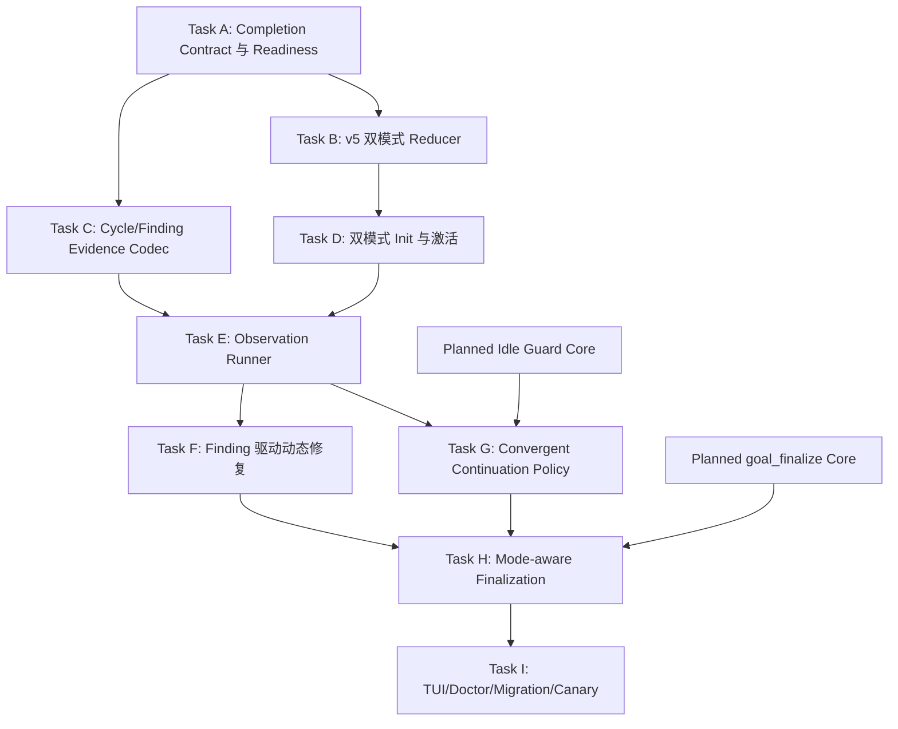

# Convergent Goal 目标收敛执行实施计划

> **已取代：** 本计划的互斥 `planned | convergent` 设计已由 `docs/superpowers/plans/2026-08-13-goal-obligation-runtime.md` 取代，仅保留为历史设计输入，不得继续派发其中 Task。

> **For agentic workers:** REQUIRED SUB-SKILL: Use superpowers:subagent-driven-development (recommended) or superpowers:executing-plans to implement this plan task-by-task. Steps use checkbox (`- [ ]`) syntax for tracking.

**Goal:** 在同一个 Goal Engine 治理核心中新增 `convergent` 执行模式，使没有初始任务 DAG、但具备可验证终态的目标能够通过“完整观察→结构化 finding→动态修复→干净复验→稳定收敛”持续推进，直到 mode-aware `goal_finalize` 证明完成。

**Architecture:** Goal Engine 保持一个事件账本、八个 model-facing Goal tools和统一的 session/action-token/resource/evidence/finalization 核心；`planned` 使用静态 DAG policy，`convergent` 使用 observation-cycle policy。Convergent Goal 在激活前经过 readiness gate 和 Cycle 0 校准，运行中只有已确认 finding 才能物化为正常 remediation task；任务修复仍复用 `dispatch → settle → integrate → accept`，但 Goal 完成由最新契约下的连续干净完整流程证据决定，而不是由 task 数量决定。

**Tech Stack:** Node.js ESM、Pi typed tools/TUI lifecycle、Goal Engine v5 events、Root Broker process identity、结构化 YAML/JSON evidence、registered oracle/reset adapters、`node:test`、真实 Pi Host integration tests。

## Global Constraints

- `planned` 与 `convergent` 必须是 `goal_init` 的 strict discriminated union；不得根据 tasks 是否为空隐式猜测模式。
- `planned` 必须有非空 task DAG；`convergent` 初始 tasks 必须为空或缺省，必须有结构化 completion contract。
- 不得用一个名为“持续运行直到完成”的假 Task 模拟 Convergent Goal。
- Convergent Goal 可以不知道修复路径、根因和子任务，但必须做到可执行、可观测、可判定、可重置、可停止。
- 新 contract 只使用 criteria/oracle refs，不允许 `acceptance.commands` 或 Agent 提供任意 shell command；旧 v1/v2/v3/v4 commands 仅只读 replay。
- Oracle、entrypoint、fixture、reset 和 environment 只能引用 Host 注册 adapter；契约和 evidence 不保存凭据。
- Observation evidence 必须绑定 contract hash、cycleId、runId、Root Broker official terminal proof、代码 HEAD、环境指纹和 artifact hash。
- 每条 terminal criterion/invariant 只能产生 `passed | failed | inconclusive`；`inconclusive` 永远不能计入完成。
- Agent 不得直接声称 observation 通过；Goal Engine 从 Host artifact 和注册 Oracle 生成 verdict/finding。
- 只有 confirmed finding 可以动态创建 remediation task；修复必须遵守 bug-first、TDD、双路径 settle evidence、workspace/process ownership。
- completion contract 的 Objective/Scope/Non-Goals/终态/稳定窗口变更必须绑定真实用户批准的 proposal hash；新 hash 立即清零旧 clean streak。
- `max_cycles`、`max_no_progress_cycles`、token/time budget 达到时进入 `budget_limited` 或 `attention_required`，不得当作完成。
- 同一业务指纹无进展最多自动续跑两次；用户中断、pending input、future wake 和活跃进程优先于自动续跑。
- Convergent Goal 完成必须满足最新 contract hash 下全部 terminal criteria/invariants passed、无 unresolved finding、全部 remediation task accepted、稳定窗口满足、资源清零、mode-aware final review 通过。
- Root model-facing Goal ABI 最终仍恰好八工具：现有七工具 + `goal_finalize`；不得新增 `goal_observe`、`goal_checkpoint` 等模型工具。
- Observation lifecycle 通过 `goal_amend` 的 strict operation variants 和 Host internal services表达；`goal_settle/goal_accept` 继续只处理 remediation task。
- `pi/settings.json` SHA-256 保持 `7b9c3ace7929e9c3a3e13dfb024188f55a619089f002fa754083971e60559adf`。
- 不触碰 TokenRec、`skill-overrides/aliyun-beijing-server/` 或历史 worktree；禁止 reset、restore、clean、stash、rebase、amend、force push 与宽泛 staging。

## 与 Planned Goal 的边界

| 维度 | `planned` | `convergent` |
|---|---|---|
| 初始输入 | 完整 tasks + DAG | completion contract，无初始 tasks |
| 顶层推进单位 | Task | Observation Cycle |
| 新工作来源 | 初始计划/批准 amendment | Host 证实的 finding |
| 主要进度 | accepted task / DAG frontier | cycle verdict / finding / clean streak |
| 任务作用 | Goal 的计划主体 | 某个 finding 的修复手段 |
| 完成谓词 | DAG/DoD/证据闭合 | 最新契约下稳定完整流程通过 |
| 终审入口 | `ready_for_finalization` | `ready_for_finalization` |

模式在一个 Goal epoch 内不可由 Agent静默切换。Convergent Goal 后续产生 remediation DAG 不会变成 Planned Goal；若用户决定将整个目标转换为确定计划，应以真实用户批准创建新 Goal/new epoch，而不是改写既有完成语义。

## 外部设计调研与取舍

### Codex Goals

参考：

- [Using Goals in Codex](https://developers.openai.com/cookbook/examples/codex/using_goals_in_codex)
- [Goal tool spec](https://github.com/openai/codex/blob/main/codex-rs/ext/goal/src/spec.rs)
- [Goal runtime](https://github.com/openai/codex/blob/main/codex-rs/ext/goal/src/runtime.rs)
- [Goal continuation audit prompt](https://github.com/openai/codex/blob/main/codex-rs/ext/goal/templates/goals/continuation.md)

借鉴：Goal 只要求持久 objective 和 completion boundary，不要求初始任务列表；续跑是 core runtime 的 idle 事件，不是普通 prompt while-loop；pending user input、interrupt、budget 和 no-tool progress 都能抑制自动续跑；完成前从 objective 动态构建 requirement-to-evidence checklist，并以当前 worktree/外部状态为权威。

不照搬：Codex 允许模型通过 `update_goal(complete|blocked)`结束；本方案中模型只能推动 typed machine action，最终完成仍由结构化账本、Host evidence 和 `goal_finalize` 判定。

### Claude Code `/goal`

参考：

- [Keep Claude working toward a goal](https://code.claude.com/docs/en/goal)
- [Automate actions with hooks](https://code.claude.com/docs/en/hooks-guide)

借鉴：执行模型与完成判定模型分离；每轮返回 `yes/no + reason`，未完成原因成为下一轮 steering；自动循环必须有阻断上限和用户 clear/interrupt。

不照搬：Claude `/goal` evaluator 主要依据 condition 与 conversation；本方案禁止仅凭 transcript 判定真实进程、终态和 Git/workspace 事实，优先使用注册 Oracle 和 Host artifact。模型评审只能补充解释，不能替代 deterministic/structured evidence。

## 稳定接口

### 初始化 strict union

```ts
type PlannedGoalInit = {
  mode: "planned";
  objective: string;
  scope?: string[];
  non_goals?: string[];
  dod?: string[];
  tasks: PlannedTask[]; // minItems: 1
};

type ConvergentGoalInit = {
  mode: "convergent";
  objective: string;
  scope?: string[];
  non_goals?: string[];
  completion: ConvergenceCompletionContract;
  tasks?: never;
};
```

### Completion contract

```ts
type OracleCriterion = {
  id: string;
  observable: string;
  expected: string;
  oracle_ref: string;
  timeout_ms: number;
};

type ConvergenceCompletionContract = {
  entrypoint: {
    description: string;
    adapter_ref: string;
    environment_ref: string;
    fixture_refs: string[];
  };
  terminal_criteria: OracleCriterion[];
  invariants: OracleCriterion[];
  reset_policy: {
    adapter_ref: string;
    expected_postcondition: string;
  };
  stability: {
    consecutive_clean_runs: number; // minimum 2 unless real user explicitly approves a risk exception
    require_fresh_environment: boolean;
  };
  budgets: {
    max_cycles: number;
    max_no_progress_cycles: number;
    max_elapsed_minutes: number;
    token_budget?: number;
  };
  blocked_policy: {
    repeated_blocker_cycles: number;
  };
};
```

### Readiness

```ts
type ConvergenceReadiness =
  | { status: "ready"; contract_hash: string; oracle_coverage_hash: string }
  | { status: "needs_clarification"; issues: ReadinessIssue[] }
  | { status: "environment_blocked"; issues: ReadinessIssue[] }
  | { status: "unsafe_to_run"; issues: ReadinessIssue[] };

type ReadinessIssue = {
  code: string;
  path: string;
  message: string;
  required_user_decision: boolean;
};
```

Readiness 是 fail-closed enum，不使用模糊分数。只有 `ready` 可以进入 Cycle 0。

### Observation cycle

```ts
type ObservationCycle = {
  cycle_id: string;
  sequence: number;
  contract_hash: string;
  code_head: string;
  environment_fingerprint: string;
  run_id: string;
  terminal_proof_hash: string;
  evidence_manifest_hash: string;
  criteria: Array<{
    criterion_id: string;
    verdict: "passed" | "failed" | "inconclusive";
    oracle_ref: string;
    artifact_refs: string[];
    reason: string;
  }>;
  finding_ids: string[];
  verdict: "clean" | "failed" | "inconclusive" | "infrastructure_error";
};

type ConvergenceFinding = {
  finding_id: string;
  cycle_id: string;
  criterion_id: string;
  status: "open" | "repairing" | "resolved" | "rejected_by_user";
  summary: string;
  evidence_refs: string[];
  remediation_task_ids: string[];
};
```

### Goal status machine actions

```text
Draft contract awaiting approval
  → goal_amend(operation="activate_convergent")

Active with no run
  → goal_amend(operation="start_observation")

Bound run terminal
  → goal_amend(operation="record_observation", cycle_id, run_id, evidence_ref)

Open finding without task
  → goal_amend(operation="patch_active", add_tasks=[...], finding_ids=[...])

Remediation tasks accepted
  → goal_amend(operation="start_observation")

Clean streak satisfied
  → goal_finalize
```

`record_observation` 参数只引用 Host artifact；extension 必须从 Root Broker/adapter registry重新读取并校验，不信任 Agent传入 verdict。

## 生命周期与完成谓词

```text
draft
  → calibrating
  → active.observing
  → active.repairing
  → active.reverifying
  → ready_for_finalization
  → completed

任意非 terminal 状态
  → paused | blocked | budget_limited | attention_required
```

Cycle 0 只验证入口、fixture、权限、process ownership、Oracle、reset 和产品失败/基础设施失败可区分性。Cycle 0 不要求业务成功；若业务失败但 evidence 可判定，生成第一个 finding 并进入 active。

`ready_for_finalization` 必须同时满足：

1. 所有 terminal criteria 和 invariants 在最新 cycle 中为 passed；
2. 不存在 inconclusive；
3. 最新 contract hash 下 clean streak 达到 stability；
4. clean cycle 均发生在最后一次 accepted remediation 之后，并绑定当前 Goal HEAD；
5. 不存在 open/repairing finding；
6. 所有 remediation task accepted/superseded 且 workspace/process/review debt 清零；
7. budget 未被误当作完成条件。

## 证据与安全规则

- Observation manifest 由 Host 写到内容寻址目录；Agent只接收 path/hash。
- 每个 Oracle result 保存摘要、artifact ref/hash，不保存完整日志和凭据。
- fresh environment 至少改变 isolation identity；仅重跑同一进程不算第二次 clean run。
- reset adapter 必须证明 postcondition；reset 失败产生 infrastructure finding，不能继续下一 cycle。
- 任何 completion contract amendment 生成新 hash，清零 clean streak，并使旧 cycle 仅保留历史用途。
- 同一 blocker 达到 configured consecutive cycles 后进入 blocked；换一种描述但相同 evidence fingerprint 不重置计数。
- 同一 progress fingerprint 连续两次无新 tool/artifact/finding/task/head 变化后转 attention，不继续消耗 token。
- 用户 steer/follow-up/abort 立即抑制 continuation；自动消息永远不能成为 human approval。

## 文件结构

新建：

- `scripts/lib/goal-engine/convergence-contract.mjs`：normalize、hash、readiness 与 mode strict validation。
- `scripts/lib/goal-engine/convergence-evidence.mjs`：cycle/finding manifest codec、artifact hash 与 criterion coverage。
- `scripts/lib/goal-engine/convergence-policy.mjs`：machine action、progress fingerprint、clean streak、completion predicate。
- `scripts/lib/goal-engine/observation-runner.mjs`：registered adapter、Root Broker binding、reset/entrypoint/oracle orchestration。
- `test/goal-engine-convergence-contract.test.mjs`
- `test/goal-engine-convergence-evidence.test.mjs`
- `test/goal-engine-convergence-policy.test.mjs`
- `test/goal-engine-observation-runner.test.mjs`
- `test/goal-engine-convergence-runtime.integration.mjs`

修改：

- `scripts/lib/goal-engine/events.mjs`：v5 mode、contract、cycle、finding reducer。
- `scripts/lib/goal-engine/extension.mjs`：dual-mode init/status/amend/finalize routing。
- `scripts/lib/goal-engine/graph.mjs`：planned-only DAG invariants 与 remediation task binding。
- `scripts/lib/goal-engine/finalization.mjs`：mode-aware manifest/predicate。
- `scripts/lib/goal-engine/auto-continuation.mjs`：policy-dispatched progress/action。
- `pi/extensions/goal-engine.ts`：Host adapter wiring。
- `scripts/doctor.mjs`、Skills、migration tests：exact-eight 与 dual-mode检查。

## DAG



依赖边说明：

- `A → B`：reducer 只接受已冻结的 mode/contract/hash/readiness 字段。
- `A → C`：cycle evidence 必须引用同一 criterion ID 与 contract hash。
- `C,D → E`：runner 需要 D 产出的持久 cycle/activation state 与 C 的冻结 evidence codec；D 已依赖 B，C 与 D 可并行后汇合。
- `E → F`：finding 必须来自已持久的 Host observation，不能由 Agent凭空添加；E 已依赖 B/C/D 的 projection、codec 和 activation 产物。
- `E,Idle Core → G`：续跑 policy 需要 E 的 cycle terminal 状态及通用安全 idle guard；mode projection 已由 E 的前驱提供。
- `F,G,Finalize Core → H`：终审需要闭合 finding/remediation、稳定 continuation state 与现有终审核心；cycle codec 已通过 F/G 的前驱 E 提供。
- `H → I`：用户控制面、Doctor 和 canary 必须针对最终状态机验收。

## 并行调度组（Wave）

- **Wave 1**：Task A。
- **Wave 2**：Task B、Task C 可并行；一个写 reducer，一个写独立 codec。
- **Wave 3**：Task D；Task E 在 C、D 均完成后立即派发，无需等待本 Wave 其他工作。
- **Wave 4**：Task F、Task G 可并行；分别处理 remediation 与 continuation，WritePaths 不重叠。
- **Wave 5**：Task H。
- **Wave 6**：Task I。

Wave 不是派发屏障；任一 Task 的全部 Deps 完成即可派发。

---

### Task A: Completion Contract、Readiness 与 proposal hash

**Deps:** none

**WritePaths:**
- `docs/bugs/bug-goal-engine-cannot-validate-planless-convergence-input.md`
- `scripts/lib/goal-engine/convergence-contract.mjs`
- `test/goal-engine-convergence-contract.test.mjs`

**Interfaces:**

```js
normalizeConvergenceContract(input)
hashConvergenceContract(contract)
validateConvergenceReadiness({ contract, adapterRegistry, environmentInventory })
assertGoalInitMode(input)
```

- [ ] 先写中文六要素 bug 文档，说明当前 `goal_init` 强制初始 DAG，且简单放开空 tasks 会形成 vacuous completion。
- [ ] 写 RED：planned 无 task、convergent 带 task、缺 entrypoint/terminal/reset/budget、未知字段全部拒绝。
- [ ] 写 RED：模糊 criterion、缺 oracle、重复 criterion ID、stability<2、无法重置环境分别返回稳定 readiness issue。
- [ ] 写 RED：凭据样式字段、任意 command、绝对秘密路径被拒绝；adapter/fixture 只允许注册引用。
- [ ] 写 RED：规范化 contract hash 稳定，字段/顺序语义变化产生新 hash。
- [ ] 运行 RED：`node --test test/goal-engine-convergence-contract.test.mjs`，确认目标失败来自未实现接口。
- [ ] 最小 GREEN；readiness 仅纯读取 registry/inventory，不运行外部流程。
- [ ] 重跑 GREEN 并提交：

```bash
git add docs/bugs/bug-goal-engine-cannot-validate-planless-convergence-input.md scripts/lib/goal-engine/convergence-contract.mjs test/goal-engine-convergence-contract.test.mjs
git commit -m "feat(goal-engine): 校验收敛目标完成契约"
```

---

### Task B: v5 双模式 projection、cycle 与 finding reducer

**Deps:** A（冻结 mode/contract/hash 接口）

**WritePaths:**
- `docs/bugs/bug-goal-engine-projection-assumes-every-goal-has-a-static-dag.md`
- `scripts/lib/goal-engine/events.mjs`
- `scripts/lib/goal-engine/graph.mjs`
- `test/goal-engine-events.test.mjs`
- `test/goal-engine-graph.test.mjs`

**Interfaces:** Produces v5 events：

```text
goal.convergence_drafted
goal.convergence_activated
goal.observation_started
goal.observation_recorded
goal.finding_recorded
goal.finding_resolved
goal.convergence_stability_reset
goal.convergence_ready_for_finalization
```

- [ ] 先写六要素 bug 文档。
- [ ] 写 RED：planned v5 仍要求非空合法 DAG；convergent v5 允许零 task但 lifecycle=draft，不能自动完成。
- [ ] 写 RED：未 activation 不得 start observation；cycle sequence/runId/contractHash/HEAD 不匹配原子拒绝。
- [ ] 写 RED：failed/inconclusive criterion 必须生成或引用 finding；clean cycle 不得含 open finding。
- [ ] 写 RED：只有 bound finding 可添加 remediation task；planned task 不需要 finding binding。
- [ ] 写 RED：contract hash变更清零 streak；旧 cycle/history保持不可变。
- [ ] 运行 RED：`node --test test/goal-engine-events.test.mjs test/goal-engine-graph.test.mjs --test-name-pattern="convergent|observation|finding"`。
- [ ] 最小 GREEN，保留 v1-v4 replay 和 planned completion语义。
- [ ] 运行完整两个测试文件并提交：

```bash
git add docs/bugs/bug-goal-engine-projection-assumes-every-goal-has-a-static-dag.md scripts/lib/goal-engine/events.mjs scripts/lib/goal-engine/graph.mjs test/goal-engine-events.test.mjs test/goal-engine-graph.test.mjs
git commit -m "feat(goal-engine): 持久化收敛周期与发现"
```

---

### Task C: Observation/Finding evidence codec

**Deps:** A（criterion ID、contract hash 与安全上限）

**WritePaths:**
- `docs/bugs/bug-convergence-observations-can-be-self-reported-or-stale.md`
- `scripts/lib/goal-engine/convergence-evidence.mjs`
- `test/goal-engine-convergence-evidence.test.mjs`

**Interfaces:**

```js
normalizeObservationManifest({ contract, runProof, codeHead, environment, oracleResults })
materializeObservationManifest({ stateRoot, manifest })
observationProgressFingerprint(manifest)
deriveFindings(manifest)
```

- [ ] 先写六要素 bug 文档。
- [ ] 写 RED：缺 runId/terminal proof、错 contract hash、旧 HEAD、未知 criterion、重复 result、无 artifact hash 全部拒绝。
- [ ] 写 RED：每条 criterion 必须精确覆盖一次；passed/failed/inconclusive 三态之外拒绝。
- [ ] 写 RED：完整日志、secret字段、绝对路径被拒绝；只保存摘要与相对内容寻址 refs。
- [ ] 写 RED：canonical manifest/hash稳定；相同失败描述但相同 evidence fingerprint仍识别为同 blocker。
- [ ] 写 RED：failed/inconclusive确定地产生 finding；passed不产生 finding。
- [ ] 运行 RED：`node --test test/goal-engine-convergence-evidence.test.mjs`。
- [ ] 最小 GREEN，atomic temp+rename、0600，随后重跑并提交：

```bash
git add docs/bugs/bug-convergence-observations-can-be-self-reported-or-stale.md scripts/lib/goal-engine/convergence-evidence.mjs test/goal-engine-convergence-evidence.test.mjs
git commit -m "feat(goal-engine): 生成收敛观察证据"
```

---

### Task D: 双模式 goal_init、Cycle 0 与真实用户激活

**Deps:** B（v5 draft/activation reducer）

**WritePaths:**
- `docs/bugs/bug-goal-init-cannot-stage-a-planless-convergence-contract.md`
- `scripts/lib/goal-engine/extension.mjs`
- `scripts/lib/goal-engine/human-decision.mjs`
- `pi/extensions/goal-engine.ts`
- `test/goal-engine-extension.test.mjs`
- `test/goal-engine-human-decision.test.mjs`
- `test/goal-engine-runtime.integration.mjs`

**Interfaces:** `goal_init` strict `planned | convergent` union；`goal_amend(operation="activate_convergent")`。

- [ ] 先写六要素 bug 文档。
- [ ] 写 RED：真实 Host schema拒绝模式混传；planned路径与现有行为一致；convergent init只创建draft并返回normalized contract/hash/readiness。
- [ ] 写 RED：needs_clarification/environment_blocked/unsafe_to_run不得签发activation action。
- [ ] 写 RED：ready contract 展示后，只有同session challenge之后 interactive/RPC精确批准可让 status offer activate；Agent/extension消息不能批准。
- [ ] 写 RED：activation token绑定 goalId/contractHash/session/version；stale hash、跨session、重复token拒绝。
- [ ] 写 RED：Cycle 0 capability calibration 失败保持draft并返回具体 adapter issue，不生成业务finding。
- [ ] 运行 RED：`node --test test/goal-engine-extension.test.mjs test/goal-engine-human-decision.test.mjs test/goal-engine-runtime.integration.mjs --test-name-pattern="convergent init|readiness|activation"`。
- [ ] 最小 GREEN；Pi provider schema使用兼容表达，`prepareArguments` 在 execute前做同一strict defense-in-depth。
- [ ] 运行完整三个测试文件并提交：

```bash
git add docs/bugs/bug-goal-init-cannot-stage-a-planless-convergence-contract.md scripts/lib/goal-engine/extension.mjs scripts/lib/goal-engine/human-decision.mjs pi/extensions/goal-engine.ts test/goal-engine-extension.test.mjs test/goal-engine-human-decision.test.mjs test/goal-engine-runtime.integration.mjs
git commit -m "feat(goal-engine): 激活无初始计划的收敛目标"
```

---

### Task E: Observation Runner、Root Broker 与 reset/Oracle orchestration

**Deps:** C（evidence codec）、D（已激活 Goal 和 Host wiring）

**WritePaths:**
- `docs/bugs/bug-convergence-flow-runs-lack-owned-process-and-reset-proof.md`
- `scripts/lib/goal-engine/observation-runner.mjs`
- `scripts/lib/goal-engine/extension.mjs`
- `scripts/lib/subagent-dispatch/root-broker-client.ts`
- `scripts/lib/subagent-dispatch/root-broker-protocol.ts`
- `test/goal-engine-observation-runner.test.mjs`
- `test/goal-engine-convergence-runtime.integration.mjs`
- `test/root-subagent-broker-protocol.test.mjs`

**Interfaces:**

```js
startObservationRun({ goalId, cycleId, contract, codeHead, adapterRegistry, broker })
inspectObservationRun({ runId, broker, adapterRegistry })
recordObservationRun({ stateRoot, projection, runProof, oracleResults })
```

- [ ] 先写六要素 bug 文档。
- [ ] 写 RED：只有 status exact action可 start；返回 cycleId/runId/process identity/environment fingerprint，不等待长进程时持有Goal writer lock。
- [ ] 写 RED：非本次启动 PID、birth identity mismatch、未知 runId、无 official terminal proof、活跃进程均不能 record。
- [ ] 写 RED：reset precondition/postcondition、entrypoint、terminal wait、Oracle按注册顺序执行并生成脱敏 artifacts。
- [ ] 写 RED：reset失败/adapter timeout/oracle crash归类 infrastructure_error，不误建产品finding，不继续下一cycle。
- [ ] 写 RED：record参数中的verdict被忽略/拒绝；Host从artifact重新派生 manifest/findings。
- [ ] 运行 RED：`node --test test/goal-engine-observation-runner.test.mjs test/root-subagent-broker-protocol.test.mjs test/goal-engine-convergence-runtime.integration.mjs`。
- [ ] 最小 GREEN；测试资源声明独占端口/fixture，不通过DAG依赖表达资源锁。
- [ ] 重跑并提交：

```bash
git add docs/bugs/bug-convergence-flow-runs-lack-owned-process-and-reset-proof.md scripts/lib/goal-engine/observation-runner.mjs scripts/lib/goal-engine/extension.mjs scripts/lib/subagent-dispatch/root-broker-client.ts scripts/lib/subagent-dispatch/root-broker-protocol.ts test/goal-engine-observation-runner.test.mjs test/goal-engine-convergence-runtime.integration.mjs test/root-subagent-broker-protocol.test.mjs
git commit -m "feat(goal-engine): 执行受管完整流程观察"
```

---

### Task F: Finding 驱动的动态 remediation task

**Deps:** E（Host 证实 finding；其前驱已提供 finding/task reducer）

**WritePaths:**
- `docs/bugs/bug-convergence-agent-can-invent-or-ignore-remediation-work.md`
- `scripts/lib/goal-engine/extension.mjs`
- `scripts/lib/goal-engine/task-definition.mjs`
- `test/goal-engine-extension.test.mjs`
- `test/goal-engine-dispatch.test.mjs`
- `test/goal-engine-convergence-runtime.integration.mjs`

**Interfaces:** `goal_amend(operation="patch_active")` 的 convergent 分支要求 `finding_ids`，新增 task必须覆盖至少一个 open finding。

- [ ] 先写六要素 bug 文档。
- [ ] 写 RED：Agent不能凭空建修复Task、不能忽略open finding直接观察下一轮、不能将finding标resolved而无accepted remediation evidence。
- [ ] 写 RED：一个finding可绑定多个可并行task；一个task可覆盖多个finding；DAG仍验证依赖和WritePaths。
- [ ] 写 RED：每个coding remediation继续要求bug-first/TDD/criteria-only contract、runId terminal proof和双路径 settle evidence。
- [ ] 写 RED：所有绑定task accepted后finding才进入resolved；failed/blocked/rejected保留可审计状态。
- [ ] 运行 RED：`node --test test/goal-engine-extension.test.mjs test/goal-engine-dispatch.test.mjs test/goal-engine-convergence-runtime.integration.mjs --test-name-pattern="convergence finding|remediation"`。
- [ ] 最小 GREEN，不改变planned amendment语义和goal_accept task-level语义。
- [ ] 运行完整三个测试文件并提交：

```bash
git add docs/bugs/bug-convergence-agent-can-invent-or-ignore-remediation-work.md scripts/lib/goal-engine/extension.mjs scripts/lib/goal-engine/task-definition.mjs test/goal-engine-extension.test.mjs test/goal-engine-dispatch.test.mjs test/goal-engine-convergence-runtime.integration.mjs
git commit -m "feat(goal-engine): 将收敛发现转为受管修复任务"
```

---

### Task G: Convergent continuation policy、预算与 no-progress guard

**Deps:** E（run lifecycle；其前驱已提供 mode/cycle projection）、Planned Idle Guard Core（安全 idle/interrupt/future-wake 基础）

**WritePaths:**
- `docs/bugs/bug-convergence-goal-can-stop-early-or-loop-without-progress.md`
- `scripts/lib/goal-engine/convergence-policy.mjs`
- `scripts/lib/goal-engine/auto-continuation.mjs`
- `scripts/lib/goal-engine/extension.mjs`
- `test/goal-engine-convergence-policy.test.mjs`
- `test/goal-engine-auto-continuation.test.mjs`
- `test/goal-engine-convergence-runtime.integration.mjs`

**Interfaces:**

```js
convergenceProgressFingerprint(projection)
nextConvergenceAction(projection)
evaluateConvergenceStability(projection)
decideConvergenceContinuation({ projection, idleState, brokerState, receipts, budget })
```

- [ ] 先写六要素 bug 文档。
- [ ] 写 RED：draft/awaiting user/active run/future wake/pending input/user interrupt均不自动trigger。
- [ ] 写 RED：无run→start observation；terminal run→record；open finding→materialize/dispatch；remediation accepted→reverify；streak ready→finalize。
- [ ] 写 RED：只status/action offer不算progress；无tool/artifact/finding/task/HEAD变化的continuation立即计无进展。
- [ ] 写 RED：同fingerprint最多两次，第三次attention；max cycles/time/token进入budget_limited并注入wrap-up，不complete。
- [ ] 写 RED：同一blocker达到阈值进入blocked；用户resume后使用新blocked audit窗口。
- [ ] 运行 RED：`node --test test/goal-engine-convergence-policy.test.mjs test/goal-engine-auto-continuation.test.mjs test/goal-engine-convergence-runtime.integration.mjs`。
- [ ] 最小 GREEN；只在root TUI `agent_settled`安全边界trigger，不使用turn_end。
- [ ] 重跑并提交：

```bash
git add docs/bugs/bug-convergence-goal-can-stop-early-or-loop-without-progress.md scripts/lib/goal-engine/convergence-policy.mjs scripts/lib/goal-engine/auto-continuation.mjs scripts/lib/goal-engine/extension.mjs test/goal-engine-convergence-policy.test.mjs test/goal-engine-auto-continuation.test.mjs test/goal-engine-convergence-runtime.integration.mjs
git commit -m "feat(goal-engine): 持续推进目标收敛循环"
```

---

### Task H: Mode-aware finalization 与独立完整流程复核

**Deps:** F（finding/remediation闭合）、G（stability/状态）、Planned `goal_finalize` Core（八工具与外源评审基础；F/G 前驱已提供 cycle evidence）

**WritePaths:**
- `docs/bugs/bug-goal-finalization-assumes-static-dag-completion.md`
- `scripts/lib/goal-engine/finalization.mjs`
- `scripts/lib/goal-engine/final-review.mjs`
- `scripts/lib/goal-engine/extension.mjs`
- `test/goal-engine-finalization.test.mjs`
- `test/goal-engine-final-review.test.mjs`
- `test/goal-engine-convergence-runtime.integration.mjs`

**Interfaces:** `buildFinalizationManifest()` 与 `validateFinalizationManifest()` 按 `projection.mode`选择 planned/convergent predicate。

- [ ] 先写六要素 bug 文档。
- [ ] 写 RED：zero-task convergent不能因“all tasks accepted”空真而ready/completed。
- [ ] 写 RED：最新contract hash、每个criterion pass、无inconclusive、clean streak、fresh environment、current HEAD、最后修复之后、无finding/resource debt逐项破坏并拒绝。
- [ ] 写 RED：final review使用独立完整流程或不同environment/artifact路径；只读同一transcript不能充当复核。
- [ ] 写 RED：外源reviewer unavailable/Critical/Important fail closed；budget_limited不能finalize。
- [ ] 写 RED：pass时仍由同一个第八工具atomic记录review+complete；planned manifest不退化。
- [ ] 运行 RED：`node --test test/goal-engine-finalization.test.mjs test/goal-engine-final-review.test.mjs test/goal-engine-convergence-runtime.integration.mjs --test-name-pattern="convergent finalization|stability"`。
- [ ] 最小 GREEN，保持legacy v1-v4只读完成兼容。
- [ ] 运行完整三个测试文件并提交：

```bash
git add docs/bugs/bug-goal-finalization-assumes-static-dag-completion.md scripts/lib/goal-engine/finalization.mjs scripts/lib/goal-engine/final-review.mjs scripts/lib/goal-engine/extension.mjs test/goal-engine-finalization.test.mjs test/goal-engine-final-review.test.mjs test/goal-engine-convergence-runtime.integration.mjs
git commit -m "feat(goal-engine): 终审目标收敛证据"
```

---

### Task I: `/goal` Host 控制面、Doctor、迁移与真实 canary

**Deps:** H

**WritePaths:**
- `pi/extensions/goal-engine.ts`
- `scripts/doctor.mjs`
- `skill-overrides/using-goal-engine/SKILL.md`
- `test/doctor.test.mjs`
- `test/migration-contract.test.mjs`
- `test/using-goal-engine-skill.test.mjs`
- `test/goal-engine-convergence-runtime.integration.mjs`
- `docs/summaries/2026-08-07-convergent-goal-verification.md`

**Interfaces:** Host TUI `/goal <completion condition>`进入convergent draft/确认流程；`/goal pause|resume|clear`走Host control plane，不伪装模型或用户授权。

- [ ] 加载 writing-skills skill并先写静态RED。
- [ ] RED：`/goal`自然语言只产生draft proposal；展示normalized contract/readiness后真实用户确认才activate。
- [ ] RED：pause/resume/clear由Host控制，Agent只能complete/blocked proposal；child/RPC行为不冒充root TUI。
- [ ] Doctor RED：模式schema不strict、convergent允许初始tasks、无readiness、无cycle proof、vacuous completion、第九个Goal tool均失败。
- [ ] Migration RED：v1-v4 planned replay不变；v5 mode必填；旧Goal不会被推断为convergent。
- [ ] 更新Skill：明确选择planned/convergent、最小completion contract、Cycle 0、finding→remediation、mode-aware finalize。
- [ ] 真实canary使用专用测试环境和Root Broker-owned进程，执行“入口→失败finding→修复task→两次fresh clean run→finalize”；非owned PID/外部环境不可用时fail closed。
- [ ] 运行专项：

```bash
node --test test/doctor.test.mjs test/migration-contract.test.mjs test/using-goal-engine-skill.test.mjs
node --test test/goal-engine-convergence-runtime.integration.mjs
```

- [ ] 运行全量：

```bash
node --test test/goal-engine-*.test.mjs test/root-subagent-broker.test.mjs test/subagent-*.test.mjs
node --test test/goal-engine-runtime.integration.mjs test/pi-runtime.integration.mjs
```

- [ ] 最多两轮外源只读复审；仅修复有证据的 Critical/Important。
- [ ] 验证 settings hash、TokenRec、aliyun skill、历史 worktree 与非owned进程边界。
- [ ] 提交：

```bash
git add pi/extensions/goal-engine.ts scripts/doctor.mjs skill-overrides/using-goal-engine/SKILL.md test/doctor.test.mjs test/migration-contract.test.mjs test/using-goal-engine-skill.test.mjs test/goal-engine-convergence-runtime.integration.mjs docs/summaries/2026-08-07-convergent-goal-verification.md
git commit -m "test(goal-engine): 验证目标收敛执行闭环"
```

## Definition of Done

- `goal_init` 明确区分 planned/convergent；planned非空DAG不变，convergent零初始task但绝不空真完成。
- Convergent completion contract通过结构、语义、Oracle覆盖、环境/reset和用户批准门禁。
- Cycle 0 能区分产品失败与基础设施失败；只有可判定结果进入active。
- 每轮observation绑定contract/cycle/run/process/HEAD/environment/artifact；Agent不能自报verdict。
- failed/inconclusive生成finding；只有confirmed finding能创建动态remediation task。
- remediation仍走现有严格Task生命周期和双路径证据；accepted后必须重新执行完整流程。
- 最新contract hash下至少两个fresh clean runs、无finding/inconclusive/resource debt后才ready。
- root idle continuation遵守pending input、interrupt、future wake、budget和no-progress上限。
- `goal_finalize`根据mode选择正确predicate，并对Convergent完整流程证据执行独立复核与外源评审。
- Root Goal ABI恰好八工具；`/goal`是Host控制面，不增加model-facing工具。
- 旧Goal只读兼容，Planned Goal行为与三份既有计划不退化。
- 全量测试、真实canary、两轮封顶复审与所有保护边界通过。
