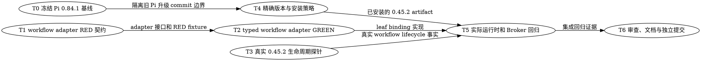

# pi-subagents 0.45.2 工作流迁移实施计划

> **供执行型 Agent 使用：** 必须先加载并遵循 `test-driven-development`；编码任务通过 `subagent-dispatch` 派发。步骤用复选框记录进度。

**目标：** 将本仓受控的 `pi-subagents` 从 `0.37.2` 迁移至 `0.45.2`，在不放宽 typed dispatch、Root Broker、Goal executor binding 与子进程隔离边界的前提下，适配新的公开 `workflowScript` 执行面。

**架构：** `pi-subagents@0.45.2` 已删除公开顶层 `agent/task` 执行，所有 execution 必须是 `workflowScript`。新增本仓私有的 workflow transport adapter，把既有 `dispatch-ir.v1` 和 generic facade 编译为一个固定键、一个异步 leaf 的 `runs.run(...)` 工作流；运行时只接受由 `subagent:async-started` 生命周期事件证明的 leaf `runId/asyncDir`，绝不把外层 workflow 的 handle 错当成 Executor。Root Broker、Goal binding、标题与 completion 继续绑定该 leaf。

**技术栈：** Node.js 22.19+、Pi `0.84.1`、`pi-subagents@0.45.2`、`typebox@1.1.38`、Pi JSONL RPC、Node 内置 test runner、npm 官方 registry。

## 决策记录

- **[目标版本]**：迁移到 npm `latest` 的 `pi-subagents@0.45.2`，而非此前探测过的 `0.45.1`。
- **推荐**：`0.45.2`，因为它不改变 `0.45.1` 的 workflow API，却修复 workflow child 的实际 `runId` 与 session file 持久化，正好支撑 Root Broker 的 leaf 证明。
- **不选原因**：`0.45.1` 会立即落后一个含绑定相关修复的补丁版本；继续固定 `0.37.2` 则不能获得新版行为。
- **选错代价**：workflow child 不能被精确绑定或恢复时暴露，修复代价高。

## 全局约束

- 精确目标为 `pi-subagents@0.45.2`；不接受 `0.45.x`、`latest` 或范围版本。
- Pi 保持 `0.84.1`，顶层 `typebox` 保持 `1.1.38`。
- 新版公开 execution payload 只能携带 `workflowScript`；不得有顶层 `agent`、`task`、`title` 或 `clarify`。`clarify: false` 也会被新版拒绝。
- coding leaf 的 upstream acceptance 固定为 `level: "checked"`；不得伪造 `verified` 的 `verify` 命令。本仓 criteria-only、child YAML evidence 与 Goal settle 仍是唯一的正式验收链路。
- workflow 外层与唯一 leaf 都必须 `async: true`、`worktree: false`，外层必须 `mission: false`、`chatProgress: "off"`；不得启用 upstream mission、schedule、worktree 或自动 UI 控制面。
- typed handle、Root Broker grant、Goal `bindSpawn`、title registry 和 completion 必须使用由 `workflowKey` 与 `parentWorkflowRunId` 相关联的 leaf `runId/asyncDir`；不得使用外层 workflow `runId` 猜测或替代 leaf。
- 未收到唯一、同 session、同 workflow key 的 leaf `subagent:async-started` 事件时必须 fail closed，并撤销监听；不得轮询猜测路径或把外层状态 artifact 当 leaf 身份。
- 不修改 `planned-goal`、不调用任何 Goal mutation、不操作 `.state/**`、不使用 raw `git worktree` 命令。
- 不读取或输出认证文件、npm 凭据、`pi/auth.json`；`pi/settings.json` 只可解析并原子修改唯一 `pi-subagents` package entry 的 `source` 字段，必须保留其余用户字段和未提交改动。
- 现有 Pi `0.84.1` 兼容补丁必须先以独立 commit 冻结；不把它、`pi/settings.json` 的既有改动或 `.state/worktree-lifecycle/` 混入本次 commit。

---

## 文件职责

- `scripts/lib/subagent-dispatch/workflow-spawn.ts`：本仓唯一的 typed/generic payload → upstream `workflowScript` 适配器，以及 leaf 生命周期相关器。
- `scripts/lib/subagent-dispatch/extension.ts`：调用适配器、等待并绑定真实 leaf handle，保持 Goal coordinator 与 title registry 的已有外部合同。
- `scripts/lib/subagent-dispatch/rpc-client.ts`：仅传输已规范化的 workflow payload；不再注入 `clarify:false` 或覆盖 caller 决定的 workflow `async` 字段。
- `scripts/lib/subagent-dispatch/runtime-membrane.ts`：把新版默认隐藏的成功 completion 仅在项目自有 notifier 通路提升为可见消息，仍屏蔽 upstream tool/command 注册。
- `pi/extensions/subagent-runtime.ts`：继续是唯一加载 upstream 的生产入口；验证其内部 import 和 completion notifier 在 `0.45.2` 下仍可用。
- `pi/extensions/lib/subagent-session-browser.ts`：把新版 `rejected` 视为 terminal state，避免浏览器 roster 永久显示已拒绝 workflow 为 active。
- `scripts/probes/pi-subagents-compat.mjs`、`scripts/doctor.mjs`：固定版本、RPC v1、workflow source contract 和依赖版本门禁。
- `pi/settings.json`、`init-pi.sh`、`scripts/setup-subagent-runtime-deps.mjs`、`pi/npm/package.json`：声明并安装精确的运行时组合；其中 `pi/npm/**` 是本地忽略安装状态，不进入 Git。
- `test/subagent-workflow-spawn.test.mjs`：适配器的 RED/GREEN、注入安全、leaf correlation、超时和冲突门禁。
- `test/subagent-dispatch-rpc.test.mjs`、`test/subagent-runtime-membrane.test.mjs`：transport、coding/generic facade 与 completion 显示行为。
- `test/pi-subagents-045-workflow.integration.mjs`：临时 prefix 中的真实 `0.45.2` workflow/RPC/lifecycle 事实探针。
- `test/pi-subagents-runtime.integration.mjs`、`test/root-subagent-broker.test.mjs`、`test/goal-engine-executor-binding.test.mjs`：真实 leaf Root Broker grant、terminal proof 与 Goal binding 回归。
- `test/pi-subagents-compat.test.mjs`、`test/doctor.test.mjs`、`test/init-pi.test.mjs`、`test/subagent-runtime-resource-isolation.test.mjs`、`test/subagent-session-browser.test.mjs`：版本、安装、隔离和 terminal state 回归。
- `docs/bugs/bug-pi-subagents-public-workflow-cutover-breaks-typed-dispatch.md`：中文六要素根因与安全边界。
- `README.md`、本计划：维护者版本策略、升级结果和回滚边界。

## DAG



### 并行调度组

- **Wave 0**：T0。它是提交边界，不是功能依赖；完成后不再把旧 Pi `0.84.1` 改动混入新工作。
- **Wave 1（可并行）**：T1、T3。T1 写本仓 adapter 的 RED 契约；T3 在临时 prefix 验证 upstream 的真实事实，二者没有共同写入路径。
- **Wave 2（按依赖触发）**：T2 依赖 T1；T4 依赖 T0。T2 与 T4 可并行，分别写 dispatch core 与版本策略。
- **Wave 3**：T5。只有 adapter、真实 upstream 生命周期和精确安装状态都已就绪后，才执行真实 Broker/Goal 回归。
- **Wave 4**：T6。只消费 T5 的证据，做最多两轮外源审查和精确暂存提交。

---

### Task 0：冻结已有 Pi 0.84.1 兼容补丁

**Deps:** none

**写入路径：**
- `README.md`
- `init-pi.sh`
- `scripts/doctor.mjs`
- `scripts/lib/subagent-dispatch/extension.ts`
- `scripts/probes/pi-subagents-compat.mjs`
- `test/custom-footer-input.integration.test.mjs`
- `test/doctor.test.mjs`
- `test/helpers/pi-tui.mjs`
- `test/init-pi.test.mjs`
- `test/pi-runtime.integration.mjs`
- `test/pi-subagents-compat.test.mjs`
- `test/subagent-runtime-production-shutdown.test.mjs`
- `test/subagent-session-viewport.test.mjs`
- `docs/bugs/bug-pi-0841-tui-and-reload-compatibility.md`
- `docs/bugs/bug-pi-compat-probe-assumes-homebrew-prefix.md`
- `docs/superpowers/plans/2026-08-10-pi-0841-upgrade.md`

**接口：**
- 消费：已有 `0.84.1` targeted test、真实 Pi integration 和外源审查记录；其中 Homebrew prefix 发现已由临时 npm root 的动态导入测试修复。
- 产出：一个只含 Pi `0.84.1` 兼容补丁的 commit；新迁移可从没有该补丁未提交噪声的索引开始。

**验收：**
- 不暂存 `pi/settings.json`、`.state/**`、`pi/npm/**` 或任何认证文件。
- `git diff --check` 通过，已有 targeted Pi/TUI/reload 套件通过。
- commit 使用 `git-commit-convention` 规定的格式，例如 `fix(pi): 兼容 0.84.1 TUI 与 reload 生命周期`。

- [ ] **Step 1：只读确认边界**

运行：

```bash
git status --short
git diff --check
```

预期：上述清单以外若有未提交文件，停止并向用户报告；`pi/settings.json` 与 `.state/worktree-lifecycle/` 必须保持未暂存。

- [ ] **Step 2：复跑既有 Pi 修复证据**

运行：

```bash
node --test --test-concurrency=1 \
  test/pi-subagents-compat.test.mjs \
  test/subagent-runtime-production-shutdown.test.mjs \
  test/custom-footer-input.integration.test.mjs \
  test/subagent-session-viewport.test.mjs
PI_REAL_BIN="$(command -v pi)" npm run test:integration
PI_REAL_BIN="$(command -v pi)" npm run test:subagents
```

预期：全部通过；不以全量 Goal Engine 的既有 fixture failure 代替此处证据。

- [ ] **Step 3：精确暂存并提交旧补丁**

仅对本 Task 的清单执行精确 `git add <path...>`；读取 `git diff --cached --name-only`，确认没有 `pi/settings.json`、`.state/`、`pi/npm/`。

运行：

```bash
git diff --cached --check
git commit -m "fix(pi): 兼容 0.84.1 TUI 与 reload 生命周期"
```

预期：只生成一个 Pi `0.84.1` commit；工作树仍保留用户自己的 settings/state 改动。

---

### Task 1：建立 workflow transport 的失败契约（RED）

**Deps:** none

**写入路径：**
- `docs/bugs/bug-pi-subagents-public-workflow-cutover-breaks-typed-dispatch.md`
- `test/subagent-workflow-spawn.test.mjs`

**接口：**
- 消费：`dispatch-ir.v1` 的 coding/generic input、`subagent:async-started` 事件事实、`0.45.2` 的公开 `workflowScript` 约束。
- 产出：后续实现必须满足的 `buildWorkflowSpawn(...)`、`createWorkflowChildStartCollector(...)` 和 `WorkflowSpawnError` 合同。

**验收：**
- 测试证明旧 `agent/task/clarify:false` payload 不能是公开上游请求。
- 生成的脚本在受控 `runs.run` 边界执行后保留含换行、引号和反引号的 task 原文，不发生 script injection。
- 只有同 workflow key、同 agent、同 session、且 `parentWorkflowRunId` 等于外层 root id 的 event 可以给出 leaf binding；超时、缺字段和冲突全部失败。

- [ ] **Step 1：先写中文六要素 bug 文档**

创建 `docs/bugs/bug-pi-subagents-public-workflow-cutover-breaks-typed-dispatch.md`，明确写出：

```markdown
## 现象
`pi-subagents@0.45.x` 拒绝现有 typed RPC spawn。

## 根因
公开执行面改为仅 `workflowScript`；本仓仍发送顶层 `agent`、`task`、`clarify:false` 与无 verify 的 `verified` acceptance。

## 影响
coding/generic dispatch、Root Broker leaf grant、Goal executor binding 和可见 completion 都可能失去精确身份。

## 不变量
leaf identity 只能来自匹配的 lifecycle event；不得伪造 verify、猜测 asyncDir 或启用 upstream mission/worktree。

## 修复策略
用本仓 adapter 编译单 leaf workflow，并在 RPC reply 与 lifecycle event 相关后才返回 handle。

## 回归测试
覆盖 payload、脚本转义、event race、冲突、超时、Root Broker 与真实 Pi integration。
```

- [ ] **Step 2：写最小 failing test**

新建 `test/subagent-workflow-spawn.test.mjs`，先导入尚不存在的模块：

```js
import {
  WorkflowSpawnError,
  buildWorkflowSpawn,
  createWorkflowChildStartCollector,
} from "../scripts/lib/subagent-dispatch/workflow-spawn.ts";
```

加入下列可观察行为：

```js
const task = 'line 1\nquote: " and backtick: `';
const request = buildWorkflowSpawn({
  workflowKey: "typed-request-1",
  agent: "executor",
  task,
  cwd: "/repo",
  context: "fresh",
  timeoutMs: 900_000,
  acceptance: { level: "checked", criteria: ["criterion"], evidence: ["commands-run"] },
});
assert.equal(Object.hasOwn(request, "agent"), false);
assert.equal(Object.hasOwn(request, "task"), false);
assert.equal(Object.hasOwn(request, "clarify"), false);
assert.equal(request.async, true);
assert.equal(request.mission, false);
assert.equal(request.worktree, false);
```

用 `node:vm` 在只暴露 `runs.run` 的 context 中执行 `request.workflowScript`；断言其一次接收键 `typed-request-1`，并接收精确 task、`async:true`、`worktree:false` 和 `level:"checked"` 的 child object。

再创建只含 `on/emit` 的最小事件总线，覆盖：先收到 event 后得到 root reply、先得到 root reply 后收到 event、错误 `parentWorkflowRunId`、重复但字段冲突的 event、超时。所有拒绝均断言 `error.code === "WORKFLOW_CHILD_BINDING_INVALID"` 或 `"WORKFLOW_CHILD_START_TIMEOUT"`。

- [ ] **Step 3：确认 RED**

运行：

```bash
node --test test/subagent-workflow-spawn.test.mjs
```

预期：因 `workflow-spawn.ts` 不存在而失败；不是测试拼写或 fixture 错误。

- [ ] **Step 4：记录 mutation 目标**

在测试注释中逐项命名会被捕获的生产错误：重新加入顶层 `clarify`、把 leaf id 换成 root id、丢失 task 原文、接受不同 parent 的 event、或接受没有 `asyncDir` 的 event。不得写只检查源码文本的 change-detector。

---

### Task 2：实现单 leaf workflow adapter 并接入 typed facade（GREEN）

**Deps:** Task 1（消费 `buildWorkflowSpawn` 和 collector 的 RED 契约）

**写入路径：**
- `scripts/lib/subagent-dispatch/workflow-spawn.ts`
- `scripts/lib/subagent-dispatch/extension.ts`
- `scripts/lib/subagent-dispatch/rpc-client.ts`
- `test/subagent-workflow-spawn.test.mjs`
- `test/subagent-dispatch-rpc.test.mjs`

**接口：**
- 消费：Task 1 的 workflow request 和 lifecycle collector；现有 `compileCodingDispatchIR`、`prepareSpawn/bindSpawn`、`titleRegistry`、RPC v1 `spawn`。
- 产出：coding/generic 调用仍向使用者返回 `{runId, asyncDir}`，其中两者都属于 leaf；上游只收到合法单 leaf `workflowScript` payload。

**验收：**
- coding/generic 均不把 `agent/task/title/clarify` 放在公开 RPC root。
- coding acceptance 是 `checked`，没有 `verify`；generic 只有在调用者本来提供合法 acceptance 时才透传，不自动升级到 `verified`。
- Root Broker/Goal binding/title registry 接收 leaf，而非 workflow root；任何 event correlation 不完整时不执行 `bindSpawn`。

- [ ] **Step 1：实现最小 workflow 模块**

创建 `scripts/lib/subagent-dispatch/workflow-spawn.ts`，只导出以下稳定接口：

```ts
export class WorkflowSpawnError extends Error {
  constructor(public code: "WORKFLOW_CHILD_BINDING_INVALID" | "WORKFLOW_CHILD_START_TIMEOUT", message: string) {
    super(message);
  }
}

export function buildWorkflowSpawn(input: {
  workflowKey: string;
  agent: string;
  task: string;
  cwd: string;
  context: "fresh" | "fork";
  timeoutMs: number;
  acceptance?: unknown;
  child?: Record<string, unknown>;
}): Record<string, unknown>;

export function createWorkflowChildStartCollector(
  events: { on(type: string, listener: (event: unknown) => void): (() => void) | void },
  expected: { workflowKey: string; agent: string; sessionId: string; timeoutMs: number },
): { waitFor(root: { runId: string }): Promise<{ runId: string; asyncDir: string }>; cancel(): void };
```

`buildWorkflowSpawn` 必须通过 `JSON.stringify` 序列化 key 与 child object，生成：

```js
return await runs.run("typed-request-1", { agent: "executor", task: "...", async: true, worktree: false });
```

其 root object 精确包含 `workflowScript`、`cwd`、`context`、`async:true`、`timeoutMs`、`artifacts:true`、`worktree:false`、`mission:false`、`chatProgress:"off"`；不得包含 `agent`、`task`、`title`、`clarify`、`chain`、`tasks`、`parallel` 或 `acceptance`。coding 的 acceptance 位于 child object，精确为 `level:"checked"` 加既有 criteria/evidence。

collector 必须在 `waitFor` 前开始监听并暂存同 key/agent/session 的候选；只接受 `event.parentWorkflowRunId === root.runId`，且从 `event.runId ?? event.id` 和 `event.asyncDir` 得到两个非空 string。相同 identity 的重复 event 可幂等；任一字段不同的重复 event、错误 parent、超时、监听器异常均 fail closed 并 unsubscribe。

- [ ] **Step 2：先让 Task 1 的 RED 转 GREEN**

运行：

```bash
node --test test/subagent-workflow-spawn.test.mjs
```

预期：全部通过，且 test 的 `vm` 执行显示原始 task 没有被改变或解释为脚本。

- [ ] **Step 3：接入 coding 和 generic 路径**

在 `extension.ts` 中按以下顺序改造 `executeCoding` 和 `executeGeneric`：

```ts
const dispatchId = identity?.spawnKey ?? createId();
const workflowKey = `typed-${dispatchId}`;
const collector = createWorkflowChildStartCollector(pi.events, {
  workflowKey,
  agent: requestedAgent,
  sessionId: (await rpc.ping()).session.sessionId,
  timeoutMs: 30_000,
});
try {
  const root = await rpc.spawn(buildWorkflowSpawn(/* ... */), identity);
  const binding = await collector.waitFor({ runId: workflowRootRunId(root) });
  // 只有这里之后才 bindSpawn、remember title 并返回 handle。
} finally {
  collector.cancel();
}
```

把 `spawnBinding` 拆为 `workflowRootBinding`（只验证 RPC root reply）和 `leafBinding`（只消费 collector），避免任何调用方意外把 outer `runId` 当 leaf。generic 的 `title` 只留在本仓 title registry；仅把上游 schema 已支持的 execution fields 显式放入 root 或 child object，未知 generic fields 继续由本仓 schema 拒绝或 upstream validation 拒绝，不能悄悄丢失。

在 `rpc-client.ts` 中将 `spawn` 改为只传递已经规范化的 `{ ...params }`；保留 `action` 拒绝，但不再注入 `clarify:false` 或强写 `async:true`。

- [ ] **Step 4：扩展 RPC/facade regression tests**

在 `test/subagent-dispatch-rpc.test.mjs` 将旧测试替换为“spawn 不篡改已规范化 workflow payload”；期望 emitted params 与输入完全相等，并明确没有 `clarify`。

在 `test/subagent-workflow-spawn.test.mjs` 的 facade fixture 中，让 fake RPC 的 `spawn` 同步或异步发出对应 `subagent:async-started` leaf event。断言：

```js
assert.equal(Object.hasOwn(spawn.params, "agent"), false);
assert.equal(Object.hasOwn(spawn.params, "task"), false);
assert.equal(Object.hasOwn(spawn.params, "clarify"), false);
assert.equal(spawn.params.async, true);
assert.equal(result.details.runId, "leaf-run-1");
assert.equal(result.details.asyncDir, "/tmp/leaf-run-1");
```

同一 fixture 再覆盖“收到 workflow root 但没有 matching leaf event 时不得调用 `bindSpawn`”和“matching leaf event 时传给 `bindSpawn` 的是 leaf identity”，避免与 Task 5 的真实 Goal integration test 竞争写入。

- [ ] **Step 5：确认 GREEN 和无回归**

运行：

```bash
node --test \
  test/subagent-workflow-spawn.test.mjs \
  test/subagent-dispatch-rpc.test.mjs
```

预期：全部通过；不得通过缩短 RPC 校验、取消 Root Broker proof 或把 outer workflow id 写入 Goal event 来达成。

---

### Task 3：以临时 prefix 固化 0.45.2 的真实 workflow lifecycle 事实

**Deps:** none

**写入路径：**
- `test/pi-subagents-045-workflow.integration.mjs`

**接口：**
- 消费：全局 Pi `0.84.1`、npm 官方 registry、deterministic provider fixture、`0.45.2` 的 RPC v1。
- 产出：真实 upstream 对 workflow root/leaf relationship、公开参数拒绝和 completion 形状的可复现事实；Task 5 只依赖该 test 的已通过证据，不依赖探索结论文字。

**验收：**
- 临时安装不改变 `pi/npm`、`pi/settings.json`、全局 npm config 或仓库源码。
- 在真实 Pi 中，含 `clarify:false` 的 workflow RPC 请求被拒绝；不含它的单 leaf workflow 请求可启动。
- event 中 leaf 的 `parentWorkflowRunId`、`workflowKey`、`runId`/`asyncDir` 可和 root reply 关联；不把跨进程 event bus 当 child 进程 IPC。

- [ ] **Step 1：写临时安装 helper 与 deterministic integration test（RED）**

在测试中用 `mkdtemp(join(tmpdir(), "pi-subagents-045-"))` 创建 temp root，运行：

```js
await execFile("npm", [
  "install", "--prefix", tempNpm, "--ignore-scripts", "--no-audit", "--no-fund",
  "pi-subagents@0.45.2", "typebox@1.1.38",
], { env: { ...process.env, NPM_CONFIG_REGISTRY: "https://registry.npmjs.org" } });
```

生成只读 probe extension：先用 RPC 请求 `{ workflowScript, clarify:false }` 并断言 `invalid_params`；再发送 root `{ workflowScript: 'return await runs.run("typed-probe", {agent:"compat-worker", task:"...", async:true, worktree:false})', async:true, mission:false, worktree:false }`。probe 必须在 spawn 前监听 `subagent:async-started`，收集 root reply 和 leaf event。

- [ ] **Step 2：运行并确认 RED**

运行：

```bash
PI_REAL_BIN="$(command -v pi)" node --test test/pi-subagents-045-workflow.integration.mjs
```

预期：在尚未实现 fixture/probe 前失败；失败原因必须是缺少该 integration fixture，而不是访问用户认证或真实网络模型。

- [ ] **Step 3：完成最小 fixture 并确认真实事实**

使用 `test/fixtures/deterministic-provider.mjs` 和 temp project `.pi/agents/compat-worker.md`，不调用真实模型。断言如下：

```js
assert.equal(rootReply.version, 1);
assert.equal(leaf.parentWorkflowRunId, rootReply.data.details.runId);
assert.equal(leaf.workflowKey, "typed-probe");
assert.equal(typeof (leaf.runId ?? leaf.id), "string");
assert.equal(typeof leaf.asyncDir, "string");
assert.notEqual(leaf.runId ?? leaf.id, rootReply.data.details.runId);
```

无论成功还是失败，`finally` 仅 `rm(tempRoot, { recursive:true, force:true })` 自己创建的 temp root；不得清理任何仓库或 worktree。

- [ ] **Step 4：确认 GREEN**

运行：

```bash
PI_REAL_BIN="$(command -v pi)" node --test test/pi-subagents-045-workflow.integration.mjs
```

预期：通过并留下零个该测试创建的临时前缀；若 event 事实与预期不符，停止后续版本安装，记录实际 artifact 后要求新的接口决策。

---

### Task 4：更新精确版本、安装策略和新版 terminal/completion 契约

**Deps:** Task 0（消费独立的旧 Pi upgrade commit 边界）

**写入路径：**
- `pi/settings.json`（仅匹配 package entry 的 `source` hunk）
- `pi/npm/package.json`（本地忽略状态）
- `init-pi.sh`
- `scripts/setup-subagent-runtime-deps.mjs`
- `scripts/doctor.mjs`
- `scripts/probes/pi-subagents-compat.mjs`
- `pi/extensions/lib/subagent-session-browser.ts`
- `scripts/lib/subagent-dispatch/runtime-membrane.ts`
- `README.md`
- `test/pi-subagents-compat.test.mjs`
- `test/doctor.test.mjs`
- `test/init-pi.test.mjs`
- `test/subagent-runtime-resource-isolation.test.mjs`
- `test/subagent-session-browser.test.mjs`
- `test/subagent-runtime-membrane.test.mjs`

**接口：**
- 消费：精确版本常量、现有 zero-resource `pi-subagents` settings entry、completion notifier factory、browser state classification。
- 产出：所有安装/Doctor/probe/test 声明精确一致地使用 `0.45.2`；新版 rejection/completion 行为不会绕开本仓 UI 与 terminal state。

**验收：**
- `typebox` 仍为 `1.1.38`，package resources 仍全部 `[]`，只有 `delegate` 保持上游可用。
- `rejected` 归类为 terminal；普通成功 completion 仍以项目自有可见 notification 呈现，不改变 upstream 全局隐藏语义以外的消息。
- `pi/settings.json` 除 package source hunk 外字节不变，且不泄漏本机 local path 或其他用户配置到 commit。

- [ ] **Step 1：先更新 version/state/completion tests（RED）**

将所有明确的 `0.37.2` 断言改为 `0.45.2`，包含：

```js
assert.equal(runtimePackage.dependencies["pi-subagents"], "0.45.2");
assert.equal(piSubagentsVersion, "0.45.2");
assert.ok(issues.includes("unexpected pi-subagents version: 0.35.1; expected 0.45.2"));
```

在 browser state test 增加：

```js
state.trackStarted({ id: "workflow-1", agent: "executor", asyncDir: "/tmp/w", cwd: "/repo" });
state.reconcileRun("workflow-1", { state: "rejected", steps: [{ agent: "executor", status: "rejected" }] });
assert.equal(state.snapshot().activeChildren.length, 0);
assert.equal(state.snapshot().recentChildren[0].state, "rejected");
```

在 membrane test 中向项目 notifier 发送 `{ customType:"subagent-notify", display:false }` 的 completed message，断言项目发送出去的 clone 为 `display:true`，原 message 不变；非 notifier/upstream bootstrap 的 hidden message 不得被普遍改写。

- [ ] **Step 2：确认 RED**

运行：

```bash
node --test \
  test/pi-subagents-compat.test.mjs \
  test/doctor.test.mjs \
  test/init-pi.test.mjs \
  test/subagent-runtime-resource-isolation.test.mjs \
  test/subagent-session-browser.test.mjs \
  test/subagent-runtime-membrane.test.mjs
```

预期：因旧版本常量、缺少 `rejected` 或尚未配置的 notifier display adapter 而失败。

- [ ] **Step 3：最小实现版本和行为变更**

将下列精确字符串统一更新为 `0.45.2`：

```text
init-pi.sh                         PI_SUBAGENTS_VERSION
scripts/setup-subagent-runtime-deps.mjs  pi-subagents@...
scripts/doctor.mjs                 PI_SUBAGENTS_VERSION
scripts/probes/pi-subagents-compat.mjs   report.version
```

将 `TERMINAL_STATES` 扩展为：

```ts
new Set(["complete", "completed", "failed", "paused", "stopped", "rejected", "detached", "timed-out"])
```

在 `runtime-membrane.ts` 为 completion notifier 专用的 `createHeadlessSubagentApi` 增加 `forceCompletionDisplay:true` 选项：仅当 `message.customType === "subagent-notify"` 时，以 clone 覆盖 `display:true`，不变更传入对象，也不改变 upstream bootstrap API 的 `suppressCompletionNotifications:true` 行为。

通过 JSON 解析验证 `pi/settings.json.packages` 恰有一个 `npm:pi-subagents@...` object entry；以原子临时文件只将它的 `source` 改为 `npm:pi-subagents@0.45.2`，保留所有其他键、数组顺序、文件 mode 和用户配置。匹配数不是一时 fail closed。

- [ ] **Step 4：更新本地忽略安装状态**

运行：

```bash
NPM_CONFIG_REGISTRY=https://registry.npmjs.org \
  PI_CODING_AGENT_DIR="$PWD/pi" \
  "$(command -v pi)" install "npm:pi-subagents@0.45.2"
NPM_CONFIG_REGISTRY=https://registry.npmjs.org npm run setup:subagent-runtime
node -p "require('./pi/npm/node_modules/pi-subagents/package.json').version"
node -p "require('./pi/npm/node_modules/typebox/package.json').version"
```

预期：依次输出 `0.45.2` 和 `1.1.38`；不暂存 `pi/npm/**`。

- [ ] **Step 5：确认 GREEN**

重跑 Step 2 命令；预期全部通过。再运行：

```bash
node scripts/doctor.mjs
```

预期：不报告版本、package resources、RPC v1 或 TypeBox 问题。

---

### Task 5：验证真实项目 runtime、Root Broker 和 Goal leaf binding

**Deps:** Task 2（leaf adapter）、Task 3（真实 lifecycle 事实）、Task 4（已安装 `0.45.2`）

**写入路径：**
- `pi/extensions/subagent-runtime.ts`（仅在真实 import/signature probe 证明需要时）
- `pi/extensions/lib/pi-subagents-browser-adapter.ts`（仅在真实 transcript/artifact probe 证明需要时）
- `test/pi-subagents-runtime.integration.mjs`
- `test/root-subagent-broker.test.mjs`
- `test/goal-engine-executor-binding.test.mjs`
- `test/subagent-runtime-production-shutdown.test.mjs`
- `test/pi-subagents-browser-adapter.test.mjs`

**接口：**
- 消费：Task 2 返回的 leaf handle、Task 3 的 upstream event facts、Task 4 的实际 installed package。
- 产出：真实 Pi 运行时中，Executor 的 child-only root owner extension、Root Broker、official terminal proof、Goal binding、browser transcript 和 reload cleanup 都继续绑定同一 leaf。

**验收：**
- top-level typed coding dispatch 在真实 Pi 中启动一条 leaf `executor`，而非只启动一个无 child 的 workflow；返回 handle 与 `subagent:async-started` leaf 完全一致。
- Root Broker 仅向该 leaf 发 grant，Goal 的 durable binding/terminal proof 使用该 leaf；workflow root id 不能满足 settle。
- workflow root/child completion 不产生重复可见完成消息；child completion 保留项目 title。

- [ ] **Step 1：写真实 integration RED**

在 `test/pi-subagents-runtime.integration.mjs` 的 deterministic RPC probe 中，将 top-level payload 改为调用项目 typed facade，而不是直接 `agent/task`。记录：

```js
assert.equal(details.handle.runId, details.startedLeaf.runId);
assert.equal(details.handle.asyncDir, details.startedLeaf.asyncDir);
assert.notEqual(details.workflowRoot.runId, details.handle.runId);
assert.equal(details.rootBrokerGrant.runId, details.handle.runId);
```

在 `test/root-subagent-broker.test.mjs` 增加一个 outer workflow id 与 inner executor id 不同的 fixture，断言 `inspectExecutorProof(outerWorkflowId) === null`，而 leaf id 可获得 proof。

- [ ] **Step 2：确认 RED**

运行：

```bash
PI_REAL_BIN="$(command -v pi)" node --test \
  test/pi-subagents-runtime.integration.mjs \
  test/root-subagent-broker.test.mjs \
  test/goal-engine-executor-binding.test.mjs \
  test/subagent-runtime-production-shutdown.test.mjs \
  test/pi-subagents-browser-adapter.test.mjs
```

预期：旧 direct transport 或错误 root/leaf identity 导致失败；不得跳过 Root Broker assertion 来取得 GREEN。

- [ ] **Step 3：只做被 RED 证明需要的最小修复**

若 `subagent-runtime.ts` 的四个既有内部 import（`index.ts`、`config.ts`、`notify.ts`、`session-identity.ts`）在 `0.45.2` 仍存在且签名兼容，不改它们；以 `test/pi-subagents-compat.test.mjs` 的实际 import 验证为准。

若真实 probe 显示 workflow root completion 与 leaf completion 双发，则在项目 notifier 边界按 `parentWorkflowRunId/workflowKey` 抑制 root-only 通知，保留 leaf 的 `runId` title；不得过滤失败、暂停或 stopped leaf 通知。若不存在重复，则不增加过滤逻辑。

- [ ] **Step 4：确认 GREEN**

重跑 Step 2 命令，并运行：

```bash
PI_REAL_BIN="$(command -v pi)" npm run test:integration
PI_REAL_BIN="$(command -v pi)" npm run test:subagents
```

预期：真实 RPC、completion、Supervisor、Root Broker、official terminal proof、browser adapter 与 reload cleanup 均通过。

---

### Task 6：审查、文档收尾与精确迁移提交

**Deps:** Task 5（消费完整集成证据）

**写入路径：**
- `README.md`
- `docs/bugs/bug-pi-subagents-public-workflow-cutover-breaks-typed-dispatch.md`
- `docs/superpowers/plans/2026-08-10-pi-subagents-0452-workflow-migration.md`
- 本次 Tasks 1–5 的已列文件

**接口：**
- 消费：通过的 targeted tests、Doctor、真实 Pi integration 和本地版本输出。
- 产出：中文维护者说明、最多两轮外源审查记录和一个不含用户既有改动的 migration commit。

**验收：**
- README 明确 Pi `0.84.1` + `pi-subagents@0.45.2` + `typebox@1.1.38` 是已验证组合，并说明 `workflowScript` 适配层和 leaf binding。
- 外源 review 只接收本次安全筛选后的 diff，不含 `pi/settings.json` 的用户 hunk、`.state/**`、`pi/npm/**` 或认证内容。
- staged diff 只含本次迁移；若 `pi/settings.json` 不能精确隔离 source hunk，则不提交并明确报告。

- [ ] **Step 1：更新 README 与根因文档**

README 写明：公开 upstream workflow ABI 不直接暴露给本仓 agent；`workflowScript` 仅在私有 adapter 内生成；用户升级后必须重新开启 Pi session。根因文档记录 `0.45.2` 的 leaf correlation、`checked` acceptance、`mission:false`、`worktree:false`、completion display 与 rollback。

- [ ] **Step 2：运行完整相关回归**

运行：

```bash
node --test \
  test/subagent-workflow-spawn.test.mjs \
  test/subagent-dispatch-rpc.test.mjs \
  test/subagent-runtime-membrane.test.mjs \
  test/pi-subagents-045-workflow.integration.mjs \
  test/pi-subagents-compat.test.mjs \
  test/pi-subagents-runtime.integration.mjs \
  test/root-subagent-broker.test.mjs \
  test/goal-engine-executor-binding.test.mjs \
  test/subagent-runtime-production-shutdown.test.mjs \
  test/pi-subagents-browser-adapter.test.mjs \
  test/subagent-runtime-resource-isolation.test.mjs \
  test/subagent-session-browser.test.mjs \
  test/doctor.test.mjs \
  test/init-pi.test.mjs
node scripts/doctor.mjs
npm test
```

预期：targeted suites 和 Doctor 全通过；若 `npm test` 剩余已知 Goal Engine/本机设置基线失败，逐项列出并证明没有 `pi-subagents` migration signature，不能把新失败标作基线。

- [ ] **Step 3：执行最多两轮安全外源审查**

加载 `external-llm-review`。创建只含本次已列源码、测试、文档的临时 sanitized Git repository，明确排除 `pi/settings.json`、`.state/**`、`pi/npm/**`、auth/config secrets。先运行 exhaustive Round 1；若发现有证据的 Critical/Important 并完成修复与回归，最多执行 Round 2。逐项进行 threat-model 复核，不把外源推测直接视为事实。

- [ ] **Step 4：精确暂存与提交**

先运行：

```bash
git diff --check
git status --short
git diff --cached --check
```

只暂存本次 Tasks 1–6 的精确路径。`pi/settings.json` 必须先从 `HEAD` 创建只改变匹配 `pi-subagents` source 的最小 patch，再 `git apply --cached`；随后验证：

```bash
git diff --cached -- pi/settings.json
git diff --cached --name-only
```

预期：settings cached diff 只含 `npm:pi-subagents@0.37.2` → `npm:pi-subagents@0.45.2`；没有其他用户字段。加载 `git-commit-convention` 后创建：

```bash
git commit -m "feat(subagents): 适配 0.45.2 workflow dispatch"
```

- [ ] **Step 5：交付与回滚说明**

报告精确版本、实际通过命令、外源 review 结论、未触碰的 Goal/用户设置，以及失败时的回滚：

```bash
NPM_CONFIG_REGISTRY=https://registry.npmjs.org \
  PI_CODING_AGENT_DIR="$PWD/pi" \
  "$(command -v pi)" install "npm:pi-subagents@0.37.2"
NPM_CONFIG_REGISTRY=https://registry.npmjs.org npm run setup:subagent-runtime
```

回滚后重新开启 Pi session；不得通过重启替代未完成的 Root Broker/leaf binding 修复。

## 自检

- **范围覆盖：** T1/T2 处理公开 workflow cutover、脚本安全、criteria-only acceptance 和 typed leaf handle；T3 固化真实 upstream 行为；T4 处理版本/安装/状态/通知；T5 覆盖 Root Broker、Goal、reload、browser 与真实 Pi；T6 覆盖文档、审查、commit 与回滚。
- **依赖合理性：** T2 仅依赖 T1 的接口/RED fixture；T5 仅依赖 adapter、真实 event facts和安装 artifact；T4 不阻塞 T1/T3；没有以“同一执行者方便”为理由添加依赖。
- **并发安全：** T1/T3 写入不同文件；T2 与 T4 写入不同主要路径。T5 是唯一处理跨模块语义合并的任务。
- **占位符扫描：** 每个 task 都给出精确文件、接口、RED/GREEN 命令、失败条件和提交边界；没有未决占位性表述。
- **安全边界：** 不伪造 upstream verification、不放宽 criteria-only、不使用 workflow root 代替 leaf、不启动未授权 worktree、不将 user settings 或 secrets 交给审查器。
