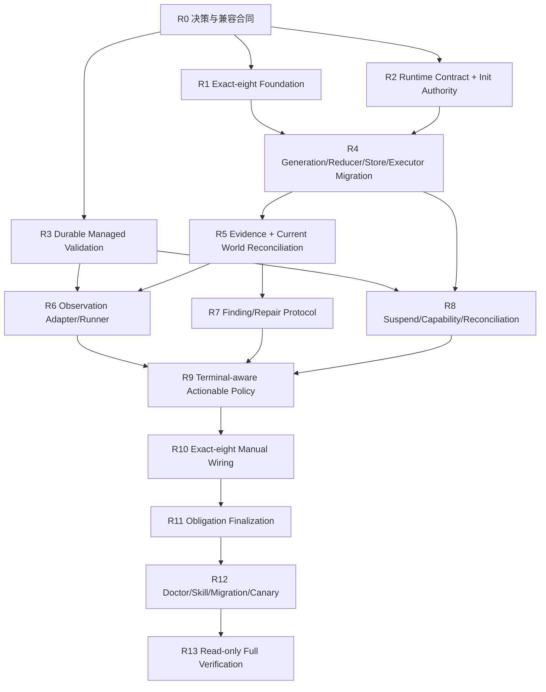

# Goal Obligation Runtime 实施计划

> **For agentic workers:** REQUIRED SUB-SKILL: Use superpowers:subagent-driven-development (recommended) or superpowers:executing-plans to implement this plan task-by-task. Steps use checkbox (`- [ ]`) syntax for tracking.

**Goal:** 在不改变 `planned.v1` 历史语义的前提下，新增 `goal-runtime.v1` 持久化协议，使同一 Goal 能同时维护不可漏项的计划任务与可失效的状态条件，并通过可恢复 Observation、Finding、Repair Episode、用户授权修订和纯账本终审形成安全的手动收敛闭环。

**Architecture:** Task 与 Condition 是两类不同的 obligation：Task 通过受管 Executor/Workspace/Settlement/Acceptance满足交付承诺，Condition 通过 Host-owned Observation 和 fresh evidence证明当前世界状态。新的 runtime Goal 先进入 draft/readiness，只有用户批准 canonical contract 后才激活；每次状态决策先重建 Current World Snapshot并级联失效旧证据。`goal_finalize` 不运行业务 Oracle，只校验已经通过普通 Condition 生命周期产生的 fresh evidence与可恢复外源评审。

**Tech Stack:** Node.js ESM、Pi typed tools/Host lifecycle、append-only JSONL events、managed worktree/validation lease、Root Broker owned-run control、内容寻址 evidence、Git NUL-safe snapshot、`node:test`。

## 已批准决策

1. `planned.v1` 永久保留“最后一个 Task accept 后自动完成”的现有语义；`goal_finalize` 只用于新 `goal-runtime.v1`。
2. Runtime Goal 必须经过 `draft → readiness_ready → awaiting_user_approval → calibrating → active`，用户批准绑定 contract hash、base HEAD、session 和 proposal ID。
3. Observation 不扩张 Root Broker 为通用命令执行器；先从 `acceptance-runner.mjs` 抽取可恢复 managed-validation service。
4. 用户中断不得等待旧 Executor 自然结束；先 durable suspend/revoke，再 typed stop 或 quarantine 受影响资源。
5. 第一版只作为 **manual preview**；auto-continuation 在本计划完成后另立计划。

## Global Constraints

- 开始 R1 生产实现前，必须完成当前 `planned-goal` bootstrap；本计划不得通过 amend 塞入其明确排除 `goal_finalize`、idle 与 Convergent 的 scope。
- 历史 `goal-engine.event.v1/v2/v3` 与当前 `planned.v1` 继续按原 generation replay/mutate；不得原地升级、混写或改变 completion protocol。
- Root Goal ABI在 R1 后精确为八工具：`goal_init/status/dispatch/settle/integrate/accept/amend/finalize`；不得新增 `goal_observe` 或第九个工具。
- 任何 production/Skill 逻辑修改必须先新增或补全中文 `docs/bugs/bug-*.md`，再写 tests-only RED、观察正确失败、最后最小 GREEN。
- 新 Runtime 输入必须显式含 `execution.schema="goal-runtime.v1"`；旧顶层 `{ objective, tasks }` branch继续创建 `planned.v1`。`tasks + execution` 混传在append前拒绝。
- 调用者不提供权威 `profile`。projection中的 `initialShape: planned | convergent | hybrid` 由 normalized tasks/conditions派生，只用于审计和显示。
- Task accepted 是不可改写的历史事实。Task 对当前 execution revision 的适用性保存在独立 `taskApplicability`；代码或环境变化只会使 Condition evidence stale，不回退 Task status。
- 第一版 obligation activation边仅允许 `TaskRef → Condition` 与 `ConditionRef → Condition`；Planned Task不得依赖Condition。Repair Task通过因果字段 `repairs(conditionId,findingId,episodeId)`关联，不属于 activation DAG。
- Condition verdict、finding与stability只能由Host adapter artifact派生；Agent不得提交 verdict、finding正文、process terminal proof或最终evidence hash。
- Contract只保存注册引用与脱敏摘要，不保存 executable、args、env value、token、cookie、authorization header、完整日志或任意 shell command。
- 所有 coding remediation继续走 bug-first、TDD、criteria-only dispatch、Root Broker binding、双路径 settlement、typed integrate和task accept；Repair Episode不提供自由写代码能力。
- Runtime Goal的 committed contract、Tasks、Conditions、Objective、Scope、Non-Goals、DoD或write policy变更必须经过canonical proposal、challenge后真实 interactive/RPC用户批准和单次capability。
- 用户交互式 steer/follow-up/abort命中 active Goal 时，Host先持久化suspension并撤销action offer；受影响owned run必须typed stop并取得official terminal proof，workspace只能quarantine/preserve/discard，不能继续integrate。
- 每次 `goal_status`、mutation和`goal_finalize` 前必须构造 Current World Snapshot；HEAD、dirty tracked/untracked、sequencer、adapter/environment/fixture版本、资源lease或上游Condition任一无法证明时fail closed。
- `goal_finalize` 不启动新Observation、不重跑业务流程。最后一次业务复验仍通过普通Condition action完成；finalize只做账本、资源、Current World Snapshot和可恢复外源review校验。
- Observation process lifecycle必须是 `requested → lease_allocated → process_bound → terminal → recorded → released`；每个crash边界可inspect/recover，无法证明时保留资源并标cleanup debt。
- Adapter声明资源claims（key/mode/capacity/reset）；资源竞争由lease调度，不得伪装成DAG依赖。
- Manual preview不宣称无人值守自治。后续auto-continuation只能复用本计划的`nextObligationAction()`和完成谓词，不得另造状态语义。
- 禁止raw Git worktree mutation、直接编辑`.state/goal-engine/**`、宽泛staging、`git -C`、`GIT_DIR/GIT_WORK_TREE`、stash、reset、restore、rebase、amend或force cleanup。

## 旧计划处置

本计划是Convergent/Hybrid与新finalization的实施权威：

- `docs/superpowers/plans/2026-08-07-convergent-goal-execution.md` 标记为 superseded，不得派发其Task。
- `docs/superpowers/plans/2026-08-05-goal-finalization-gate.md` 标记为 superseded；其外源review与manifest思想由R1/R11重写，旧v4 generation假设废弃。
- `docs/superpowers/plans/2026-08-05-goal-idle-continuation-guard.md` 保留为历史输入但暂停执行；manual preview完成后另写基于obligation frontier的auto-continuation计划。

## 目标架构

```text
Goal Contract（版本化、用户批准）
├── Objective / Scope / Non-Goals / DoD
├── writePolicy.allowedPaths
├── executionRevision / contractHash
└── budgets / remediation authority
                 │
                 ▼
Obligation Graph
├── Task
│   ├── kind = planned | remediation
│   ├── status = existing Task FSM
│   └── applicability = applicable | superseded | reverify_required
└── Condition
    ├── dependsOn = TaskRef | ConditionRef
    ├── enforcement = pre_integrate | continuous | final
    └── satisfaction = fresh evidence + stability window
                 │
                 ▼
Runtime Episodes
├── ObservationRun（可恢复managed-validation协议）
├── Finding（Host从artifact派生）
└── RepairEpisode（Finding与remediation Task的因果容器）
                 │
                 ▼
Current World Reconciliation
├── Git HEAD / dirty / sequencer / ancestry
├── adapter / environment / fixture revisions
├── resource leases / active processes
└── predecessor Condition freshness cascade
                 │
                 ▼
Goal Finalization（纯账本终审，不运行业务Oracle）
```

## 稳定接口

### Generation capability matrix

禁止在production继续散落`eventSchemaVersion === "planned.v1"`判断。R4必须提供：

```js
generationCapabilities(schemaVersion) => Object.freeze({
  taskContract: "legacy-commands" | "criteria-only",
  executorBinding: "legacy" | "strict",
  settlement: "legacy" | "dual-path",
  completion: "accept-auto" | "goal-finalize",
  conditions: boolean,
  executionRevision: boolean,
});
```

固定矩阵：

| Generation | Task contract | Executor | Settlement | Completion | Conditions | Execution revision |
|---|---|---|---|---|---|---|
| `goal-engine.event.v1/v2/v3` | legacy-commands | legacy | legacy | accept-auto | false | false |
| `planned.v1` | criteria-only | strict | dual-path | accept-auto | false | false |
| `goal-runtime.v1` | criteria-only | strict | dual-path | goal-finalize | true | true |

历史 `goal-engine.event.v1/v2/v3` 的 capability 固定返回上述 union 内值；各历史 codec 仍按原代际 replay/mutate，禁止原地升级、混写或以字符串 fallback 代替 codec。

### Runtime init

```ts
type RuntimeGoalInit = {
  objective: string;
  scope?: string[];
  non_goals?: string[];
  dod?: string[];
  execution: {
    schema: "goal-runtime.v1";
    tasks?: PlannedTask[];
    conditions?: GoalCondition[];
    write_policy: { allowed_paths: string[] };
    budgets: {
      max_observations: number;
      max_repairs: number;
      max_elapsed_minutes: number;
      max_no_progress: number;
    };
  };
};
```

`tasks`与`conditions`至少一项非空。`initialShape`按以下规则派生：仅tasks=`planned`；仅conditions=`convergent`；两者均有=`hybrid`。

### Obligation refs 与 Condition

```ts
type ObligationRef =
  | { kind: "task"; id: string }
  | { kind: "condition"; id: string };

type GoalCondition = {
  id: string;
  role: "terminal" | "invariant";
  enforcement: "pre_integrate" | "continuous" | "final";
  statement: string;
  observable: string;
  expected: string;
  depends_on: ObligationRef[];
  oracle_ref: string;
  environment_ref: string;
  fixture_refs: string[];
  invalidation: {
    paths: string[];
    task_ids: string[];
  };
  remediation: {
    policy: "autonomous" | "user-approved";
    allowed_paths: string[];
    max_attempts: number;
  };
  stability:
    | { mode: "single"; require_fresh_environment: true }
    | { mode: "consecutive"; count: number; require_distinct_environment: true };
};
```

- `single`仅允许Host adapter声明`deterministic=true`且用户批准的contract使用；其余Condition必须`consecutive`且`count>=2`。
- `invariant + pre_integrate`必须在integrate前验证；无法前置验证的invariant只能显式使用`continuous`或`final`，不能冒充硬guard。
- `invalidation.paths=[]`表示任何repository source/config变化都失效，不表示永不失效。
- `remediation.allowed_paths`必须是`execution.write_policy.allowed_paths`的子集。

### Runtime projection

```ts
type RuntimeProjectionFields = {
  runtimeGeneration: "goal-runtime.v1";
  initialShape: "planned" | "convergent" | "hybrid";
  executionRevision: number;
  executionContractHash: string;
  readiness: "draft" | "ready" | "needs_clarification" | "environment_blocked" | "unsafe_to_run";
  runtimeState: "draft" | "awaiting_user_approval" | "calibrating" | "active" | "suspended" | "attention_required" | "ready_for_finalization";
  writePolicy: { allowedPaths: string[] };
  taskApplicability: Map<string, {
    revision: number;
    state: "applicable" | "superseded" | "reverify_required";
    reason: string | null;
  }>;
  conditions: Map<string, ConditionState>;
  observationRuns: Map<string, ObservationRunState>;
  findings: Map<string, FindingState>;
  repairEpisodes: Map<string, RepairEpisodeState>;
  suspension: SuspensionState | null;
  convergenceBudget: ConvergenceBudgetState;
};

type ConditionState = {
  definition: GoalCondition;
  status: "inactive" | "unsatisfied" | "observing" | "satisfied" | "stale" | "blocked";
  supportingEvidenceIds: string[];
  lastObservationRunId: string | null;
  invalidationReason: string | null;
};

type ObservationRunState = {
  runId: string;
  conditionId: string;
  cycle: number;
  phase: "requested" | "lease_allocated" | "process_bound" | "terminal" | "recorded" | "released" | "cleanup_debt";
  allocationId: string | null;
  leaseReceiptHash: string | null;
  processIdentityHash: string | null;
  terminalProofHash: string | null;
  evidenceId: string | null;
};

type FindingState = {
  findingId: string;
  conditionId: string;
  observationRunId: string;
  fingerprint: string;
  status: "open" | "repairing" | "reverification" | "resolved" | "rejected_by_user";
  episodeId: string | null;
};

type RepairEpisodeState = {
  episodeId: string;
  conditionId: string;
  findingIds: string[];
  remediationTaskIds: string[];
  status: "active" | "waiting_for_tasks" | "reverifying" | "resolved" | "blocked" | "cancel_pending" | "cancelled";
  cancellation: {
    ownedTaskIds: string[];
    ownedRunIds: string[];
    terminalProofRefs: string[];
    workspaceClosureProofRefs: string[];
    resourceClosureProofRefs: string[];
    resourceDebt: boolean;
  } | null;
};

type SuspensionState = {
  suspensionId: string;
  reason: "interactive_steer" | "follow_up" | "abort" | "execution_amendment" | "host_pause";
  affectedTaskIds: string[];
  affectedRunIds: string[];
  requestedAt: string;
  resourcesQuarantined: boolean;
};

Observation identity 一律使用 `runId`：`ConditionState.lastObservationRunId`、`FindingState.observationRunId`、`ObservationRunState.runId` 与 observation/finding/repair event payload 均指向同一 `runId`；不得使用未定义的 `observationId`。`allocationId` 在 `requested` 为 `null`，仅自 `lease_allocated` 起非空。

取消先进入 durable `cancel_pending`；仅在关联 owned tasks/runs 全部 terminal，且每个受影响 workspace/resource 都有 quarantine 或 release proof 后，才可进入 `cancelled`。
```

### Current World Snapshot

```ts
type CurrentWorldSnapshot = {
  repo: {
    root: string;
    head: string;
    branch: string | null;
    trackedDirty: string[];
    untracked: string[];
    sequencer: string | null;
  };
  adapters: Array<{ ref: string; version: string }>;
  environments: Array<{ ref: string; fingerprint: string; available: boolean }>;
  fixtures: Array<{ ref: string; fingerprint: string; available: boolean }>;
  resources: Array<{ key: string; holders: string[]; capacity: number }>;
  activeRuns: Array<{ runId: string; kind: "executor" | "observation"; state: string }>;
  capturedAt: string;
};
```

Snapshot构建失败、Git status未知、相关dirty/untracked、non-ancestor、adapter/environment/fixture不可用或资源identity冲突，都不能被解释为fresh。

### Managed validation service

```js
prepareManagedValidation(input)       // durable intent, no process
startManagedValidation(prepared)      // bind process identity
inspectManagedValidation(receipt)     // read-only status/proof
recoverManagedValidation(receipt)     // adopt/terminal/cleanup-debt decision
releaseManagedValidation(receipt)     // owner-CAS release
```

Lease phase与Observation event phase必须一一对应。每次外部副作用前先有durable intent；崩溃后以lease+process identity为authority，不依赖内存Promise。

### User capability

```ts
type UserExecutionCapability = {
  prefix: "goal-user-capability.v1";
  goalId: string;
  executionRevision: number;
  proposalId: string;
  proposalHash: string;
  sessionId: string;
  userEntryId: string;
  nonce: string;
  singleUse: true;
};
```

它与`goal-action.v1:`使用不同前缀和验证器。`execution.amendment_capability_consumed`事件必须与apply batch原子提交。

### Observation verdict

```ts
type ObservationVerdict =
  | { kind: "passed"; evidenceId: string }
  | { kind: "failed"; evidenceId: string; failureCode: string; findingFingerprint: string }
  | { kind: "inconclusive"; evidenceId: string; reason: string }
  | { kind: "infrastructure_error"; reason: string };
```

只有`failed`可产生产品Finding；`inconclusive/infrastructure_error`进入blocked/attention，不创建remediation Task。

### Finalization predicate

```text
all applicable planned/remediation tasks accepted or explicitly superseded
AND all required conditions have fresh supporting evidence at current world snapshot
AND each stability policy is independently auditable from evidence history
AND no open/repairing/reverification finding
AND 无 active/blocked/cancel_pending Repair Episode，且无任何 `cancelled` Episode 的 `cancellation.resourceDebt`
AND no active observation/executor/workspace/process/resource/cleanup debt
AND no suspension, pending human decision or untriaged discovery
AND execution revision/capability/action offer are current
AND recoverable external final review has no Critical/Important
```

`goal_finalize`不得调用Observation adapter；若Condition stale，`goal_status`必须先签发普通observation action。

## Event contract

`goal-runtime.v1`增加：

```text
goal.runtime_drafted
goal.runtime_readiness_recorded
goal.runtime_approval_recorded
goal.runtime_activated
goal.runtime_suspended
goal.runtime_resumed
condition.observation_requested
condition.observation_lease_allocated
condition.observation_process_bound
condition.observation_terminal
condition.observation_recorded
condition.observation_released
condition.evidence_invalidated
finding.recorded
finding.status_changed
repair.episode_opened
repair.task_linked
repair.reverification_requested
repair.episode_resolved
repair.episode_cancel_requested
repair.episode_cancelled
task.applicability_changed
execution.amendment_proposed
execution.amendment_approved
execution.amendment_capability_consumed
execution.amendment_applied
goal.final_review_started
goal.final_review_recorded
goal.completed
```

finding/repair payload 必填 `findingId`、`conditionId`、`runId`、`evidenceId`、`fingerprint`、`episodeId`、关联 remediation task IDs/runs、旧/新状态与原因；取消请求另含 terminal proof、workspace quarantine/release proof、resource quarantine/release proof 与 `resourceDebt`。

`ready_for_finalization`是动态派生状态，不新增权威`condition.ready_for_finalization`事件。

## Model-facing operations

Root工具仍为exact-eight。Runtime使用`goal_amend` strict variants：

```text
activate_runtime
start_observation
record_observation
materialize_repair
propose_execution_change
apply_execution_change
suspend_runtime
resume_runtime
```

- `goal_init` runtime branch只创建draft，不授予写入或启动进程。
- `activate_runtime`必须同时消费engine action token与user capability；随后进入calibrating。
- Cycle 0通过普通Observation process protocol校验adapter/reset/resource/环境可判定性，但不生成产品Finding。
- `start_observation`不接受command/verdict；`record_observation`只接受run/condition/artifact引用，Host重新读取authority。
- `materialize_repair`只接受Host-confirmed finding/episode，Task WritePaths受writePolicy和Condition remediation scope双重约束。
- `apply_execution_change`必须在affected run terminal、workspace quarantine、capability有效时执行。
- `goal_accept`只处理Task；`planned.v1`保持自动complete，`goal-runtime.v1`永不由accept完成。

## 文件职责

| 文件 | 职责 |
|---|---|
| `scripts/lib/goal-engine/generation-capabilities.mjs` | 代际能力矩阵，替代字符串分支 |
| `scripts/lib/goal-engine/obligation-contract.mjs` | runtime contract、write policy、Condition、readiness normalize/hash |
| `scripts/lib/goal-engine/current-world.mjs` | Git/adapter/environment/fixture/resource snapshot |
| `scripts/lib/goal-engine/condition-evidence.mjs` | evidence codec、CAS、finding fingerprint、stability history |
| `scripts/lib/goal-engine/condition-validity.mjs` | freshness、path overlap、predecessor cascade、task applicability |
| `scripts/lib/goal-engine/managed-validation.mjs` | durable validation prepare/start/inspect/recover/release |
| `scripts/lib/goal-engine/observation-adapters.mjs` | registered adapter与resource claims |
| `scripts/lib/goal-engine/observation-runner.mjs` | Observation event/lease/process/artifact协调 |
| `scripts/lib/goal-engine/repair-policy.mjs` | Finding/RepairEpisode/remediation Task合法转换 |
| `scripts/lib/goal-engine/suspension.mjs` | durable suspend、stop plan、quarantine proof |
| `scripts/lib/goal-engine/reconciliation.mjs` | proposal hash与keep/supersede/add/reverify计划 |
| `scripts/lib/goal-engine/obligation-policy.mjs` | terminal-aware actionable frontier与machine action选择 |
| `scripts/lib/goal-engine/finalization.mjs` | pure ledger manifest/predicate |
| `scripts/lib/goal-engine/final-review.mjs` | recoverable external review |
| `scripts/lib/goal-engine/events.mjs` | runtime event reducer与immutable history |
| `scripts/lib/goal-engine/store.mjs` | runtime projection snapshot与atomic batches |
| `scripts/lib/goal-engine/extension.mjs` | exact-eight typed tools、Host lifecycle wiring |

## DAG



### 依赖边理由

- `R0 → R1/R2/R3`：代际、实体、authority与crash协议先冻结，三个基础切片才能并行。
- `R1,R2 → R4`：reducer/store/executor必须同时知道exact-eight completion边界与runtime contract。
- `R4 → R5`：World reconciliation依赖可序列化projection和完整generation capability。
- `R3,R5 → R6`：Observation必须建立在可恢复validation与freshness authority之上。
- `R5 → R7`：Finding/Repair只能从canonical failed evidence派生。
- `R3,R4 → R8`：suspend/reconciliation必须同时控制owned process与event-sourced execution revision。
- `R6,R7,R8 → R9`：policy要看到terminal Observation、Repair和Suspension事实，不能猜动作。
- `R9 → R10`：Extension只在纯策略稳定后一次接线，避免多个任务并发修改热点。
- `R10 → R11`：finalization必须验收真实manual闭环，但不启动新的Observation。
- `R11 → R12 → R13`：Doctor/Skill/canary针对最终ABI；最终任务只运行测试和写summary。

## 并行调度组（Wave）

- **Wave 0:** R0。
- **Wave 1:** R1、R2、R3并行。
- **Wave 2:** R4。
- **Wave 3:** R5、R8并行（R8的前驱R3/R4已完成即可派发）。
- **Wave 4:** R6、R7并行。
- **Wave 5:** R9。
- **Wave 6:** R10。
- **Wave 7:** R11。
- **Wave 8:** R12。
- **Wave 9:** R13。

Wave不是派发屏障；全部前驱完成即可派发。R1/R2/R3与R5/R8的production WritePaths不重叠；`extension.mjs`只在R1、R10、R11按依赖顺序修改。

## 发布切片

- **M0 兼容基础（R0–R4）**：root exact-eight存在但`planned.v1`永不签发finalize；runtime draft/reducer可回放，严格Task协议不退化。
- **M1 内部canary（R5–R10）**：可手动完成Observation→Finding→Repair→Reobserve与用户中断恢复，但不得宣称Goal完成。
- **M2 Manual Preview（R11–R13）**：runtime finalize、双session/reload/crash恢复、局部收敛canary、Doctor/Skill/全量回归完成。
- **Auto-continuation**：M2稳定后独立计划；不得纳入本Goal临时追加。

## Subagent-Driven 执行协议

本计划不由任何Goal自举，固定采用Subagent-Driven执行：

1. 先完成当前`planned-goal`的原始scope；在它active期间不得开始R1 production修改。当前Goal完成后，不为R0–R13创建新的Goal。
2. 主Agent只读取本计划`Deps`构建DAG、派发Executor、核对terminal proof、处置managed workspace、运行必要的主工作区回归并形成验收决策；不直接实施production coding。
3. 每个coding任务使用完整`dispatch-ir.v1`、criteria-only acceptance与独立managed worktree；由Executor严格执行bug文档→tests-only RED→最小GREEN。禁止自由文本coding派发。
4. 无依赖任务按DAG并行派发；有前驱的任务只在所需产物已集成并验收后派发。并行写路径重叠时不抢写，按本计划既定接口或专门顺序集成处理。
5. 子任务完成不等于可合入。主Agent先读取official terminal/workspace proof，再使用typed subagent workspace disposition；不得raw worktree或Git清理。
6. R1之后每个中间提交仍必须保持`planned.v1` replay、action token、Executor contract、settlement与completion向后兼容，但该兼容性由tests和fresh child Pi Host验证，不由active Goal自证。
7. R10–R12的新runtime canary必须使用独立临时Git repository、独立state root与fresh child Pi Host，不得复用当前cwd的Goal events、session、worktree或resource lease。
8. R13通过后才重启主Pi Host、运行exact-eight Doctor并允许创建第一个production `goal-runtime.v1` Goal。Auto-continuation继续另立计划。

直接使用`planned.v1`或`goal-runtime.v1`管理R0–R13均视为循环控制面风险，明确禁止。

---

### R0: 冻结代际、实体、authority 与 crash 协议

**Deps:** none

**Workflow:** docs-only

**WritePaths:**
- `docs/superpowers/specs/2026-08-13-goal-obligation-runtime-design.md`
- `docs/superpowers/plans/2026-08-13-goal-obligation-runtime.md`
- `docs/superpowers/plans/2026-08-07-convergent-goal-execution.md`
- `docs/superpowers/plans/2026-08-05-goal-finalization-gate.md`
- `docs/superpowers/plans/2026-08-05-goal-idle-continuation-guard.md`

**Interfaces:** 产出本计划“稳定接口”的逐字段设计、capability matrix、runtime entity FSM、managed-validation crash matrix与旧计划superseded标记。

- [x] 在design spec逐项复制并解释本计划的generation matrix、RuntimeGoalInit、GoalCondition、Projection states、CurrentWorldSnapshot、UserExecutionCapability和event payload。
- [x] 为每个Observation阶段列出五个事实：durable authority、允许重试、恢复输入、成功event、无法证明时的cleanup-debt结果。
- [x] 明确`planned.v1` accept-auto永不改变，runtime finalize不观察业务状态。
- [x] 已核验三个旧计划标题有醒目标记：Convergent/finalization由本计划取代；idle暂停至Manual Preview完成；标记与新设计一致，无需修订。
- [x] 已运行：

```bash
git diff --check -- docs/superpowers/specs/2026-08-13-goal-obligation-runtime-design.md docs/superpowers/plans/2026-08-13-goal-obligation-runtime.md docs/superpowers/plans/2026-08-07-convergent-goal-execution.md docs/superpowers/plans/2026-08-05-goal-finalization-gate.md docs/superpowers/plans/2026-08-05-goal-idle-continuation-guard.md
```

- [x] 提交：

```bash
git add docs/superpowers/specs/2026-08-13-goal-obligation-runtime-design.md docs/superpowers/plans/2026-08-13-goal-obligation-runtime.md docs/superpowers/plans/2026-08-07-convergent-goal-execution.md docs/superpowers/plans/2026-08-05-goal-finalization-gate.md docs/superpowers/plans/2026-08-05-goal-idle-continuation-guard.md
git commit -m "docs(goal): 冻结义务运行时演进合同"
```

---

### R1: Exact-eight Finalization Foundation，冻结 `planned.v1`

**Deps:** R0（finalization/代际边界）

**WritePaths:**
- `docs/bugs/bug-goal-finalize-cannot-coexist-with-planned-auto-completion.md`
- `scripts/lib/goal-engine/finalization.mjs`
- `scripts/lib/goal-engine/final-review.mjs`
- `scripts/lib/goal-engine/extension.mjs`
- `pi/extensions/goal-engine.ts`
- `scripts/doctor.mjs`
- `skill-overrides/using-goal-engine/SKILL.md`
- `test/goal-engine-finalization.test.mjs`
- `test/goal-engine-final-review.test.mjs`
- `test/goal-engine-extension.test.mjs`
- `test/doctor.test.mjs`
- `test/using-goal-engine-skill.test.mjs`

**Interfaces:** 注册第八工具`goal_finalize({goal_id?, action_token, approval_entry_id})`；当前所有generation均返回`FINALIZATION_UNSUPPORTED_GENERATION`，且`planned.v1` status/accept/completion event逐字节不变。R11再为`goal-runtime.v1`启用。

- [ ] 先写中文bug文档，说明旧finalization计划会原地改变`planned.v1`完成语义。
- [ ] 写RED：root tools exact-eight；`planned.v1`最后Task accept仍自动completed且从不签发finalize；显式对planned调用finalize无event/review副作用。
- [ ] 写RED：final-review intent/result codec可持久恢复，review期间不持writer lock，provider失败不泄漏secret。
- [ ] 运行RED：

```bash
node --test test/goal-engine-finalization.test.mjs test/goal-engine-final-review.test.mjs test/goal-engine-extension.test.mjs test/doctor.test.mjs test/using-goal-engine-skill.test.mjs
```

Expected: FAIL，`goal_finalize`未注册或exact-seven断言失败。

- [ ] 最小GREEN：注册tool与unsupported generation guard；不添加ready/finalization event，不修改`goal_accept` planned分支。同步Skill的root工具清单和调用禁令，但不提前描述尚未实现的runtime流程。
- [ ] 重跑上面命令，并额外运行：

```bash
node --test test/goal-engine-runtime.integration.mjs
```

- [ ] 提交：

```bash
git add docs/bugs/bug-goal-finalize-cannot-coexist-with-planned-auto-completion.md scripts/lib/goal-engine/finalization.mjs scripts/lib/goal-engine/final-review.mjs scripts/lib/goal-engine/extension.mjs pi/extensions/goal-engine.ts scripts/doctor.mjs skill-overrides/using-goal-engine/SKILL.md test/goal-engine-finalization.test.mjs test/goal-engine-final-review.test.mjs test/goal-engine-extension.test.mjs test/doctor.test.mjs test/using-goal-engine-skill.test.mjs
git commit -m "feat(goal): 建立兼容终局工具边界"
```

---

### R2: Runtime Contract、Readiness 与初始化用户授权

**Deps:** R0（contract/entity/authority shape）

**WritePaths:**
- `docs/bugs/bug-goal-runtime-contract-can-grant-unapproved-repair-authority.md`
- `scripts/lib/goal-engine/obligation-contract.mjs`
- `scripts/lib/goal-engine/human-decision.mjs`
- `test/helpers/goal-runtime-fixtures.mjs`
- `test/goal-engine-obligation-contract.test.mjs`
- `test/goal-engine-human-decision.test.mjs`

**Interfaces:**

```js
normalizeRuntimeGoalInit(input, registries)
hashRuntimeExecutionContract(contract)
deriveInitialShape(contract)
validateRuntimeReadiness(contract, registries)
createRuntimeActivationChallenge({ goalId, contractHash, baseHead, sessionId, proposalId })
recordHumanChoice({ ..., challenge.kind === "runtime_activation_approval" })
```

- [ ] 先写中文bug文档，说明Agent可自行创建active Goal并授予autonomous repair的风险。
- [ ] 写RED：tasks/conditions至少一项非空；调用者`profile/initialShape`未知字段拒绝；mixed top-level tasks+execution拒绝；writePolicy、Condition、budget、stability严格校验。
- [ ] 写RED：unknown adapter/environment/fixture、command/executable/env/secret字段、scope越界、Condition cycle、duplicate ID、`single`用于non-deterministic adapter全部拒绝。
- [ ] 写RED：readiness enum稳定；activation challenge绑定goal/contract/baseHead/session/proposal；批准必须发生在challenge之后且精确interactive/RPC。
- [ ] 运行RED：

```bash
node --test test/goal-engine-obligation-contract.test.mjs test/goal-engine-human-decision.test.mjs
```

- [ ] 最小GREEN：全部函数纯化；readiness只读registry/inventory，不运行进程或写state。
- [ ] 重跑并提交：

```bash
node --test test/goal-engine-obligation-contract.test.mjs test/goal-engine-human-decision.test.mjs
git add docs/bugs/bug-goal-runtime-contract-can-grant-unapproved-repair-authority.md scripts/lib/goal-engine/obligation-contract.mjs scripts/lib/goal-engine/human-decision.mjs test/helpers/goal-runtime-fixtures.mjs test/goal-engine-obligation-contract.test.mjs test/goal-engine-human-decision.test.mjs
git commit -m "feat(goal): 校验并授权运行时合同"
```

---

### R3: 抽取可恢复 Durable Managed Validation

**Deps:** R0（crash/resource/proof contract）

**WritePaths:**
- `docs/bugs/bug-validation-runner-cannot-recover-owned-process-after-host-crash.md`
- `scripts/lib/goal-engine/managed-validation.mjs`
- `scripts/lib/goal-engine/acceptance-runner.mjs`
- `scripts/lib/worktree-lifecycle/managed-worktree.mjs`
- `test/goal-engine-managed-validation.test.mjs`
- `test/goal-engine-acceptance-runner.test.mjs`
- `test/worktree-lifecycle-managed.test.mjs`

**Interfaces:**

```js
prepareManagedValidation({ ownerKind, ownerId, originRoot, stateRoot, integratedHead, plan, resourceClaims })
startManagedValidation(preparedReceipt)
inspectManagedValidation(receipt)
recoverManagedValidation(receipt)
releaseManagedValidation(receipt, { expectedHead })
```

- [ ] 先写中文bug文档，列出当前one-shot runner在process started/event missing、terminal artifact/event missing、release crash三类不可恢复窗口。
- [ ] 写tests-only RED：逐个fault marker验证`requested/lease_allocated/process_bound/terminal/recorded/released`边界；reload后inspect/recover幂等；identity未知只标cleanup-debt。
- [ ] 写RED：resource claims支持`exclusive/shared + capacity`；相同端口/fixture/environment冲突由lease拒绝，不添加DAG依赖。
- [ ] 写RED：acceptance runner通过新service运行后现有receipt/output/process proof/workspace teardown行为不变。
- [ ] 运行RED：

```bash
node --test test/goal-engine-managed-validation.test.mjs test/goal-engine-acceptance-runner.test.mjs test/worktree-lifecycle-managed.test.mjs
```

- [ ] 最小GREEN：从`acceptance-runner.mjs`抽取durable lease/process逻辑；不复制第二套supervisor，不改Root Broker协议。
- [ ] 连续运行两轮确认validation workspace/lease/runtime前缀回到基线。
- [ ] 提交：

```bash
git add docs/bugs/bug-validation-runner-cannot-recover-owned-process-after-host-crash.md scripts/lib/goal-engine/managed-validation.mjs scripts/lib/goal-engine/acceptance-runner.mjs scripts/lib/worktree-lifecycle/managed-worktree.mjs test/goal-engine-managed-validation.test.mjs test/goal-engine-acceptance-runner.test.mjs test/worktree-lifecycle-managed.test.mjs
git commit -m "refactor(goal): 抽取可恢复验证运行时"
```

---

### R4: Generation Capabilities、Reducer、Store 与 Strict Task Migration

**Deps:** R1（completion boundary）、R2（runtime contract/fixtures）

**WritePaths:**
- `docs/bugs/bug-goal-strict-task-protocol-is-hard-coded-to-planned-generation.md`
- `scripts/lib/goal-engine/generation-capabilities.mjs`
- `scripts/lib/goal-engine/events.mjs`
- `scripts/lib/goal-engine/store.mjs`
- `scripts/lib/goal-engine/executor-binding.mjs`
- `scripts/lib/goal-engine/task-definition.mjs`
- `scripts/lib/goal-engine/dispatch.mjs`
- `scripts/lib/goal-engine/audit.mjs`
- `test/goal-engine-generation-capabilities.test.mjs`
- `test/goal-engine-runtime-events.test.mjs`
- `test/goal-engine-events.test.mjs`
- `test/goal-engine-executor-binding.test.mjs`
- `test/goal-engine-dispatch.test.mjs`
- `test/migration-contract.test.mjs`

**Interfaces:** `generationCapabilities()`矩阵；`goal-runtime.v1` reducer/snapshot；runtime Tasks复用criteria-only、strict Executor binding与dual-path settlement。

- [ ] 先写中文bug文档，枚举当前`PLANNED_SCHEMA_VERSION`硬编码点及runtime remediation会落入legacy evidence的失败路径。
- [ ] 写RED：能力矩阵exact；unknown generation拒绝；所有task protocol决策只能通过capabilities。
- [ ] 写RED：runtime draft projection完整序列化/重载Conditions/Runs/Findings/Episodes/taskApplicability/suspension/evidence history；event log replay与projection snapshot state hash一致。
- [ ] 写RED：runtime task dispatch获得strict Executor ticket，错generation/contract/attempt/run/lease拒绝；succeeded settle强制双路径evidence；不得进入legacy evidenceSource分支。
- [ ] 写RED：`planned.v1`最后accept仍auto-complete；runtime task accept只更新Task/applicability，不appendcompleted。
- [ ] 写RED：全部runtime event payload、FSM与不可变约束；inconclusive/infra不生成Finding；accepted Task status不可回退；跨generation原子拒绝。
- [ ] 运行RED：

```bash
node --test test/goal-engine-generation-capabilities.test.mjs test/goal-engine-runtime-events.test.mjs test/goal-engine-events.test.mjs test/goal-engine-executor-binding.test.mjs test/goal-engine-dispatch.test.mjs test/migration-contract.test.mjs
```

- [ ] 最小GREEN；将`events/executor-binding/extension helper/task-definition/dispatch/audit`中的协议判断改为capability，不做字符串fallback。
- [ ] 重跑并提交：

```bash
git add docs/bugs/bug-goal-strict-task-protocol-is-hard-coded-to-planned-generation.md scripts/lib/goal-engine/generation-capabilities.mjs scripts/lib/goal-engine/events.mjs scripts/lib/goal-engine/store.mjs scripts/lib/goal-engine/executor-binding.mjs scripts/lib/goal-engine/task-definition.mjs scripts/lib/goal-engine/dispatch.mjs scripts/lib/goal-engine/audit.mjs test/goal-engine-generation-capabilities.test.mjs test/goal-engine-runtime-events.test.mjs test/goal-engine-events.test.mjs test/goal-engine-executor-binding.test.mjs test/goal-engine-dispatch.test.mjs test/migration-contract.test.mjs
git commit -m "feat(goal): 迁移运行时严格任务协议"
```

**Milestone M0：** R4完成后，exact-eight与runtime reducer存在，`planned.v1`全路径不退化；production尚未允许初始化runtime Goal。

---

### R5: Condition Evidence、Current World Snapshot 与级联失效

**Deps:** R4（runtime projection/capabilities）

**WritePaths:**
- `docs/bugs/bug-goal-condition-evidence-ignores-current-world-drift.md`
- `scripts/lib/goal-engine/current-world.mjs`
- `scripts/lib/goal-engine/condition-evidence.mjs`
- `scripts/lib/goal-engine/condition-validity.mjs`
- `test/goal-engine-current-world.test.mjs`
- `test/goal-engine-condition-evidence.test.mjs`
- `test/goal-engine-condition-validity.test.mjs`

**Interfaces:**

```js
captureCurrentWorld({ repoRoot, adapterRegistry, environmentRegistry, fixtureRegistry, resourceRegistry, runInventory })
normalizeConditionEvidence(input, expectedIdentity)
materializeConditionEvidence({ stateRoot, evidence })
deriveObservationVerdict(evidence)
evaluateConditionGraph({ projection, worldSnapshot })
```

- [ ] 先写中文bug文档，覆盖外部commit、dirty tracked/untracked、sequencer、adapter/environment/fixture drift和上游Condition stale。
- [ ] 写RED：Current World Snapshot NUL-safe、边界化、脱敏；Git command失败、symlink repo root、unmerged/sequencer、相关dirty/untracked返回unsafe而非clean。
- [ ] 写RED：evidence绑定goal/condition/revision/contract/conditionHash/HEAD/adapter/environment/fixture/run/terminal proof/artifact；未知字段与caller verdict拒绝。
- [ ] 写RED：相关path/task变更、non-ancestor、unknown diff、contract/revision/adapter/environment/fixture变化使stale；仅完整证明disjoint才fresh。
- [ ] 写RED：Condition predecessor stale/failed会拓扑级联；cycle由R2拒绝。Task accepted保持不变，taskApplicability只因execution amendment改变。
- [ ] 写RED：`supportingEvidenceIds[]`可独立证明single/consecutive窗口、不同environment、顺序和最后mutation之后；不能只靠计数。
- [ ] 运行RED：

```bash
node --test test/goal-engine-current-world.test.mjs test/goal-engine-condition-evidence.test.mjs test/goal-engine-condition-validity.test.mjs
```

- [ ] 最小GREEN：evidence使用0600、temp/fsync/no-replace/directory-fsync CAS；finding fingerprint不使用自由文本。
- [ ] 重跑并提交：

```bash
git add docs/bugs/bug-goal-condition-evidence-ignores-current-world-drift.md scripts/lib/goal-engine/current-world.mjs scripts/lib/goal-engine/condition-evidence.mjs scripts/lib/goal-engine/condition-validity.mjs test/goal-engine-current-world.test.mjs test/goal-engine-condition-evidence.test.mjs test/goal-engine-condition-validity.test.mjs
git commit -m "feat(goal): 对齐状态证据与当前世界"
```

---

### R6: Observation Adapter 与可恢复 Runner

**Deps:** R3（managed-validation）、R5（world/evidence authority）

**WritePaths:**
- `docs/bugs/bug-goal-observation-lacks-recoverable-host-authority.md`
- `scripts/lib/goal-engine/observation-adapters.mjs`
- `scripts/lib/goal-engine/observation-runner.mjs`
- `test/fixtures/goal-observation/pass.test.mjs`
- `test/fixtures/goal-observation/fail.test.mjs`
- `test/goal-engine-observation-adapters.test.mjs`
- `test/goal-engine-observation-runner.test.mjs`
- `test/goal-engine-observation-recovery.integration.mjs`

**Interfaces:**

```js
createObservationAdapterRegistry(definitions)
resolveObservationAdapter(registry, refs)
requestObservation({ projection, conditionId, worldSnapshot })
startObservation(requestReceipt, services)
inspectObservation(runReceipt, services)
recoverObservation(runReceipt, services)
recordObservation({ projection, runReceipt, artifactRef, worldSnapshot })
releaseObservation(runReceipt, services)
```

- [ ] 先写中文bug文档，说明Agent verdict、任意command、非owned process与crash窗口会伪造或泄漏Observation。
- [ ] 写adapter RED：只接受Host registry引用；definition声明version、deterministic、resource claims、reset和artifact classifier；caller executable/args/env全部拒绝。
- [ ] 写runner RED：request event在任何外部副作用前；managed lease allocation/process binding/terminal/artifact/record/release逐阶段持久；每个fault marker reload后recover到唯一状态。
- [ ] 写RED：terminal artifact已存在但record event缺失时只记录一次；process active时不record/release；identity不明标cleanup-debt；资源capacity冲突返回blocked。
- [ ] 写RED：caller verdict/finding/error object为unknown field；Host从artifact派生passed/failed/inconclusive/infra。Cycle 0 failure只更新readiness，不生成产品Finding。
- [ ] 运行RED：

```bash
node --test test/goal-engine-observation-adapters.test.mjs test/goal-engine-observation-runner.test.mjs test/goal-engine-observation-recovery.integration.mjs
```

- [ ] 最小GREEN：Runner组合managed-validation与condition evidence；不修改Root Broker通用协议。
- [ ] 连续运行两轮确认Observation resources零增长并提交。

```bash
git add docs/bugs/bug-goal-observation-lacks-recoverable-host-authority.md scripts/lib/goal-engine/observation-adapters.mjs scripts/lib/goal-engine/observation-runner.mjs test/fixtures/goal-observation/pass.test.mjs test/fixtures/goal-observation/fail.test.mjs test/goal-engine-observation-adapters.test.mjs test/goal-engine-observation-runner.test.mjs test/goal-engine-observation-recovery.integration.mjs
git commit -m "feat(goal): 执行可恢复状态观察"
```

---

### R7: Finding、Repair Episode 与 Remediation Task Protocol

**Deps:** R5（canonical failed evidence/fingerprint）

**WritePaths:**
- `docs/bugs/bug-goal-repair-can-bypass-finding-and-write-authority.md`
- `scripts/lib/goal-engine/repair-policy.mjs`
- `scripts/lib/goal-engine/task-definition.mjs`
- `scripts/lib/goal-engine/dispatch.mjs`
- `test/goal-engine-repair-policy.test.mjs`
- `test/goal-engine-task-definition.test.mjs`
- `test/goal-engine-dispatch.test.mjs`

**Interfaces:**

```js
deriveFindingFromFailedEvidence({ projection, evidence })
openRepairEpisode({ projection, findingIds })
validateRemediationTask({ projection, episodeId, findingIds, taskDef })
repairEpisodeTransition({ projection, episodeId, event })
```

- [ ] 先写中文bug文档，说明动态bug污染原DAG与Repair Episode自由写代码的旁路。
- [ ] 写RED：只有Host failed evidence可派生Finding；inconclusive/infra拒绝；fingerprint重复幂等关联现有open Finding。
- [ ] 写RED：autonomous policy仅允许writePolicy∩Condition remediation scope内task；user-approved policy必须有独立capability。
- [ ] 写RED：Task内部metadata为`kind=remediation/findingIds/episodeId`，但dispatch-ir不增加未知字段；criteria/TDD/workspace/evidence规则与strict Task一致。
- [ ] 写RED：一个Episode可含多个Finding/Task；Task accepted只进入reverifying，不能resolve；只有后续fresh Condition PASS或真实用户reject才能关闭。
- [ ] 写RED：取消先 append `repair.episode_cancel_requested` 并进入`cancel_pending`；关联 owned tasks/runs 全部 terminal，且 workspace/resource quarantine 或 release proof 完整后才可 append `repair.episode_cancelled`；带`resourceDebt`的 cancelled Episode阻止finalize。
- [ ] 运行RED：

```bash
node --test test/goal-engine-repair-policy.test.mjs test/goal-engine-task-definition.test.mjs test/goal-engine-dispatch.test.mjs
```

- [ ] 最小GREEN，重跑并提交：

```bash
git add docs/bugs/bug-goal-repair-can-bypass-finding-and-write-authority.md scripts/lib/goal-engine/repair-policy.mjs scripts/lib/goal-engine/task-definition.mjs scripts/lib/goal-engine/dispatch.mjs test/goal-engine-repair-policy.test.mjs test/goal-engine-task-definition.test.mjs test/goal-engine-dispatch.test.mjs
git commit -m "feat(goal): 约束发现驱动的修复工作"
```

---

### R8: Durable Suspend、Owned Stop、Quarantine 与 User Capability

**Deps:** R3（owned process/validation）、R4（runtime events/revision）

**WritePaths:**
- `docs/bugs/bug-goal-amendment-allows-revoked-intent-to-keep-running.md`
- `scripts/lib/goal-engine/suspension.mjs`
- `scripts/lib/goal-engine/reconciliation.mjs`
- `scripts/lib/goal-engine/human-decision.mjs`
- `scripts/lib/subagent-dispatch/root-broker-registry.ts`
- `scripts/lib/subagent-dispatch/root-broker-server.ts`
- `test/goal-engine-suspension.test.mjs`
- `test/goal-engine-reconciliation.test.mjs`
- `test/goal-engine-human-decision.test.mjs`
- `test/root-subagent-broker.test.mjs`

**Interfaces:**

```js
buildSuspensionPlan({ projection, reason, affectedIds, inventories })
requestOwnedRunStop(pi, { runId, expectedTaskId, expectedAttempt })
inspectSuspensionCompletion({ projection, stopProofs, workspaceInventories })
buildExecutionAmendmentProposal({ projection, changes, reason })
issueUserExecutionCapability({ challenge, decision, projection })
reconcileExecutionChange({ projection, proposal, capability, inventories })
```

- [ ] 先写中文bug文档，说明等待旧Executor自然结束会继续执行已撤销意图。
- [ ] 写suspension RED：interactive steer/follow-up/abort或propose amendment先append`suspended`并撤销active action offer；新dispatch/integrate/finalize全部阻断。
- [ ] 写owned stop RED：只停止绑定Goal/task/attempt/run/lease的owned process；等待official terminal proof；stop failure/identity mismatch保持suspended并attention，不伪造terminal。
- [ ] 写quarantine RED：受影响workspace只能preserve/quarantine/discard；旧result即使succeeded也不能integrate；未受影响分支可由明确policy继续或暂停。
- [ ] 写capability RED：不同前缀、goal/revision/proposal/hash/session/userEntry/nonce/single-use逐项匹配；批准前、跨session、stale revision、重复consume拒绝。
- [ ] 写reconciliation RED：输出仅`keep/supersede/add/reverify/block_until_terminal`；accepted历史不变，taskApplicability可变；active资源未清零时apply拒绝。
- [ ] 运行RED：

```bash
node --test test/goal-engine-suspension.test.mjs test/goal-engine-reconciliation.test.mjs test/goal-engine-human-decision.test.mjs test/root-subagent-broker.test.mjs
```

- [ ] 最小GREEN；Root Broker只增加owned stop/proof facade，不获得Git权限。
- [ ] 重跑并提交：

```bash
git add docs/bugs/bug-goal-amendment-allows-revoked-intent-to-keep-running.md scripts/lib/goal-engine/suspension.mjs scripts/lib/goal-engine/reconciliation.mjs scripts/lib/goal-engine/human-decision.mjs scripts/lib/subagent-dispatch/root-broker-registry.ts scripts/lib/subagent-dispatch/root-broker-server.ts test/goal-engine-suspension.test.mjs test/goal-engine-reconciliation.test.mjs test/goal-engine-human-decision.test.mjs test/root-subagent-broker.test.mjs
git commit -m "feat(goal): 暂停并协调被修改的执行意图"
```

---

### R9: Terminal-aware Actionable Frontier

**Deps:** R6（Observation terminal/recovery）、R7（Repair）、R8（Suspension/amendment）

**WritePaths:**
- `docs/bugs/bug-goal-action-policy-can-starve-conditions-or-ignore-terminal-facts.md`
- `scripts/lib/goal-engine/obligation-policy.mjs`
- `test/goal-engine-obligation-policy.test.mjs`

**Interfaces:**

```js
actionableFrontier({ projection, worldSnapshot, taskActions, observationInventory })
nextObligationAction(frontier)
obligationProgressFingerprint({ projection, worldSnapshot })
```

- [ ] 先写中文bug文档，说明单task action与运行中task优先级会饿死局部Condition。
- [ ] 写RED：frontier展示全部当前可行动项，但只选择一个签token；仍running且有future terminal wake的task不是“需要立刻settle”，不会遮蔽可启动Condition。
- [ ] 写RED：稳定优先级为suspension/resource recovery→terminal record/release→task disposition/accept→repair→runnable task/condition→finalize；同级按canonical ID稳定排序。
- [ ] 写RED：Condition在task predecessors accepted后激活，与无关frontend task并行；resource conflict只阻塞冲突Condition。
- [ ] 写RED：stale predecessor级联、budget/no-progress、pending user capability、cleanup debt均返回明确blocking/attention，不当成complete。
- [ ] 运行RED：

```bash
node --test test/goal-engine-obligation-policy.test.mjs
```

- [ ] 最小GREEN：复用现有`taskActionState()`，不复制workspace FSM；progress fingerprint排除action offer/version/checkpoint噪声。
- [ ] 重跑并提交：

```bash
git add docs/bugs/bug-goal-action-policy-can-starve-conditions-or-ignore-terminal-facts.md scripts/lib/goal-engine/obligation-policy.mjs test/goal-engine-obligation-policy.test.mjs
git commit -m "feat(goal): 计算终态感知行动前沿"
```

---

### R10: Exact-eight Extension Manual Wiring

**Deps:** R9（全部纯模块和policy）

**WritePaths:**
- `docs/bugs/bug-goal-extension-cannot-drive-recoverable-obligation-runtime.md`
- `scripts/lib/goal-engine/extension.mjs`
- `pi/extensions/goal-engine.ts`
- `test/goal-engine-extension.test.mjs`
- `test/goal-engine-obligation-runtime.integration.mjs`
- `test/goal-engine-local-convergence.integration.mjs`
- `test/pi-runtime.integration.mjs`

**Interfaces:** runtime `goal_init` draft、activation/Cycle 0、Observation operations、repair materialization、suspend/amend/resume、status frontier全部接线；finalize仍不签发。

- [ ] 先写中文bug文档。
- [ ] 写init RED：legacy顶层tasks→planned.v1；explicit execution→runtime draft+session bind；draft无workspace/process/action；readiness challenge与用户批准后才activate/calibrate。
- [ ] 写Cycle 0 RED：使用普通Observation managed protocol校验adapter/reset/resource/环境，业务FAIL只证明可判定而不生成Finding；infra失败回environment_blocked。
- [ ] 写manual loop RED：status→start→terminal→record；failed原子写evidence/finding/episode；materialize remediation→strict task lifecycle→reobserve；caller verdict schema拒绝。
- [ ] 写local convergence RED：backend tasks accepted后backend Condition可行动，frontend task仍runnable；backend PASS后frontend相关改动只在scope overlap时失效；full-flow Condition等待全部predecessors。
- [ ] 写suspension RED：真实steer先durable suspend/stop/quarantine；reload恢复；旧result不能integrate；approved amendment apply后new revision清零相关evidence并resume。
- [ ] 写跨session/compaction RED：其他session零泄漏；owner session reload从events/leases恢复draft/run/suspension；无内存Map authority。
- [ ] 运行RED：

```bash
node --test test/goal-engine-extension.test.mjs test/goal-engine-obligation-runtime.integration.mjs test/goal-engine-local-convergence.integration.mjs test/pi-runtime.integration.mjs
```

- [ ] 最小GREEN：所有长进程在writer lock外；每次mutation锁内重新加载projection、world snapshot、capability/action offer并atomic append。
- [ ] 运行GREEN及旧路径：

```bash
node --test test/goal-engine-extension.test.mjs test/goal-engine-obligation-runtime.integration.mjs test/goal-engine-local-convergence.integration.mjs test/goal-engine-runtime.integration.mjs test/pi-runtime.integration.mjs
```

- [ ] 提交：

```bash
git add docs/bugs/bug-goal-extension-cannot-drive-recoverable-obligation-runtime.md scripts/lib/goal-engine/extension.mjs pi/extensions/goal-engine.ts test/goal-engine-extension.test.mjs test/goal-engine-obligation-runtime.integration.mjs test/goal-engine-local-convergence.integration.mjs test/pi-runtime.integration.mjs
git commit -m "feat(goal): 接通手动义务运行时"
```

**Milestone M1：** 到此只允许内部canary。系统可手动收敛与恢复，但runtime Goal不得签发finalize action或宣称完成。

---

### R11: Obligation Finalization 与 Recoverable External Review

**Deps:** R10（真实manual闭环）

**WritePaths:**
- `docs/bugs/bug-goal-finalization-can-run-unrecoverable-oracle-or-trust-stale-ledger.md`
- `scripts/lib/goal-engine/finalization.mjs`
- `scripts/lib/goal-engine/final-review.mjs`
- `scripts/lib/goal-engine/extension.mjs`
- `scripts/lib/goal-engine/events.mjs`
- `scripts/lib/goal-engine/store.mjs`
- `test/goal-engine-finalization.test.mjs`
- `test/goal-engine-final-review.test.mjs`
- `test/goal-engine-extension.test.mjs`
- `test/goal-engine-obligation-runtime.integration.mjs`

**Interfaces:**

```js
buildObligationFinalizationManifest({ projection, events, worldSnapshot, resourceInventory })
validateObligationFinalizationManifest(manifest)
runRecoverableFinalReview({ manifest, approval, reviewStore })
```

- [ ] 先写中文bug文档，说明finalize内启动Oracle会在token消费后形成不可恢复长流程。
- [ ] 写RED：任何stale/inactive/failed Condition、stability history不足、applicability debt、open Finding/Episode、active/suspended/run/workspace/resource/decision/discovery阻止status签发finalize。
- [ ] 写RED：`goal_finalize`不得调用adapter/managed-validation；测试注入的adapter调用计数必须为0。
- [ ] 写manifest RED：event replay/projection/store/registry/world snapshot/state hash一致；列出全部supporting evidence IDs和task settlement hashes；dirty/unknown world拒绝。
- [ ] 写review recovery RED：intent durable后进程崩溃，reload按reviewId/stateHash/head恢复；网络调用不持lock；pass原子record+complete；Critical/Important只record+changes_required。
- [ ] 写RED：planned.v1仍不签发finalize且accept-auto；runtime只有goal_finalize可appendcompleted。
- [ ] 运行RED：

```bash
node --test test/goal-engine-finalization.test.mjs test/goal-engine-final-review.test.mjs test/goal-engine-extension.test.mjs test/goal-engine-obligation-runtime.integration.mjs
```

- [ ] 最小GREEN：finalize纯账本检查+external review；若world/evidence在review期间变化，result因stateHash/head CAS失效并返回status重试。
- [ ] 重跑并提交：

```bash
git add docs/bugs/bug-goal-finalization-can-run-unrecoverable-oracle-or-trust-stale-ledger.md scripts/lib/goal-engine/finalization.mjs scripts/lib/goal-engine/final-review.mjs scripts/lib/goal-engine/extension.mjs scripts/lib/goal-engine/events.mjs scripts/lib/goal-engine/store.mjs test/goal-engine-finalization.test.mjs test/goal-engine-final-review.test.mjs test/goal-engine-extension.test.mjs test/goal-engine-obligation-runtime.integration.mjs
git commit -m "feat(goal): 终审统一目标义务"
```

---

### R12: Doctor、Skill、Migration 与真实 Canary

**Deps:** R11（最终ABI与完成谓词）

**WritePaths:**
- `skill-overrides/using-goal-engine/SKILL.md`
- `pi/AGENTS.md`
- `scripts/doctor.mjs`
- `test/using-goal-engine-skill.test.mjs`
- `test/doctor.test.mjs`
- `test/migration-contract.test.mjs`
- `docs/summaries/2026-08-13-goal-obligation-runtime-verification.md`

**Interfaces:** Skill固定manual preview操作；Doctor固定generation matrix、exact-eight、draft approval、managed-validation recovery、world freshness、repair/suspend/finalize边界。

- [ ] 加载`writing-skills`并写Skill静态RED：禁止synthetic task/caller verdict/free edit；必须status action、draft approval、finding-bound remediation、suspend-first amendment、finalize不跑Oracle；明确无人值守尚未实现。
- [ ] 写Doctor RED：第九个工具、runtime无task/condition、profile caller input、arbitrary command、strict task fallback、无managed recovery、无world snapshot、finalize调用adapter均报稳定issue。
- [ ] 写Migration RED：v1/v2/v3/planned.v1 replay/mutation/completion原样；runtime snapshot含全部新实体；旧日志不推断runtime；新generation不混写。
- [ ] 在独立临时repo执行真实manual canary：runtime draft→批准→Cycle0→local FAIL→repair Task→typed integrate/accept→两次fresh PASS→full-flow PASS→finalize；记录所有artifact hashes与资源释放。
- [ ] 执行双session、reload/compaction、Observation crash、user steer stop/quarantine canary；不得修改本bootstrap Goal state。
- [ ] 运行：

```bash
node --test test/using-goal-engine-skill.test.mjs test/doctor.test.mjs test/migration-contract.test.mjs
```

- [ ] 更新summary，只记录真实命令、计数、环境阻塞和manual preview边界，提交：

```bash
git add skill-overrides/using-goal-engine/SKILL.md pi/AGENTS.md scripts/doctor.mjs test/using-goal-engine-skill.test.mjs test/doctor.test.mjs test/migration-contract.test.mjs docs/summaries/2026-08-13-goal-obligation-runtime-verification.md
git commit -m "docs(goal): 固定义务运行时操作合同"
```

---

### R13: Read-only Full Verification 与外源复审

**Deps:** R12（Doctor/Skill/Migration/Canary全部完成）

**Workflow:** existing-tests

**WritePaths:**
- `docs/summaries/2026-08-13-goal-obligation-runtime-verification.md`

- [ ] 运行Goal Engine专项：

```bash
node --test test/goal-engine-*.test.mjs test/goal-engine-*.integration.mjs
```

- [ ] 运行Subagent、Root Broker、managed worktree/validation专项：

```bash
node --test test/subagent-*.test.mjs test/root-subagent-broker*.test.mjs test/worktree-lifecycle-*.test.mjs
```

- [ ] 运行Doctor、Skill、Migration与Pi Host：

```bash
node --test test/doctor.test.mjs test/using-goal-engine-skill.test.mjs test/migration-contract.test.mjs test/pi-runtime.integration.mjs
```

- [ ] 运行全量：

```bash
npm test
```

不得在R13新增/修改行为测试；发现缺陷必须回到对应R1–R12任务，补bug文档和RED后修复，再重跑R13。

- [ ] 最多两轮外源只读复审：固定base/head、design spec、generation matrix、crash matrix、world validity、suspend、finalization diff与测试报告；只修复有证据的Critical/Important。
- [ ] 核验主工作区clean、无Goal/validation/worktree/process/resource debt、settings/凭据/历史recovery refs未受影响。
- [ ] 将真实测试计数、review结果、manual preview限制与auto-continuation下一计划入口写入summary。
- [ ] 提交：

```bash
git add docs/summaries/2026-08-13-goal-obligation-runtime-verification.md
git commit -m "test(goal): 验证义务运行时完整闭环"
```

## Definition of Done

- R0–R13全部由Subagent-Driven DAG执行，不创建自举Goal；新runtime只在隔离child Host中canary，R13后才允许production cutover。
- `planned.v1` 的strict Task协议、双路径settlement与accept-auto completion全部不变；root exact-eight仅新增对旧generation无动作的`goal_finalize`。
- 新runtime Goal不接受caller profile，initialShape由tasks/conditions派生；draft/readiness/approval/Cycle0/activation均有durable authority。
- Runtime remediation Task通过generation capability获得与Planned相同的Executor binding、terminal proof、dual settlement、workspace/integrate/accept门禁。
- Managed validation在每个外部副作用crash边界可inspect/recover/release；Observation无孤儿进程、重复record或伪造proof。
- Current World Snapshot覆盖HEAD、dirty tracked/untracked、sequencer、adapter/environment/fixture/resource/run；未知事实fail closed。
- Condition失效可沿predecessor级联；stability由完整evidence history证明；accepted Task status不可回退，applicability独立表达。
- Finding只来自Host failed evidence；Repair Episode不允许自由coding；全部修改通过受管remediation Task。
- 用户steer/amend先suspend/revoke/typed stop/quarantine；旧意图result不能继续integrate；capability与engine token类型隔离且单次消费。
- Actionable frontier展示全部可行动项并根据terminal/resource facts选择一个token，不因running Task饿死局部Condition。
- final业务复验走普通Condition协议；`goal_finalize`不调用Oracle，只在全部fresh obligations与资源闭合后执行recoverable external review。
- Doctor、Skill、Migration、双session、reload/compaction、crash、suspend、local convergence、finalize canary和全量回归均有真实证据。
- 首发明确标记Manual Preview；auto-continuation未实现且不在本Goal范围内。
